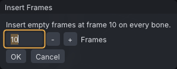

# Time editing

Time editing changes when things happen rather than what the pose is: open empty frames, cut a stretch out, make a section faster or slower, retime by dragging markers, copy a section of keys to another point in time, or split a long dance into parts. The commands are in **Edit → Time** and in the timeline's right-click menu.

> Related articles: [[Keys and timeline]], [[Graph editor]], [[Loop tools]], [[Couples and groups]]

## Usage

### Picking a range

Most commands work on a frame range. **Shift+drag** along the timeline to mark one; it shows as a yellow band, and a plain click on the timeline clears it. Without a timeline range, the span of the keys selected in the [[Graph editor]] is used instead.

With no range, the range commands are greyed out with "Shift-drag a frame range on the timeline first".

### Which keys move

- **With bones selected**, only their keys move, together with their pins and IK controls.
- **With nothing selected**, the whole animation moves: every bone, and the animation's length, loop points and pins follow.

The status bar ends with **(all bones)** or **(selected bones)** so you can tell which happened. Keys that end up past the last frame extend the animation. Each command is one undo step.

### Inserting frames

**Edit → Time → Insert Frames...** opens empty frames at the playhead. The dialog reads "Insert empty frames at frame N on every bone" (or "on the selected bones"); set **Frames** (1–3600, 10 by default) and press **OK**. Keys at or after the playhead move later by that many frames.

*With nothing selected, the frames open on every bone.*

### Removing a range

**Edit → Time → Remove Range** deletes the frames of the range and closes the gap: keys after the range move earlier. The range is cleared afterwards.

### Stretching a range

**Edit → Time → Stretch Range...** makes the range longer or shorter. The dialog reads "Frames a to b (n frames) become:"; set the new length in **Frames** and press **OK**. Keys inside spread out or bunch up, and later keys move by the difference.

### Copying and pasting a range

1. Mark a range and choose **Edit → Time → Copy Range**. The status bar says "Copied frames a to b".
2. Move the playhead to where the copy should go.
3. Choose one of:
   - **Paste Range**: pastes at the playhead, replacing the keys already there over the length of the copy.
   - **Paste Range, Inserting**: opens room at the playhead first, so nothing is overwritten and later keys move later.
   - **Paste Range Mirrored**: pastes with left and right swapped, as [[Mirror, flip and reverse|Mirror]] does.

The paste commands are greyed out with "Copy a range first" until something is copied. A paste goes onto the same bones it was copied from, whatever is selected when you paste.

### Retiming with markers

Retime markers change timing by dragging instead of typing lengths, which suits fitting a dance to music. Turn the mode on with the **Retime** button on the timeline bar (a map pin, after **Mirror**; highlighted while on), or **Edit → Time → Retime Markers**. The ruler takes a tint while the mode is on.

1. **Double-click** the ruler (the strip with the frame numbers) to drop a marker, a triangle pointing down. Drop one on each moment that should land somewhere else, for example each big pose that should hit a beat.
2. **Drag** a marker. The keys between it and the marker before it (or frame 0, for the first marker) stretch or squash to fit, and every key after it, and every later marker, moves by the same amount. The timeline shows the result live; a tooltip gives the marker's frame and how fast the section now plays, for example "frames 10.00 to 20.00 play at 150% of their length".
3. Let go. The drag is one undo step, **Retime**.

A marker drag always edits the whole animation, whatever is selected: every bone, pins, loop points, IK blend keys and the animation's length follow, as with **Stretch Range...** on nothing selected. A marker cannot be dragged to or before the marker before it (it stops a frame after), and a marker on frame 0 does not move.

Where a marker lands:

- With **Snap to Beats** on (the timeline's right-click menu, see [[Audio track]]), it snaps to the nearest beat within 3 frames, grid or tapped.
- Otherwise it follows the mouse between frames; keys can end up on fractional frames.
- With **Snap frames** ticked on the [[Graph editor]]'s toolbar (the default), the result rounds to a whole frame, the beat included.

Markers are not saved and not part of undo: undo puts the keys back and leaves the markers where they are. Turning **Retime** off removes them all.

## Split a dance

Second Life refuses animations over 60 seconds, so a long dance goes up as several parts that a dance HUD plays one after another. **Tools → Split Dance at Beats...** cuts the animation into parts of at most 60 s, each cut on the last beat before the limit, so every part ends on the music.

The window lists the parts with their frames, their length and where each ends: **on a beat**, **at 60 s (no beat)** when no beat falls in reach, or **the end**. The beats are the [[Audio track]]'s beat grid and tapped beats, rounded to whole frames; with neither, every cut falls at exactly 60 s. An animation of 60 s or less says it fits SL's 60 s limit in one part.

Every part:

- starts on the frame the one before it ends on, so the first frame of a part is the same pose as the last frame of the one before, and the parts together last as long as the original;
- keeps the frame rate, priority, hand pose and the **Loop** setting (a looping part loops from its first frame to its last);
- has no ease at a join: the first part keeps **Ease in**, the last keeps **Ease out**, and the rest are 0, so the HUD's switch from one part to the next does not dip.

Then:

- **Save Parts as Projects** saves them beside the project as `<project>_part1.vat`, `<project>_part2.vat` and so on, to edit further. It is greyed out until the project is saved. Parts from an earlier split are listed first, and replaced (kept as `.bak`) only after **Replace Them**.
- **Export All as .anim** exports every part to the export folder with the settings in **File → Export SL .anim...**. The names come from its **Pattern**, with `[#]` counting up from **Number**: `Dance_01`, `Dance_02`, `Dance_03`. A pattern without `[#]` gets `_[#]` added. With **Also save to Animations library** ticked, each part is copied there too. With no export folder set, it asks you to choose one in the Export dialog first.

> **Note:** The split and export use the active actor only, and write no mirrored copy. In a couple, select each actor in turn and export again.

## Worked example: slow a nod down

[Open the example](example:time-nod.vat): a 30-frame clip in which the head nods between frames 0 and 20 (keys on **mHead** and **mNeck** at 0, 10 and 20) and then holds.

1. With nothing selected, **Shift+drag** on the timeline from frame 10 to frame 20. A yellow band marks the range.
2. Choose **Edit → Time → Stretch Range...**. The dialog reads "Frames 10 to 20 (10 frames) become:"; type `20` in **Frames** and press **OK**. The status bar says "Stretch Range (all bones)".
3. Look at the timeline: the keys are now at frames 0, 10 and 30, and **Properties → Animation → Last frame** reads 40, because the key that ended up at frame 30 pushed the 10 frames after it along. The head comes up in 20 frames instead of 10; the way down is unchanged.

To try the other command instead, undo (**Ctrl+Z**), scrub to frame 10 and choose **Edit → Time → Insert Frames...** with **Frames** at 10: the keys land at 0, 20 and 30 and the last frame is again 40. Nothing holds: the curve runs from the key at 0 to the key at 20, so the head now takes 20 frames to go down and 10 to come up.

## Tips and tricks

- To slow down one move, mark its frames and **Stretch Range...** to a larger number; to speed it up, a smaller one.
- Repeat a gesture by copying its range and pasting it later with **Paste Range, Inserting**.
- A walk's second step is often the first step mirrored: copy the first step's range and use **Paste Range Mirrored** half a cycle later.
- To put a dance on the music, set a beat grid ([[Audio track]]), turn on **Snap to Beats** and **Retime**, drop a marker on each hit pose and drag it to its beat, first to last.
- Select only the arms before stretching to change their timing while the legs keep theirs.
- In a scene with several avatars, time edits keep every actor the same length and loop; see [[Couples and groups]].

## Troubleshooting

### A time edit moved every bone, not just mine

Nothing was selected when you ran it, so the whole animation was edited. Undo (**Ctrl+Z**), select the bones, and run it again. The status bar's **(all bones)** or **(selected bones)** shows which happened.

### Insert Frames made the animation longer than 60 seconds

Inserting on every bone extends the animation. Check the seconds under **Last frame** in **Properties → Animation**; Second Life refuses animations over 60 seconds. A dance that has to be that long can go up in parts: see [[Time editing#Split a dance]].

### A retime marker won't move

A marker on frame 0 has nothing before it to stretch, so it stays put. A marker also stops one frame after the marker before it; drag that one first.

## See also

- [[Keys and timeline]]
- [[Loop tools]]
- [[Audio track]]

Category: Animating
