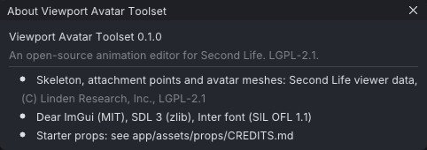

# Troubleshooting

This page covers problems with VATs itself: starting, graphics, speed, text, settings and logs, and
how to report a bug. Problems with a particular feature are on that feature's page, under its own
**Troubleshooting** section; see [[Troubleshooting#Topic pages]].

> Related articles: [[Installation]], [[Projects and files]], [[Preferences]], [[FAQ]]

## VATs does not start

When VATs cannot start it shows a message box and prints the same text to standard error, then exits
with status 1.

| Message | Cause | Fix |
|---|---|---|
| **Could not start SDL** | No display to connect to: no desktop session, or `DISPLAY` / `WAYLAND_DISPLAY` unset. | Start VATs from the desktop, or from a terminal inside it. |
| **Could not open a window** | The display refused a window with OpenGL. | Update the graphics driver. On Linux, try the other display system (see below). |
| **OpenGL 3.3 is not available** | The driver offers only an older OpenGL, or none. Common in virtual machines and some remote-desktop sessions. | Update the graphics driver, or run VATs on the machine itself. On Windows, Mesa's software `opengl32.dll` placed next to `vats.exe` works, slowly. |
| **OpenGL function missing** | The driver claims OpenGL 3.3 but lacks a function VATs needs; the message names it. | Update the graphics driver. |
| **Could not start the 3D view** | The driver rejected the 3D view's shaders or offscreen targets; the message gives the driver's reason. | Update the graphics driver. |
| **Could not load the Second Life skeleton** | The skeleton data beside the program is missing or damaged. | Unpack the archive again, keeping `bin/` and `share/` together; see [[Installation]]. |

On Linux, SDL picks Wayland or X11 by itself. To force one, set `SDL_VIDEO_DRIVER`:

```
SDL_VIDEO_DRIVER=x11 bin/vats
SDL_VIDEO_DRIVER=wayland bin/vats
```

## Speed and CPU use

### CPU use while idle

An idle VATs window uses no CPU: it sleeps until there is input. For two seconds after input, and
while a text field is being edited, it wakes four times a second for tooltips and the text cursor.

It draws continuously, at the display's refresh rate, only while something moves: playback, a drag,
a camera swing, the Second Life keyboard camera, the view cube fading, or a motion capture
connection. If CPU use stays high while nothing moves, check that playback is stopped and the
**Motion Capture** window is disconnected.

### Playback is slow

- The viewport draws every frame at the display's refresh rate during playback. Close other GPU-heavy
  programs.
- To measure, run `vats <project> --bench 10`; see [[Command line#Benchmarks]].

## Text and fonts

### The text looks like a small pixel font

VATs could not read `share/viewport-avatar-toolset/assets/fonts/Inter-Regular.ttf` and fell back to Dear
ImGui's built-in font. Unpack the archive again, keeping its folders together.

### Some characters show as boxes or question marks

VATs draws text with the Inter font, which covers Latin, Greek and Cyrillic scripts. Characters Inter
lacks, such as Chinese, Japanese, Korean or emoji in file and bone names, cannot be drawn.

### Text is too small or too large

Set **Interface size** in [[Preferences]]. VATs also follows the display scale of the operating
system; after changing that, restart VATs.

## Settings and data

### Where are my settings and files?

| | Linux | Windows |
|---|---|---|
| Settings (`settings.json`) | `~/.config/viewport-avatar-toolset/` | `%APPDATA%\viewport-avatar-toolset\` |
| Libraries, autosaves, window layout | `~/.local/share/viewport-avatar-toolset/` | `%APPDATA%\viewport-avatar-toolset\` |

With `--data-dir <dir>`, all of these are in `<dir>`. See [[Projects and files#Data folders]] and
[[Preferences#Settings file]].

### Starting fresh

Quit VATs, then:

- delete `settings.json` to reset preferences;
- delete `layout.ini` to reset the panel layout;
- move the `library` folder away to start with empty libraries.

To test without touching your data, start VATs with `--data-dir` and an empty folder.

### Worked example: a clean start

1. Quit VATs and start it from a terminal with an empty folder: `bin/vats --data-dir /tmp/vats-fresh`
   on Linux, `bin\vats.exe --data-dir %TEMP%\vats-fresh` on Windows. The folder is created.
2. The Welcome window opens, the panels are in their default layout and the Inventory's libraries are
   empty: every setting is a default, whatever your own settings say.
3. Open **Edit → Preferences...**, set **Colour theme** to **Studio Grey** and quit. The folder now holds a
   `settings.json` with `"theme": "Studio Grey"` and a `layout.ini`; your own settings folder is untouched.
4. Delete the folder when you are done. If the problem is gone with the clean start, it is in your settings:
   see [[Troubleshooting#Starting fresh]].

### My work is gone after a crash

See [[Projects and files#Recovering after a crash]].

## Logs

VATs keeps no log file. It prints warnings and errors to standard error:

- Linux: start `bin/vats` from a terminal, or save the output with
  `bin/vats 2> vats-log.txt`.
- Windows: VATs has no console window. From Command Prompt, run
  `bin\vats.exe 2> vats-log.txt` to save the output to a file.

Messages you may see there include `ignoring unknown argument <arg>`, `unknown preset <name>`,
`no built-in pose <slug>` (from the [[Command line]]) and `starter props: <reason>` when the starter
prop list cannot be read.

## Reporting bugs

Include:

1. The VATs version, from **Help → About Viewport Avatar Toolset** or the title bar.
2. The system: Linux distribution or Windows version, graphics card and driver, and on Linux whether
   the desktop is Wayland or X11.
3. The control preset in use.
4. Exact steps from a new or attached project, what you expected, and what happened.
5. Any output on standard error (see [[Troubleshooting#Logs]]) and the text of any message box.
6. The `.vat` project, and the exported file for export or in-world problems.


*The version is the first line of **Help → About Viewport Avatar Toolset**.*

## Topic pages

These pages have their own **Troubleshooting** sections:

- [[Interface#Troubleshooting]]: missing panels, text size.
- [[Control presets#Troubleshooting]] and [[Keyboard shortcuts#Troubleshooting]]: keys and mouse.
- [[Projects and files#Troubleshooting]]: saving, crashes, missing props.
- [[Installation#Troubleshooting]]: file associations.
- [[Export to Second Life]]: refused uploads and files that look different in-world.
- [[Animation check]]: problems that show only in Second Life (loop pops, feet in the floor, frozen
  tails and hands, files too big), each with a fix.
- [[Animation priority]]: another animation wins.
- [[Hold and bind]]: a bound hand drifts.
- [[IK]], [[Retargeting]], [[BVH]], [[Props]], [[Mesh bodies]], [[Motion capture]] and
  [[Face tracking]]: problems specific to each.

## See also

- [[FAQ]]
- [[Command line]]

Category: Troubleshooting
