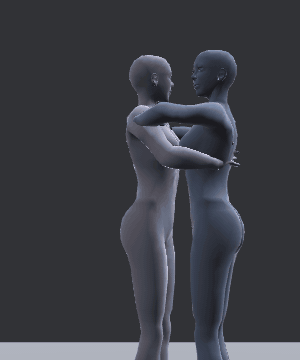
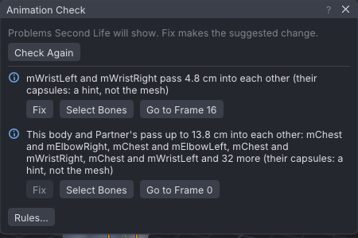
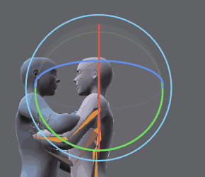
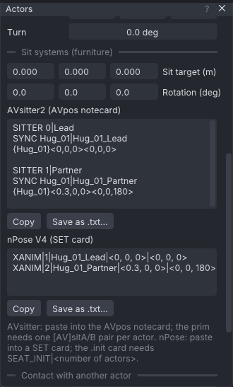

# A hug for two

An advanced tutorial: two avatars hug and rock gently from side to side. You fix the arms where they pass through
each other, keep every hand on the other body while it moves, and export both animations with the lines a sit
system (AVsitter or nPose) needs to seat the pair. It assumes you have done the beginner and routine tutorials on
the [[Tutorials]] page.

> Related articles: [[Couples and groups]], [[Hold and bind]], [[Animation check]], [[Export to Second Life]]

## What you will make


*The finished hug: Lead's hands low on Partner's back, Partner's arms over Lead's shoulders, both heads turned aside.*

Two actors, **Lead** and **Partner**, stand 0.3 m apart, facing each other. Both reach in by frame 14 and close the
hug by frame 24; from 24 to 84 the hug loops while Partner rocks. The start of the tutorial already has the poses,
blocked the way a first pass usually is, and three problems a beginner would not see at first:

- Lead's wrists cross inside each other behind Partner's back.
- The arms are keyed with their own angles, so when Partner rocks, Lead's hands stay where they were and slide
  over Partner's back instead of moving with it.
- The heads meet face to face, where real people turn aside.

[Open the example](example:hug-start.vat)

## Steps

### 1. Look at the problem

1. Open the start example with the button above. Choose **Tools → Actors (Couples and Groups)...**: the list shows
   **Lead (you)** and **Partner**, and **Lead (you)** is highlighted, so you are editing Lead. To edit the other one,
   click its name here (or its body in the view).
2. Press **Space** to play, and watch Lead's hands on Partner's back from frame 24 on. Partner sways from side to
   side, and the hands stay put while the back moves under them. To look closer, stop and drag the playhead slowly
   along the timeline from the start of the blue loop band (frame 24) to the end.


*Before the fix: seen from behind Partner, the hands keep their own place while the back sways under them.*

> **Why:** a hand keyed by its arm's angles (forward kinematics, FK) knows only its own shoulder. Nothing in those
> keys says "on Partner's back". Contact between two bodies has to be made a rule, not a coincidence of angles:
> that is what a bind does (step 4).

### 2. Check where the body passes through itself

The status bar shows **Check: 2** in blue: the [[Animation check]] has two findings.

1. Click the badge (or choose **Tools → Animation Check...**). The first finding reads "mWristLeft and mWristRight pass
   4.8 cm into each other (their capsules: a hint, not the mesh)". The second compares Lead's body with Partner's:
   "This body and Partner's pass up to 14.6 cm into each other: mChest and mElbowLeft, ..." (see the note below).
2. Look at the timeline: short red lines along its foot mark the frames of the finding, from 16 on. On those
   frames both wrists are drawn red in the view.
3. Press **Go to Frame 16** to see the first one, then **Fix**. The fix is **Push Out**: on each listed frame it
   moves the hands apart through the arm's IK, by the overlap and 5 mm more. The first finding goes; the one about
   Partner stays.
4. Close the window, click **Partner** in the **Actors** window and do the same for it: its badge opens a finding
   of its own crossed wrists; press **Fix**.


*Lead's crossed wrists, and where Lead's body meets Partner's. A blue ring means Info: often a mistake, sometimes meant.*

> **Why:** in a hug the arms are close to the other body and to each other, and it is easy to key a pose that
> looks right from the front while a hand is buried in the other hand, or in your own hip. The check measures
> simple rods (capsules) round each bone, not the mesh, so read it as "look here", and judge in the view.

> **Note:** the second finding compares the actor you are editing with each other actor, capsule against capsule.
> In a hug the arms wrap round the other body and the feet stand between the other's, so it lists every frame, and
> the capsules are rounder than the bodies: read it as where the two meet, not as a mistake. It has no **Fix**: which
> of the two should give way is yours to judge, by eye, from several views (**1**, **3** and **7** in the Industry
> preset).

### 3. Turn the heads aside

The heads meet face to face. Turn each one to its own left, so the cheek goes past the other's shoulder:

[Show the target](target:hug-finished.vat)

The target lays the finished hug over yours as two see-through green bodies, each actor on its own. Drag the
playhead to 18: the green heads are turned; yours are not yet.

1. Click **Lead (you)** in the **Actors** window. In the **Picker** tab (beside **Bones**), on the **Body** page,
   click the dot where the head meets the neck: the tooltip says **Head**, and the line under the chart reads
   **Head**. (Clicking the head in the view picks the skull or the neck instead; the picker's dot is the sure way.)
2. Drag the playhead back to frame 0, the left end of the timeline, and press **Set Key** on the timeline bar (**S**,
   **Edit → Set Key**). A yellow diamond appears at 0: the head is keyed straight ahead, so it only starts to turn
   after this frame.
3. Drag the playhead to frame 18, a little before the blue loop band starts at 24, and press **E** for the Rotate
   tool. Press **F** with the pointer over the view to frame the head.
4. Point at the blue ring: it lights up yellow. Drag along it until the face turns to Lead's left, about a third of
   the way from straight ahead to the shoulder. The angle shows beside the gizmo while you drag, and letting go
   keys frame 18. The status bar's **Target: hug-finished** chip counts down the degrees still to go and turns
   green under 5°, when your head sits inside the green one. If the blue ring is a flat line, orbit the view a
   little first (**Alt+drag** up or down) so you see it as an oval.
5. Click **Partner** in the **Actors** window and do the same for its head: **Set Key** at 0, then at 18 the blue
   ring, to Partner's own left, until the chip turns green: the distance is now to Partner's ghost. The head usually stays selected when you switch actors; if the line under the chart
   already reads **Head**, don't click the dot again, since a second click on the same spot selects the bone under
   it (the neck).


*Dragging the blue ring at frame 18: the face turns towards you, Lead's left, and the frame is keyed.*

Play: both heads turn aside while the arms come in, and the faces pass each other.

> **Check:** the turn reads well anywhere between about 25° and 35°. **Properties → Bone** shows it as the third
> **Rotation** value (Z), around `30.0°`; hold **Ctrl** while dragging to step in 5° if you want it round.

> **Why:** faces never meet in a hug; each head turns to one side so the cheek rests past the other's shoulder.
> Small turns sell a pose: a third of the way is enough to read from any camera, and it starts before the hug closes,
> so the head leads and the arms follow.

### 4. Keep the hands on the other body

Bind each hand to the other actor's chest from the frame the hug closes. A bind is a pin on another actor's bone
(see [[Hold and bind]]): the hand keeps the distance and angle it has now from that bone, whatever the bone does.

1. Click **Lead (you)** in the **Actors** window. Drag the playhead to frame 24, where the blue loop band starts:
   the arms' keys (the yellow diamonds on the picker's arm dots) are there.
2. In the **Picker**, click the dot at the end of the arm on the left of the chart (**R ARM**: the avatar faces you,
   so its right is on your left). The tooltip says **Right Hand**.
3. In the **Actors** window, scroll down to **Contact with another actor**. **Other actor** reads **Partner** and
   **Their bone** reads **mChest**, the partner's chest, which is what the hug needs.
4. Press **Bind Selected Point to This Bone from Here**. The status bar says "mWristRight now follows Partner's
   mChest"; **Properties → Bone** says **Pinned to mChest from frame 24**, and the wrist's dot in the picker turns
   light blue.
5. Click the matching dot on the **L ARM** side (**Left Hand**) and press **Bind Selected Point to This Bone from
   Here** again (**Their bone** keeps **mChest**).
6. Click **Partner** in the **Actors** window. **Other actor** now reads **Lead**. Bind Partner's two hands to
   Lead's **mChest** the same way, at frame 24.
7. Play. Lead's hands now rock with Partner's back, and the elbows bend and open to follow.

> **Why:** contact is the thing people notice first in a couples animation. A hand that floats a centimetre off a
> shoulder, or sinks into it, reads as fake even to someone who couldn't say why. A bind makes contact a rule, so
> you can go on changing the bodies (retime them, turn them, make them rock more) and the hands stay on.

> **Tip:** bind from the frame the hands arrive, not from frame 0: before the bind, the arms travel on their own
> keys. To end a bind, go to the frame and use **Tools → Release from Here** with the hand selected.

### 5. Name the export and read the sit-system lines

1. Choose **File → Export SL .anim...**. Type `Hug` in **Name** and press **Enter**. Further down, **Saves as**
   lists `Hug_01_Lead.anim`, `Hug_01_Partner.anim` and `Hug_01_placement.txt (where each actor stands)`. Close the
   dialog with its **×** for now.
2. In the **Actors** window, scroll to **Sit systems (furniture)**. **Sit target (m)** and **Rotation (deg)** are
   at 0, so the lines give each actor's placement as it is.

The AVsitter2 lines read:

```
SITTER 0|Lead
SYNC Hug_01|Hug_01_Lead
{Hug_01}<0,0,0><0,0,0>

SITTER 1|Partner
SYNC Hug_01|Hug_01_Partner
{Hug_01}<0.3,0,0><0,0,180>
```

and the nPose V4 lines:

```
XANIM|1|Hug_01_Lead|<0, 0, 0>|<0, 0, 0>
XANIM|2|Hug_01_Partner|<0.3, 0, 0>|<0, 0, 180>
```

3. Press **Copy** under the format your furniture uses, or **Save as .txt...** to keep the lines in a file.


*Partner sits 0.3 m in front of Lead, turned 180° to face it.*

> **Why:** in Second Life each avatar plays its own animation around its own seat. The animations only line up if
> the furniture seats the two avatars exactly where they stood in VATs, so the offsets travel with the files.

### 6. Export both sides

1. Choose **File → Export SL .anim...** again, press **Export .anim** and choose a folder when asked.
2. VATs writes three files: `Hug_01_Lead.anim`, `Hug_01_Partner.anim` and `Hug_01_placement.txt`. The placement
   note lists each actor's offset and rotation, an `llSitTarget` line for each, and the same AVsitter2 and nPose
   V4 lines as step 5.
3. Save the project with **File → Save As...**.

## Check your result

[Open the example](example:hug-finished.vat) to compare with the finished hug, or
[show it as the target](target:hug-finished.vat) over your own and play with **Lead (you)** highlighted: where
Lead and the green body part, look closer.

- **Playing, from frame 24 on:** every hand moves with the back it rests on; nothing slides.
- **The heads:** turned aside by frame 18, each cheek past the other's shoulder; Lead's head inside the green target's (a
  few degrees either way does not show).
- **The picker, each actor:** both wrist dots light blue from frame 24; **Properties → Bone** on a wrist says
  **Pinned to mChest from frame 24**.
- **The Check badge:** **Check: 1** for each actor, the finding that the two bodies meet; no crossed wrists.
- **The export folder:** `Hug_01_Lead.anim` and `Hug_01_Partner.anim`, about 3 KB each, and `Hug_01_placement.txt`.

> **Check:** the finished example has each head at about `30°` on Rotation Z at frame 18, Last frame `84`, **Loop**
> on from `24` to `84`, and Priority `4`.

## Troubleshooting

### Bind Selected Point to This Bone from Here is greyed out

No bone is selected. Click the wrist's dot in the **Picker** first.

### Clicking the head selects the neck

The picker's dots cycle: a click on a dot that is already selected takes the next bone under it. Click once more to
come back round to **Head**, and check the line under the chart before you drag.

### The hand jumps when the bind starts

The bind keeps the hand where it is at the frame you bind from. If the hand was not yet on the back at that frame,
it stays off it. Undo (**Ctrl+Z**), go to the frame where the hand touches, and bind from there.

### The finding comes back after Fix

**Push Out** keys only the frames the finding lists; the frames round them can still overlap a little once the
curves change, and the check then lists those. Press **Fix** again. A bind holding the hand wins over the new
keys, so fix the arms before you bind them (step 2 before step 4).

### Partner's finding does not show

The check and its badge follow the actor you edit. Click **Partner** in the **Actors** window.

### The lines say hug-start_01

The export **Name** is empty, so the pose name comes from the project file's name. Set **Name** in **File →
Export SL .anim...** (step 5).

Next: [[Dance to the beat]]

Category: Getting started
Order: 20
