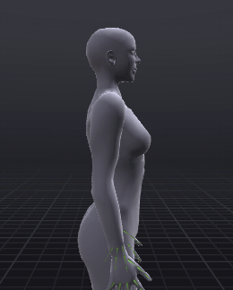
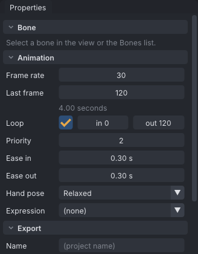
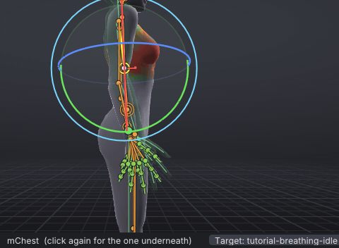
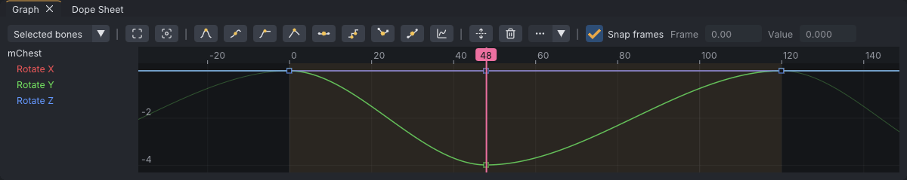
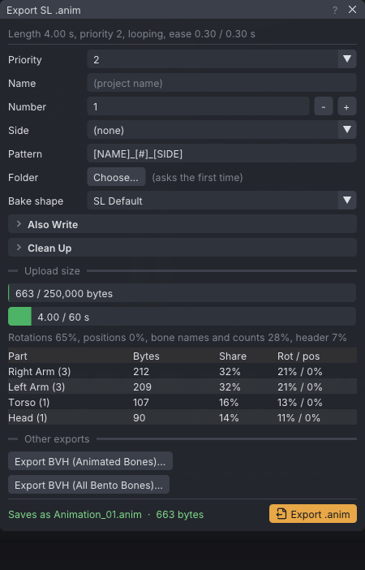

# A breathing idle that loops

Beginner tutorial 3 of 3, about 15 minutes. You make a standing idle: the avatar breathes in and out, once every four
seconds, forever. It is the kind of animation an AO plays when you are doing nothing, so it has to be calm enough to
watch for minutes and to repeat without anyone seeing where it starts again. You pose the breath with small drags on
a green ghost, close the loop, and export it as an `.anim` file ready to upload to Second Life.

> Related articles: [[Timing and spacing: a head nod]], [[Target ghost]], [[Keys and timeline#Looping]], [[Animation priority]], [[Export to Second Life]], [[Idle layer]]

## What you will make

*One breath, four seconds, looping. The chest lifts, the collarbones rise, and the head dips to keep looking straight
ahead.*

A 120-frame loop at 30 frames per second on the Relaxed Stand: four bones keyed at frames 0, 48 and 120, with frame
120 a copy of frame 0, at priority 2.

## Steps

### 1. Set the length and the loop

1. Choose **File → New** (**Ctrl+N**); answer **Don't Save** if it asks.
2. Right-click empty space in the view and choose **Poses → Starter poses → Relaxed Stand**.
3. Press **Esc** to select nothing: **Properties** now shows the **Animation** section at the top.
4. Double-click **Last frame**, type `120` and press **Enter**. The line under it reads **4.00 seconds**.
5. Tick **Loop**. **in 0** and **out 120** appear beside it, and the loop band is tinted on the timeline.

> **Why:** People at rest breathe 12 to 20 times a minute, so one breath takes 3 to 5 seconds. Four seconds is calm
> without looking sleepy. The whole loop is one breath, so it repeats with no seam in the middle.

### 2. Set the priority

Set **Priority** to `2` in the same section.

*The settings after steps 1 and 2.*

Second Life plays several animations on an avatar at once. When two of them move the same bone, the one with the
higher **priority** (0 to 6) wins that bone. An idle is the bottom layer: anything else you play, a gesture, a dance,
a sit, should win over it. This idle keys only the upper body (Relaxed Stand keys the arms; you will key the chest and
head), so 2 is right, and the status bar's **Check** badge stays quiet.

> **Note:** A stand that keys the hips and legs too (the **Contrapposto** starter pose does) is different: a walking or
> standing AO would take its legs, so the [[Animation check]] asks for priority 4 and its **Fix** sets it. If that
> stand is your AO's own, keep 2 and give the clip the **Standing** AO state in **Tools → Clips (AO Sets)...** instead;
> the Check then agrees. See [[Animation priority]].

### 3. Show the target

[Show the target](target:tutorial-breathing-idle.vat)

The finished breath appears as a green ghost. Click **48** on the timeline's ruler: the ghost's chest is lifted and its
shoulders are up, a little. It is subtle; that is the point. Press **Space** to watch it breathe, and again to stop.

### 4. Key the out-breath at frame 0

1. Click **0** on the ruler (or press **Home**).
2. Open the **Picker** tab. Click the **Chest** (the third dot up the spine), then **Shift+click** both collars (the
   dots either side of the spine at shoulder height, where the arm lines start) and the **Head** (the top dot). Four
   bones are drawn in the accent colour.
3. With the pointer over the view, press **S** (**Edit → Set Key**). The status bar says `Keyed 4 items at frame 0`.

This is the resting pose: breath out, everything as Relaxed Stand left it.

> **Why:** Key only the bones you mean to move. An `.anim` claims every bone it has keys for, at its priority, for as
> long as it plays. This idle leaves the legs and hips alone, so a walk or a sit can take them without a fight.

### 5. Key the in-breath at frame 48

The moves here are a few degrees each: small drags. Watch the angle that shows beside the gizmo while you drag, and
the status bar's distance to the ghost, which counts down to `0°` (it is green from the start, since every part is
already within 5°).

1. Click **48** on the ruler.
2. Press **E** for the **Rotate** tool. With the pointer over the view, press **3** to look from the side, and zoom in
   on the chest with the wheel.
3. Click the **Chest** in the Picker (a plain click selects just it). Press on the **green** ring where it passes in
   front of the chest and drag up, a short way: the chest tips back and the ribs lift. Stop when the angle beside
   the gizmo reads about 4°, and the distance `0°`.
4. Press **1** to look from the front. Click her left collar in the Picker (on your right). Press on its **red** ring
   and drag a short way so the shoulder rises: stop at about 3°, the distance at `0°`.
5. Press **M** (**Edit → Mirror Bone to Other Side**): the right collar rises the same way.
6. Click the **Head** in the Picker, press **3** again, and drag its **green** ring the other way, down a little: the
   face tips forward about `2°`, back to level.

*Four degrees is a few pixels of drag. Overshot? Drag back while still holding the button.*

> **Tip:** A bigger gizmo turns more slowly under the same drag: **Edit → Preferences... → Gizmo size**.

The status bar's **Check** badge turns amber now: the [[Animation check]] sees that the loop ends (frame 120) with
the collars somewhere else than where it starts. The next step closes it.

> **Why:** Breathing in takes less time than breathing out, so the in-breath is 48 frames (1.6 s) and the out-breath
> 72 (2.4 s). Uneven timing is one of the things that keep a loop from feeling like a machine.

> **Why (the head):** When the chest tips back it carries the neck and head with it, and the avatar would stare at
> the ceiling on every breath. Tipping the head forward by about as much cancels that, so the eyes stay level.
> Correcting one part for the motion of another is called *counter-animation*.

### 6. Close the loop at frame 120

The loop has to end exactly where it starts, or the avatar jumps once every four seconds. Copy frame 0 onto frame 120:

1. Select the four bones again: click the **Chest** in the Picker, **Shift+click** the collars and the **Head**.
2. Press **Home** to go to frame 0, and with the pointer over the view press **Ctrl+C** (**Edit → Copy Pose**). The
   status bar says `Copied 4 items`.
3. Press **End** to go to frame 120, and press **Ctrl+V** (**Edit → Paste Pose**). The status bar says
   `Pasted the pose at frame 120`.

The timeline shows keys at 0, 48 and 120.

> **Tip:** With the pointer over the **Graph** panel, **Ctrl+C** and **Ctrl+V** copy and paste the selected *keys*
> instead of the pose. Keep the pointer over the view for this step.

### 7. Play and watch the seam

Press **Space**. The avatar breathes in, breathes out, and starts again with no jump, in step with the ghost. Click the
**Target:** button in the status bar to hide the ghost, let it run for a few cycles and watch only the moment it
passes frame 120: nothing should happen there.

Select only the **Chest** and look at its curve in the **Graph** panel:

*One breath as a curve. The faint parts before frame 0 and after 120 are the loop going round again.*

The curve leaves frame 0 flat and arrives at 120 flat, and because both ends are the same value the loop joins without
a kink. The faint copies either side show how the next cycle continues (**Tools → Loop Tools → Loop-Aware Tangents**
is on in new projects; see [[Loop tools#Loop-aware tangents]]).

> **Why:** A good idle is almost invisible. The changes here are a few degrees; if the viewer notices the breathing, it
> is too big. Subtle motion is still motion, though: a stand with no breath at all looks frozen next to one that has
> it.

### 8. Read the upload size

1. Press **Ctrl+E** (**File → Export SL .anim...**). The top line reads
   `Length 4.00 s, priority 2, looping, ease 0.30 / 0.30 s`, and **Priority** shows `2`.
2. Type `Breathing` into **Name**. **Saves as** changes to `Breathing_01.anim`.

*The upload size of the breathing idle.*

**Upload size**, in the middle of the window, measures the file before you write it:

- The first bar is the file's size against `250,000` bytes: Second Life refuses a file of 250,000 bytes or more, and
  this one is well under a kilobyte.
- `4.00 / 60 s`: the length against Second Life's 60-second limit. Both bars turn amber from 90% of a limit and red
  over it.
- The table lists the body parts that cost the most: the arms, keyed by Relaxed Stand, the torso (the chest) and the
  head. Eight bones in all.

> **Why:** Size grows with the number of bones keyed and the number of keys each needs. A few keys on a few bones, like
> this idle, cost almost nothing; motion capture keyed on every frame of every bone can pass the limit. See
> [[Export to Second Life#Check the upload size]].

### 9. Export

Press **Export .anim**. The first time, a dialog asks where to save; the folder you pick becomes the export **Folder**.
The status bar says `Exported Breathing_01.anim` with the bones, the length, the priority and the size.

**Ease in** and **Ease out** (0.30 s each) are how long Second Life takes to blend this animation in when it starts
and out when it stops, so the avatar never snaps into or out of the breath. For a looping idle the defaults are fine.

Upload the file as in [[First steps#12. Upload]]. The loop, the priority and the ease times travel inside the `.anim`.

## Check your result

Play yours with the target showing: the chest, the shoulders and the head should rise and settle with the ghost's.
Then [Open the example](example:tutorial-breathing-idle.vat) and compare:

- **Properties → Animation**: **Last frame** 120, **Loop** ticked from 0 to 120, **Priority** 2.
- The chest's curve in the **Graph** dips once, from frame 0 to 48 and back by 120, and is flat at both ends.

> **Check:** the example's chest is at `-4°` on its second **Rotation** box at frame 48, the left collar at `-2°` on the
> first (it was `-5°`), the right at `2°`, and the head at `2°` on the second. A degree either way breathes the same.

## Troubleshooting

### Playback repeats only the first second

**Loop out** is still 30: you ticked **Loop** before setting **Last frame**. Drag the loop band's right flag on the
timeline to 120, or double-click **out 30** beside **Loop** and type `120`. While **Loop** is ticked, playing in VATs
repeats only the loop band, as Second Life will.

### The avatar jumps at the end of each breath

Frame 120 does not match frame 0: a key is missing at 120, or a bone was not selected when you pasted. Select the four
bones at frame 0, **Ctrl+C**, go to 120, **Ctrl+V**. A red tick on the timeline at the loop's end marks a seam; hover
it for the channels that jump, and see [[Loop tools]].

### Ctrl+V pasted keys at the wrong frame

The pointer was over the **Graph** panel, which pastes keys at the current frame. **Ctrl+Z**, move the pointer over the
view and paste again.

### The drag jumps past the angle I want

Small angles are small drags. Drag back while still holding the button; or make the gizmo bigger
(**Edit → Preferences... → Gizmo size**), which makes the same drag turn less.

### Breathing is too strong or too weak

Change the pose at frame 48 only; frames 0 and 120 are the rest pose. Keep the chest within a few degrees for a calm
idle; much more reads as heavy breathing, which suits a different animation.

### The arms or legs move in Second Life when they should not

Another animation is playing on those bones with a higher priority, which is expected: the idle is meant to lose. If
this idle wins bones it should not, key fewer bones rather than raising priority.

## Next

The beginner tutorials end here. Continue with [[A sit pose for furniture]] and the other [[Tutorials#Routine]]
tutorials, or try the [[Idle layer]], which adds breathing and sway to any stand without keys.

## See also

- [[Tutorials]]
- [[Keys and timeline]]
- [[Loop tools]]
- [[Animation priority]]
- [[Export to Second Life]]

Category: Getting started
Order: 12
