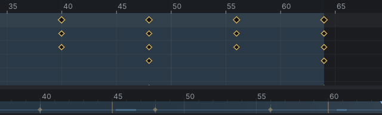

# Dance to the beat

An advanced tutorial: a step-touch groove put on the beat of a song, then loosened with follow-through so it stops
looking stiff. You load music, mark its beats, fit the loop to four beats, let the arms and head trail behind the
body, and learn how a dance longer than a minute goes to Second Life in parts. It follows [[A hug for two]].

> Related articles: [[Audio track]], [[Loop tools]], [[Overlap]], [[Dynamics]], [[Time editing]]

## What you will make

*The finished groove: the hips drop and the free foot taps on each beat; the forearms, hands and head follow a moment behind.*

A 2-second loop at 30 fps: four beats of a 120 BPM song. On each beat the knees bend, the hips drop and sway over
one foot while the other foot taps out to the side, the chest sways the other way, one arm pumps forward and the
other back, and the head nods; the side changes every beat. Both legs are in [[IK]], so the feet stay where they are
put. The start already has the moves, keyed the way a first pass usually is:

- the loop is 64 frames, a little slower than the music, so it drifts off the beat;
- every bone moves on the same frames, so the whole body goes at once, like a puppet.

[Open the example](example:dance-start.vat)

The examples come with a 120 BPM click loop, `beat-120bpm.wav`, already loaded. To dance to your own song, load any
track with a steady beat at 120 BPM (a WAV, MP3, FLAC or Ogg Vorbis file) with **File → Load Audio...**; the numbers
below hold for any 120 BPM track. The audio never goes into the exported `.anim` (see [[Audio track]]).

## Steps

### 1. Set the beat grid

1. Open the start example. The click loop's waveform runs along the timeline; press **Space** to hear it with the
   dance. (With your own track, choose **File → Load Audio...** and pick it; the status bar says its name and
   length, for example "Loaded song.ogg (93.4 s)".)
2. Right-click the timeline. In the menu's **Audio** section, double-click the **BPM** field (it reads `off`),
   type `120` and press **Enter**.
3. Drag the playhead back to the start of the timeline (or press **Home**), open the menu again and choose **Beat
   Grid Starts Here**, then tick **Snap to Beats**.
4. Grid lines appear on the timeline, one per beat: at 120 BPM a beat is 0.5 s, 15 frames at 30 fps.

*Each click of the track sits on a grid line.*

Click **Select All** at the top of the **Bones** tab so the timeline shows the key diamonds: the first bounce sits
on the first line, and each one after it lands a little further to the right of its line. That drift is the problem step 2 fixes.

If the song's own beat does not sit on the lines, **Ctrl+drag** the timeline to slide the audio until it does, or
set **Start (s)** in the same menu.

> **Tip:** don't know the BPM? Play the animation and press **B** on each beat: every press adds a beat marker
> (**Mark a Beat Here**). Count the markers over 15 seconds and multiply by 4.

> **Why:** dancers hit poses *on* the beat and travel between beats. When the key poses (the hips at their lowest,
> the arms at full reach) land on the grid, the eye reads the dance as musical, even with the sound off.

### 2. Squeeze the loop onto four beats

[Open the example](example:dance-grid.vat)

To start here, open this example: the groove with the beat grid of step 1 already set.

The loop is four bounces long, but it is a little too long for four beats: its last key sits past the fourth beat
line, so every repeat starts later than the music. You squeeze all the keys together in the [[Dope sheet]] until the
last one sits on that line.

1. Click the **Dope Sheet** tab at the bottom. Open the drop-down at its top left and choose **All animated bones**,
   so the rows include the legs' IK keys as well as the bones.
2. Drag a box across the **Summary** row, from the empty space left of the first diamond to past the last one. Every
   diamond turns yellow, and a box with a grey handle at each end surrounds them.
3. Drag the right handle to the left. The keys close up towards the first one; with **Snap to Beats** ticked the
   edge jumps to the beat line at **60** as it comes near. With **Snap frames** ticked, every key lands on a whole
   frame. The keys ran from 0 to the last frame, so **Last frame** and **Loop out** go along: the timeline now ends
   at 60.
4. Look at the timeline under it: the bounce keys now sit on the beat lines at 15, 30, 45 and 60.
5. Press **Space** and drag the playhead across the beat lines: at each line the hips are at their lowest and the
   free foot is out to the side.

*The right handle dragged from 64 to 60: every key moves in proportion, and the beats land on the grid.*

> **Check:** the loop was 64 frames; four beats at 120 BPM are 60 frames at 30 fps (4 x 0.5 s x 30). The
> in-between keys land on whole frames near 7, 22, 37 and 52; a frame either way plays the same.

> **Tip:** **Tools → Loop Tools → Fit Loop to Beats...** does this in one step: set **Beats** to `4` in the **Loop
> Assist** window and press **Stretch to 60 Frames**. It sets **Last frame** and **Loop out** as well, but leaves some
> keys between frames (a key at 8 moves to 7.5). The status bar then shows an amber **Check: 1**, "132 keys sit
> between whole frames"; click it and press **Fix** (**Snap Keys to Whole Frames**).

> **Why:** a looping dance plays for minutes in Second Life. A loop that is 4 frames long drifts a whole beat
> every four repeats; one that is a whole number of beats stays on the music for ever. Second Life also plays whole
> frames only: a key between two frames is never shown as you made it, which is why snapping matters.

### 3. Make the arms follow through

Right now the upper arm, forearm and hand all start and stop together. In a real body the hand is carried by the
forearm, which is carried by the upper arm, so each part moves a moment after the one it hangs from.

1. Choose **Tools → Overlap...** (the window is pictured on the [[Overlap]] page).
2. Click the **Picker** tab at the top left. On the **Body** page, click the line of the left upper arm, between the
   shoulder and elbow dots on the side labelled **L ARM** (the avatar faces you, so its left is on your right). The
   tooltip over it says **Left Upper Arm**. The **Chain** line lists `mShoulderLeft`, `mElbowLeft`, `mWristLeft`.
3. Drag the **Delay** slider to the right until it reads **2.0 frames** (or double-click it and type `2`). Leave
   **Bones** at `3` and **Falloff** at `1.00`.
4. Press **Apply Overlap**. The status bar says "Overlap applied down 3 bones".
5. Click the right upper arm, on the **R ARM** side, and press **Apply Overlap** again.
6. Play and watch a hand: it arrives two frames after the forearm, which arrives two after the upper arm. In the
   Dope Sheet, the **Left Arm** and **Right Arm** rows now hold a key on almost every frame: overlap bakes the
   delayed motion.

*Before (left, all at once) and after (right, each part two frames behind the one above it, the head on a spring).*

[Open the example](example:dance-compare.vat) to play the two side by side: the actors **Before** and **After**
dance the groove before and after steps 3 and 4. [Show the target](target:dance-finished.vat) lays the finished
groove over your avatar as a green ghost: play, and your hands should trail the chest the way the ghost's do.

> **Why:** this is *overlapping action* and *follow-through*, two of the oldest rules of animation. Parts that
> hang loose (hands, a head, hair, a tail) are dragged by what they hang from, so they start late, overshoot a
> little and settle late. Without it, motion looks like a puppet on one string.

### 4. Let the head trail with dynamics

The head could get the same treatment, but a simulation gives it a softer, springier lag.

1. Choose **Tools → Dynamics...**. In the **Picker**, click the dot at the base of the neck, just above the
   shoulders' dots: the tooltip says **Neck** (the head's dot sits just above it; a second click on the same spot
   takes the one underneath).
2. Press **Add Chain from Selected Bone**. The list shows `mNeck +2`: the neck, the head and the skull.
3. Press **Overlap** to load that preset: **Stiffness** `0.300`, **Damping** `0.350`, **Gravity** `0.00 g`.
4. Tick **Preview while playing** if it is off, and play: the head now lags a little behind each twist of the
   chest and settles.
5. Press **Bake**. The status bar says "Baked mNeck to keys" and the list reads `mNeck +2  (baked)`.

> **Why:** [[Overlap]] shifts keys you already have; [[Dynamics]] simulates a spring, so the lag grows and shrinks
> with how hard the body moves. Use overlap for limbs you want to control exactly, dynamics for loose parts.
> Second Life plays keys, not physics, so a simulation always has to be baked.

> **Tip:** for a looser head, drag **Stiffness** lower (to about `0.15`) and press **Re-bake**. Re-bake starts
> again from the unbaked keys, so try as many settings as you like.

### 5. Split a long dance at the beats

Second Life refuses animations over 60 seconds. A full song goes up as parts that a dance HUD plays one after the
other, and each part should end on a beat so the switch is not heard in the motion.

[Open the example](example:dance-long.vat)

1. Open the long example: the same groove, 31 times over, 62 seconds. **Properties → Animation** shows the length
   in red, "62.00 s: over SL's 60 s limit".
2. Choose **Tools → Split Dance at Beats...**. The window says "62.00 s in 2 parts of at most 60 s, each cut on the
   last beat before the limit", and lists part 1, frames `0-1800`, `60.00 s`, ending **on a beat**, and part 2,
   frames `1800-1860`, `2.00 s`, ending at **the end**.
3. Press **Export All as .anim** to write the parts with the names from **File → Export SL .anim...**, or **Save
   Parts as Projects** to keep editing them (save the project first; the example opens untitled).

*The long dance cut at 60 s, which falls on a beat at 120 BPM.*

## Check your result

[Open the example](example:dance-finished.vat) to compare with the finished groove, or
[Show the target](target:dance-finished.vat) to play it as a ghost over yours.

- **Playing with the click loop (or your track):** every drop of the hips lands on a click, on the first loop and the tenth.
- **The timeline:** the bounce keys sit on the beat lines, and the loop ends on the fourth one.
- **A hand, played:** it arrives a moment after its upper arm and swings on a little past it; the head lags the
  chest and settles.
- **The status bar:** no **Check** badge.
- **Dynamics:** the list reads `mNeck +2  (baked)`.

> **Check:** **Properties → Animation** reads Last frame `60`, **Loop** on, Loop in `0`, Loop out `60`, Priority
> `4`; the timeline's right-click menu reads **BPM** `120.0` with **Snap to Beats** ticked; **mPelvis** is at its
> lowest (**Offset (m)** Z about `-0.07`) at frames 0, 15, 30, 45 and 60; each hand arrives about 4 frames after its
> upper arm.

The example carries the beat grid and the click loop; load your own track with **File → Load Audio...** to dance to it.

## Troubleshooting

### Beat Grid Starts Here is greyed out

It needs a **BPM**. Set the BPM first (step 1).

### "Needs a BPM" in the Loop Assist window

**Fit Loop to Beats** reads the audio track's **BPM**. Load audio and set its BPM in the timeline's right-click
menu.

### Apply Overlap is disabled

No bone is selected, or a bone of the chain is in a limb that uses [[IK]]; the reason is shown beside the button.
Switch that arm to FK first.

### The status bar says "Audio not found"

The project remembers the audio file by its path, and the file has moved or been deleted. Load it again with
**File → Load Audio...**.

### The head stops following after I change the dance

A bake follows the animation it was baked from. After changing the body, press **Re-bake** in **Tools →
Dynamics...**.

Next: [[The polish pass]]

Category: Getting started
Order: 21
