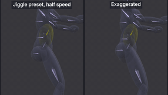
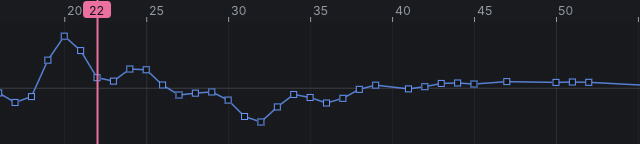

# Dynamics: soft-body jiggle

An advanced tutorial, the third of four on [[Dynamics]]: soft parts of the body, the belly, the chest and the buttocks,
that bounce and settle when the body lands. It explains which Second Life bones carry soft-body motion and why, what the
simulation does to them, how to keep the result subtle or push it further, and what reaches Second Life. It assumes
[[Dynamics: tails, ears and hair]].

> Related articles: [[Dynamics]], [[Skeleton]], [[Mesh bodies]], [[Export to Second Life]]

## What you will make

*The belly volume at a landing, half speed: the **Jiggle** preset (left) and an exaggerated setting (right).*

| | Start | Finished |
|---|---|---|
| Jiggle on a landing | `dynamics-jump-start.vat` | `dynamics-jiggle.vat` |

## How soft-body motion works in Second Life

### The bones that carry it: collision volumes

Second Life's skeleton has 26 *collision volumes* besides its bones: ellipsoids attached to the bones, first made for
collisions and later used to shape bodies. The ones that carry soft-body motion are:

| Volume | Attached to | Covers |
|---|---|---|
| `BELLY` | `mTorso` | the belly |
| `LEFT_PEC`, `RIGHT_PEC` | `mChest` | the left and right chest |
| `BUTT` | `mPelvis` | the buttocks |
| `LEFT_HANDLE`, `RIGHT_HANDLE` | `mTorso` | the sides of the waist |

Show them with **View → Bones → Show Collision Volumes**; select one in the **Bones** list (they are listed under the bone
they are attached to) or click it in the view.

### Why they move a body

Mesh bodies are *rigged* to the skeleton: each vertex of the skin follows one or more bones, with weights. Most mesh
bodies ("fitted mesh") also weight the skin of the belly, chest and buttocks to these volumes. Move the volume and that
skin moves with it; the rest of the body stays where its bones put it. That is what Second Life's own avatar physics
does, and what a jiggle animation does with keys.

> **Note:** **The Linden body is not rigged to the volumes.** The default bodies in VATs (and the system body in
> Second Life) do not move when a volume moves. In VATs you see the jiggle on the volumes themselves; on a mesh body
> weighted to them, the skin moves. Mesh bodies differ in which volumes they use and how strongly, so test on the body
> you made the animation for.

### What the simulation does

A collision volume is one point, not a chain. VATs follows the volume's centre: every 1/120 s it keeps moving the way it
was moving, **Damping** takes out part of its speed relative to the body, **Stiffness** pulls it back towards where the
body puts it, and **Gravity** (if any) pulls it down. The result is a spring: when the body stops suddenly, the soft part
carries on, is pulled back, overshoots, and settles.

The motion is baked as *position keys* on the volume: how far its centre is from its place on the body, frame by frame.
There are no rotation or scale keys; Second Life animations cannot scale a bone.

The **Jiggle** preset: **Stiffness** 0.12, **Damping** 0.08, **Drag** 0, **Gravity** 0, **Radius** 0, and no **Bones**
setting (a volume is always one point).

### What drives it

Only the body's motion. A volume jiggles when the bone it is attached to changes speed: a landing, a stop at the end of
a jump, a bounce, the heel strikes of a run. A smooth walk hardly moves it; a sharp landing does. Pick a base motion with
a clear stop.

## Usage

### 1. Open the landing

[Open the example](example:dynamics-jump-start.vat): a hop in place, 72 frames at 30 frames per second, not looping,
priority 4.

| Frames | Phase |
|---|---|
| 0–6 | Standing |
| 6–16 | Crouch: the hips drop 13 cm and sit back, the torso leans forward, the arms swing back |
| 16–20 | Push off: the legs straighten, the heels lift, the arms swing forward and up |
| 20–30 | In the air, a third of a second, the hips 13 cm higher at the top |
| 30 | The toes touch down |
| 30–38 | Landing: the heels come down and the knees bend deep to absorb it, the hips drop 16 cm |
| 38–56 | Back up to standing |

Press **3** for the right view and play. Then drag the playhead slowly across frames 28 to 38 in the timeline: the hips
fall fastest at 30 and stop within 8 frames. That sudden stop is what the soft parts react to.

### 2. Add the jiggle chains

1. Choose **View → Bones → Show Collision Volumes**. Faint rounded shapes show through the body: one on the belly, one on each
   breast, one on the buttocks, and others over the limbs.
2. Choose **Tools → Dynamics...**. It opens over the view: drag it aside by its title so the torso shows.
3. Press **1** (**View → Camera → Front**), point at the belly and scroll up a few notches to zoom in on the torso, and press
   **Q** for the Select tool, so no gizmo covers the body. Click the belly a little to one side of the spine: the round
   volume there turns yellow, and the status bar and **Properties → Bone** say **BELLY**.
4. In the **Dynamics** window, press **Add Chain from Selected Bone**. The list shows `BELLY` (no `+N`: a volume is one
   point) and the settings read the **Jiggle** preset. There is no **Bones** slider.
5. Click the avatar's right breast (on your left) and press **Add Chain from Selected Bone**, then the left breast and
   add it too: `RIGHT_PEC` and `LEFT_PEC`.
6. Press **Ctrl+1** (**View → Camera → Back**), click the volume over the buttocks, between the hips, and add it: `BUTT`.

If a click selects the wrong thing (a spine bone, a volume behind), check the name on the status bar and click again a
little to one side; clicking the name in the **Bones** list, under the bone the volume hangs from, works too.

Play. At the landing each volume drops a little below its place and comes back.

### 3. Subtle or exaggerated

The **Jiggle** preset is subtle: the belly drops about 2 cm just after touchdown and is back within 6 frames. That
reads as weight without drawing the eye.

To see the difference, click `BELLY` in the **Dynamics** list and drag **Stiffness** left to about a third of where it
is (about `0.04`), then drag **Damping** left to about a third of its value too (about `0.03`). The knobs move in
small steps; within a hundredth either way is close enough. Play again: now the belly drops about twice as far,
swings up past its place, down again, and bounces three times before it settles, some 20 frames after the landing.

| Look | Stiffness | Damping | What it does at this landing |
|---|---|---|---|
| Subtle (the preset) | 0.12 | 0.08 | drops about 2 cm, back in 6 frames |
| Soft | 0.06 | 0.06 | drops a little more, then a second, smaller bounce |
| Exaggerated, cartoon | 0.04 | 0.03 | drops about 4 cm, bounces three times |

- **Stiffness** sets how slowly the part comes back: lower is softer and slower, and lets it travel a little further.
- **Damping** sets how many times it bounces, and with low stiffness, how far: the exaggerated row owes most of its
  travel to its low damping.
- Leave **Gravity** at 0. On a volume it does not add weight to the bounce; it only lowers the part a few millimetres
  for the whole animation.
- Keep the chest and buttocks at the same or lower values than the belly: all of them jiggling at once, strongly, looks
  like a cartoon.

To type a recipe's exact values, double-click a slider. Put the preset back (press **Jiggle**) before you bake, or keep
your own values.

### 4. Bake and scrub the landing

1. Press **Bake All**. The status bar says `Baked 4 chains to keys`.
2. Click `BELLY` in the **Dynamics** list to select it and close the window. Press **3** (**View → Camera → Right**).
3. In the Graph's channel list, click **Translate Z** to show it alone, then press the Graph's **Frame All** button
   (the first after the drop-down). The curve looks flat: its values are metres, a few hundredths at most. Hold
   **Shift** and turn the wheel up over the graph to stretch the values, and **Alt+drag** up or down to bring the curve
   back into view, until the bumps show.
4. Drag the playhead slowly through the landing, from about frame 25 to 45, in the Graph's ruler or the timeline.
   The curve dips just after the toes touch down at 30, is lowest near 32 and is back on its line by about 38; in the
   view, the belly volume sinks and comes back. The bump before, around 20, is the push-off.

*Scrubbing the baked landing: the dip in **Translate Z** is the belly's bounce.*

> **Check:** stop on frame 32: **Offset (m)** in **Properties → Bone** reads about `-0.021` in its third box (Z), and
> within a millimetre of 0 again at frame 38.

### 5. What reaches Second Life

- The four volumes are written to the `.anim` with position keys. Second Life takes position keys on the collision
  volumes as on any bone, and a body rigged to them moves.
- A jiggle keeps a key on nearly every frame around the landing. Here the four volumes add about a quarter to the file
  (about 1,900 of 8,100 bytes). Long dances with jiggle on every beat grow fast; see
  [[Dynamics: editing, re-baking and export]].
- **Animation Check** has no finding here. Position keys on the hips or legs would change the avatar's height (the
  **Hip and leg position keys** rule), but the volumes are not bones of the leg: their keys move only the skin rigged
  to them.

## Check your result

[Open the example](example:dynamics-jiggle.vat): the hop with the four volumes baked at the **Jiggle** preset. Its
**Translate Z** curve on `BELLY` is the one to compare with yours. [Show the target](target:dynamics-jiggle.vat): the
[[Target ghost]] draws each keyed volume as a small green ring; scrub frames 25 to 45 and yours should bounce with it.

- The **Dynamics** list shows `BELLY`, `RIGHT_PEC`, `LEFT_PEC` and `BUTT`, each `(baked)`.
- Scrubbing frames 25 to 45 in the right view: each volume sinks a little just after touchdown and settles by about
  frame 38, with no second bounce you can see at the preset.
- The **Check** badge is not shown.

## Tips and tricks

- A run gives a small jiggle on every heel strike; the same values as here, or softer, suit it.
- Use one chain on `BELLY` alone for a subtle breath or a laugh driven by the torso's keys.
- For motion you want exactly (a deliberate bounce), key the volume's position by hand with **Animate Position** in
  **Properties → Bone**, and skip the simulation.

## Troubleshooting

### Nothing moves on the body

The Linden body is not rigged to the collision volumes; show them with **View → Bones → Show Collision Volumes** to see the
motion, and test on a mesh body rigged to them.

### The part sits lower for the whole animation

**Gravity** is above 0. Set it to 0 and re-bake.

### The jiggle is too small to see in the view

It is centimetres. Look at the volume's **Translate Z** curve in the Graph (step 4), or lower **Stiffness**.

### A click on the belly selects a spine bone

The spine's bones run through the middle of the belly volume. Click a little to the side of the spine, still inside the
volume, or click **BELLY** in the **Bones** list, under `mTorso`.

## See also

- Previous: [[Dynamics: wings]]
- Next: [[Dynamics: editing, re-baking and export]]
- [[Dynamics]]
- [[Mesh bodies]]

Category: Getting started
Order: 25
