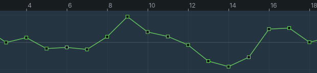
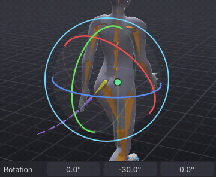
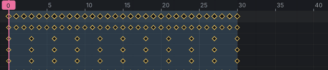
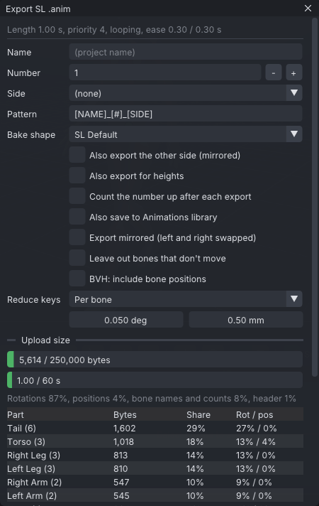

# Dynamics: editing, re-baking and export

An advanced tutorial, the last of four on [[Dynamics]]: what to do with a chain after the first bake. You drag a key of
a baked curve in the Graph, swing a tail wag with the Rotate tool under the simulation so the chain adds overlap to it,
stretch the walk in the dope sheet and re-bake, and export: the priority, what the baked keys cost, **Fit to 250 KB**
and the **Animation Check**. It assumes [[Dynamics: tails, ears and hair]].

> Related articles: [[Dynamics]], [[Graph editor]], [[Dope sheet]], [[Time editing]], [[Export to Second Life]], [[Animation check]]

| | Start | Finished |
|---|---|---|
| Keys under dynamics, export | `dynamics-walk-tail.vat` | `dynamics-walk-wag.vat` |

## How a bake keeps your keys

A chain remembers the keys its bones had before the first bake. From then on:

| Button | Starts from | Result |
|---|---|---|
| **Bake** / **Re-bake** | the keys before the first bake, and the body as it is now | new baked keys; anything you changed on the chain's bones since is lost |
| **Unbake** | | the keys before the first bake come back; the baked keys go |
| **Remove** | | as **Unbake**, and the chain is deleted |

So there are two kinds of edit, and they belong in different places:

- **Hand edits to the baked result** (nudging the tail tip at one frame): after the last bake. A re-bake throws them away.
- **Keys the simulation should follow** (a wag, a curl, a tail held higher): on the unbaked chain. Unbake, key, bake.

## Usage

### 1. Drag a baked key in the Graph

[Open the example](example:dynamics-walk-tail.vat): the walk from [[Dynamics: tails, ears and hair]], its tail baked.

1. Click the **Picker** tab, then **Extras** at the top and **Tail** in the canvas's bottom-left corner. The tail runs
   from the hips to the left, one dot per bone. Click the last dot, the tip (its tooltip says **Tail 6**). The tail's
   bones appear in the view and the Graph shows the tip's curves.
2. In the Graph's channel list, click **Rotate Y** to show that curve alone. It is dense: a key every frame or two,
   joined by straight lines.
3. Click the key at frame 8 (it turns yellow) and drag it up, level with the peak beside it. The curve bends up
   around frame 8 and nowhere else; play, and the tip flicks up for a moment at that point in the stride.

*A baked curve is an ordinary curve: one key dragged up at frame 8.*

Baking writes a key wherever the motion needs one to stay within 0.1°, at least one every two seconds, and joins them
with **Linear** tangents. Move, delete or add keys as on any curve (see [[Graph editor]]). To make it easier to edit, run
**Edit → Simplify Curves...** on it first (see [[Dynamics: tails, ears and hair#7. Clean up after baking]]).

Press **Ctrl+Z**: the next steps re-bake, which would throw that edit away.

### 2. Swing a wag under the simulation

A tail that only follows the hips looks passive. A wag is acting: you key it on the tail's first bone. The chain then
adds the follow-through, so the tip trails the wag.

1. Choose **Tools → Dynamics...**, click `mTail1 +5  (baked)` and press **Unbake**. The tail drops back into its keyed
   shape, hanging down behind the hips, and `mTail1` is selected (clicking a chain selects its first bone). Close the
   window, or drag it aside.
2. Press **Ctrl+1** (**View → Camera → Back**), point at the tail and press **F** (**Frame Selected**), then **Alt+drag** down a
   little so you look at the hips from behind and slightly above.
3. Press **E** for the Rotate tool, then press **O** until the button beside **Scale** on the timeline bar reads
   **Gimbal**. In **Gimbal** each ring turns exactly one rotation channel, so the wag stays a side-to-side swing.
4. Click frame **0** in the timeline's ruler. Drag the blue ring (it lies flat around the base of the tail) a short
   way sideways: the tail swings out to one side. Stop at a small swing, about an eighth of a turn or a little less;
   the angle shows beside the gizmo while you drag. The frame is keyed.
5. Click frame **15** in the ruler and drag the blue ring the other way, so the tail swings as far to the other side.
6. Click frame **0** again, point at the view and press **Ctrl+C** (**Copy Pose**). Click frame **30** and press
   **Ctrl+V** (**Paste Pose**): the last frame repeats the first, so the loop closes without a jump.
7. Play with the chain unbaked: the base of the tail swings from side to side once a cycle, and the rest of the tail
   follows it, a little later at each bone.
8. Open **Tools → Dynamics...** again and press **Bake**. The status bar says `Baked mTail1 to keys`.

*Frame 0: a short drag on the blue ring swings the base of the tail to one side.*

[Show the target](target:dynamics-walk-wag.vat) to see the finished wag as a green ghost over your avatar. The tail
has no mesh on the default body, so the ghost's tail is its thin green bone lines (**Show Tail Bones** is on): at
frames 0 and 15 your tail should lie close to them, and with `mTail1` selected the status bar's **Target** chip turns
green under 5°. [Open the example](example:dynamics-walk-wag.vat) to play it.

> **Check:** **Properties → Bone** reads about `12°` in the third **Rotation** box at frame 0 and about `-12°` at frame
> 15; anything from 8° to 16° either way wags the same.

Once a cycle is slow and lazy; for an eager wag, key it twice as often (sides at 0, 7, 15, 22 and 30).

> **Note:** **Why Gimbal.** The tail's first bone points down and back, so its own axes (**Local**) are tilted against
> the channels the file stores. A **Local** ring drag there changes all three **Rotation** boxes at once and the wag
> twists as it swings.

> **Note:** **Why the chain still starts at mTail1.** A chain simulates its first bone too, pulled towards its keys, so
> the base follows the wag with a slight softness. To keep the base exactly on its keys, **Remove** the chain and add
> one from `mTail2` instead (**Bones** 5): `mTail1` then plays the wag as keyed and drives the rest.

### 3. Stretch the walk and re-bake

The bake follows the body it was baked from. Change the body (the hips, the timing, the length) and the baked tail no
longer matches; **Re-bake** simulates again against the new body.

Try it by slowing the walk down from 30 frames to 40:

1. In the **Dynamics** window, press **Unbake**.
2. Press **Esc** so no bone is selected, click the **Dope Sheet** tab under the view and set its drop-down to **All
   animated bones**. Scroll the wheel over the dope sheet to zoom out until frame 40 shows.
3. Drag a box across the **Summary** row, starting in the empty space left of frame 0 and ending right of frame 30:
   every key turns yellow and a handle appears at each end of the selection.
4. Drag the right-hand handle from 30 to 40. The keys spread out, landing on whole frames (**Snap frames** is ticked).
5. The keys ran from 0 to the last frame, so the animation's length went with them: **Last frame** and the **Loop
   out** flag (the small blue triangle at the right end of the timeline) are now at 40 too.
6. Press **Bake**. The wag, now at 0, 20 and 40, drives the new bake; play to see the slower walk and its tail.

*Scaling the keys in the dope sheet: one drag, one undo step (**Scale Keys**).*

Press **Ctrl+Z** three times (the bake, the scale and the unbake) to go back to the 30-frame walk.

> **Tip:** **Edit → Time → Stretch Range...** does steps 3 to 5 in one go when you know the number of frames: it moves
> the keys, the loop and the last frame together, as the scale handle does. It can leave keys between whole frames; the
> [[Animation check]] then offers **Snap Keys to Whole Frames**.

> **Warning:** Unbake before any time edit. The keys a chain keeps from before its first bake are not moved by the dope
> sheet, the **Edit → Time** commands or **Tools → Loop Tools → Start Cycle at Frame N**: a **Re-bake** after them
> puts the wag back at frames 0, 15 and 30 of a 40-frame loop.

### 4. Set the priority

In **Properties → Animation**, **Priority** is `4`. A walk keys the whole body, and the [[Animation check]] warns when
the hips and legs of a whole-body animation play below 4, because a walking or standing AO would win them. For an AO
walk that replaces the default walk, 4 is right.

The tail is part of this walk. A tail swing baked on this walk only fits this walk's hips, so it goes out with it, at the
same priority. A tail-only animation meant to play over *any* walk, at a lower priority, is a keyed or idle-style sway,
not a bake: see [[Idle layer]].

### 5. Read what the baked keys cost

Press **Ctrl+E** (**File → Export SL .anim...**). The top line reads `Length 1.00 s, priority 4, looping, ease 0.30 /
0.30 s`.

*The walk with the wag baked: the six tail bones are the biggest part of the file.*

- The **Upload size** bar is short: about 5,600 of 250,000 bytes. The same walk with the tail unbaked is about 4,200
  bytes, so the bake costs about a third.
- **Tail (6)** is the most expensive part, near 30% of the file. A baked bone keeps a key on nearly every frame.

**Reduce keys** thins the file: keys the viewer's interpolation reproduces within the tolerance are left out. Baked
curves thin well: drag **Rotation** from `0.050` towards `0.5` deg and watch the bar shorten (to about 5,000 bytes).
See what a tolerance costs in motion with **View → Preview as SL Plays It** before you export (see
[[Preview as SL plays it]]).

**Fit to 250 KB** raises **Reduce keys** step by step until the file fits. It appears only while the file is over the
limit or longer than 60 seconds, so it is not offered here. It is the tool for a long dance with baked dynamics on
many bones: see [[Export to Second Life#Check the upload size]].

> **Tip:** If a file is too big, bake fewer bones before you raise the tolerance: **Bones** 4 on a tail whose last two
> bones move little, one jiggle volume instead of four.

### 6. Run the Animation Check and export

Choose **Tools → Animation Check...**. It says `No problems found.`: the baked tail adds no finding, and the status bar
shows no **Check** badge. Things it catches on baked dynamics:

- `turns ... degrees between two kept keys` on a chain's last bones: the tip whips round too fast. Raise **Damping**
  and re-bake.
- `The loop jumps where it repeats`: the loop points changed after baking, or the last frame's pose does not match the
  first (a wag keyed by hand at 30 instead of pasted). Re-bake, or paste the first frame's pose again.
- `The file is ... bytes; SL refuses 250000 bytes or more`: see step 5.

Then press **Export SL .anim** in the export window. See [[Export to Second Life]].

## Check your result

[Open the example](example:dynamics-walk-wag.vat) and [Show the target](target:dynamics-walk-wag.vat) over your own
walk to compare.

- Played from behind, the base of the tail swings from side to side once a cycle and each bone after it follows a
  little later, the tip last.
- No **Check** badge on the status bar: no loop jump, no other finding.
- **Properties → Animation**: 30 frames, **Loop** on, priority 4.

## Troubleshooting

### A ring drag changes all three Rotation boxes

The gizmo is on **Local** or **World** axes. Press **O** until the timeline bar reads **Gimbal**, undo, and drag again.

### Clicking the timeline moved a blue triangle instead of the playhead

The loop flags sit at the foot of the timeline, at the loop's ends. Click or drag in the ruler, where the frame
numbers are, to move the playhead.

### My hand edit disappeared

A **Bake**, **Re-bake** or **Unbake** after it. Hand-edit the baked result last.

### After a time edit the tail is out of step

The chain was baked during the time edit. **Unbake**, undo the time edit, then do it again with the chain unbaked,
and bake.

### Fit to 250 KB is not there

The file is under 250,000 bytes and 60 seconds: there is nothing to fit.

## See also

- Previous: [[Dynamics: soft-body jiggle]]
- Next: [[Tutorials]]
- [[Dynamics]]
- [[Export to Second Life]]

Category: Getting started
Order: 26
