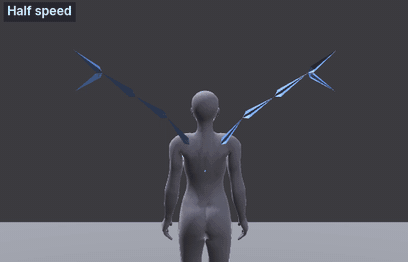
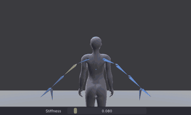
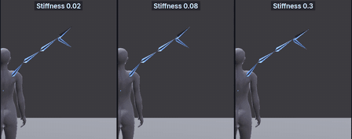
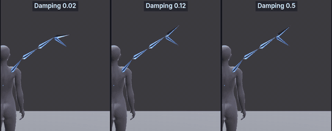
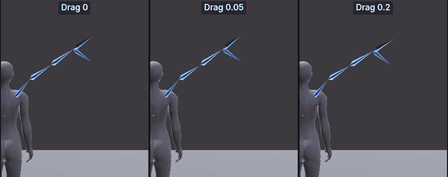
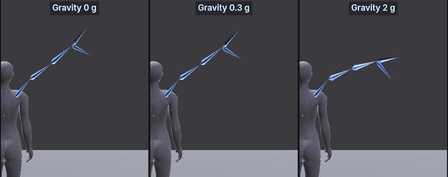

# Dynamics: wings

An advanced tutorial, the second of four on [[Dynamics]]: a wing beat keyed at the wing roots only, with the rest of
each wing simulated, so the tips lag the roots on every stroke. It compares the settings on wings, gives recipes for big
and small wings, and explains what the wing bones can and cannot do. It assumes [[Dynamics: tails, ears and hair]].

> Related articles: [[Dynamics]], [[Dynamics: tails, ears and hair]], [[Skeleton]], [[Overlap]]

## What you will make

*One wing beat at half speed. Only the wing roots are keyed; the bend in each wing is the simulation.*

| | Start | Finished |
|---|---|---|
| Wings | `dynamics-wings-start.vat` | `dynamics-wings.vat` |
| Recipes | | `dynamics-wings-big.vat`, `dynamics-wings-small.vat` |

## The wing bones

Each Bento wing is `mWing1` (the root, on the upper back), `mWing2`, `mWing3` and `mWing4` (the tip), with a fifth bone,
`mWing4Fan`, beside the tip, all under `mWingsRoot` on the chest. At rest the wings point back and out, level with
the shoulders.

A wing beat reads well when the wing bends like a whip: the root leads, each joint follows a little later, and the
tip arrives last and flicks past at the end of the stroke. That is overlap, and a chain from `mWing2` gives it: you
key the root's beat on `mWing1`, and the simulation bends the rest.

> **Note:** A chain follows the first child of each bone, and takes the bones that start at the same point as a
> branch: a chain from `mWing2Left` runs `mWing2Left`, `mWing3Left`, `mWing4Left`, and `mWing4FanLeft` beside the tip,
> which swings with its own lag. A wing mesh rigged to the fan bone bends its outer feathers too.

## Usage

### 1. Open the wing beat

[Open the example](example:dynamics-wings-start.vat): the avatar stands and both wings beat once a second, 30 frames
at 30 frames per second, looping, priority 4. Only `mWing1Left` and `mWing1Right` are keyed: up 30° at frame 0, a fast
downstroke to 35° down at frame 12 (the power stroke, 12 frames), and a slower upstroke back up (18 frames). Each wing
turns as one rigid board. The chest lifts a little on each downstroke, three frames after it, as the push lifts the
body.

Press **Ctrl+1** for the back view and play. The wing bones are hidden, so only the chest lifts: in the **Picker**,
click **Extras**, then **Wings** in the canvas's bottom-left corner, and click any wing dot. The wing bones appear in
the view (**View → Bones → Show Wing Bones** does the same). Play again: the wings flap, stiff as boards.

> **Note:** **Why a fast downstroke.** The downstroke pushes air and does the work; the upstroke only resets the wing.
> Uneven timing, fast down and slow up, is what makes a beat look powered rather than mechanical.

### 2. Add a chain to each wing

1. The **Picker**'s **Wings** view shows the wings from behind, as the view does: the avatar's left wing is on the
   left. Each wing is a row of dots from the shoulder blade out to the tip. Click the second dot out from the body on
   the left wing; its tooltip says **Left Wing 2** (`mWing2Left`).
2. Choose **Tools → Dynamics...** and drag the window by its title bar off the view, over **Properties**.
3. Press **Add Chain from Selected Bone**. The list shows `mWing2Left +2`, with **Bones** 3 and the **Tail** preset
   (the preset for any bone without `Ear` in its name): **Stiffness** 0.080, **Damping** 0.120, **Drag** 0.030,
   **Gravity** 0.30 g, **Radius** 0.030 m.
4. A wing pushes against more air than a tail. Drag the **Drag** knob a few pixels to the right, until it reads about
   `0.05`, and leave the rest.
5. Click **Swap Sides** (the two arrows in the Picker's bottom-right corner): the selection moves to **Right Wing 2**.
   Add a chain from it and drag its **Drag** to about `0.05` too.

Start the chain at `mWing2`, not `mWing1`: `mWing1` carries the beat you keyed, and a chain on it would simulate that
too, softening the whole stroke.

Press **Q** (the Select tool) so the rotate rings are out of the way, and play. On the way down the tips trail above
the rest of the wing; at the bottom they carry on past it and come back; on the way up they trail below.

### 3. Compare the settings

With two chains you have a built-in comparison: change one wing and keep the other as it is. Click `mWing2Left +2` in
the list, play, and drag its **Stiffness** knob a few pixels to the left, to about `0.03`. The left wing now bends
further and its tip trails a long way behind the stroke, while the right wing keeps the preset's crisp flick. Press
**Ctrl+Z** to put it back, and try the other sliders the same way.

*The left wing's **Stiffness** dragged down while it plays; the right wing is the reference.*

The comparisons below show one wing from behind, the beat played at half speed, baked with one setting changed and the others
at the values of step 2.

*Stiffness 0.02, 0.08 and 0.3.*

**Stiffness:** low makes a limp wing that bends far and trails; high a stiff wing that barely bends.

*Damping 0.02, 0.12 and 0.5.*

**Damping:** low lets the tip flick and wobble after each stroke; high gives a smooth bend with no flick back.

*Drag 0, 0.05 and 0.2.*

**Drag:** feathers push against the air. More drag makes the outer wing lag behind the whole stroke, which reads as a
big, broad wing.

*Gravity 0, 0.3 and 2 g, on a softer wing (**Stiffness** 0.03).*

**Gravity:** weight. It shows on soft wings; on a stiff wing it barely changes anything.

**Radius** does nothing here: the wings never come near a collision volume.

### 4. Recipes

| Wing | Stiffness | Damping | Drag | Gravity | Radius | Example |
|---|---|---|---|---|---|---|
| Big, feathered (an angel, a bird of prey) | 0.04 | 0.10 | 0.08 | 0.6 g | 0.03 m | `dynamics-wings-big.vat` |
| Medium (this tutorial) | 0.08 | 0.12 | 0.05 | 0.3 g | 0.03 m | `dynamics-wings.vat` |
| Small, fluttering (a fairy, an insect) | 0.20 | 0.08 | 0.02 | 0.1 g | 0.02 m | `dynamics-wings-small.vat` |

[Open the example](example:dynamics-wings-big.vat): the big wings, baked: they bend deeply and the tips trail through
each stroke.
[Open the example](example:dynamics-wings-small.vat): the small wings, baked: they stay nearly straight and snap into
place.

> **Tip:** A small wing also beats faster. The recipes use the same once-a-second beat so they compare; for a real
> flutter, key a beat of 6 to 10 frames on `mWing1` and keep the small wing's values.

### 5. Bake

Press **Bake All**. The status bar says `Baked 2 chains to keys`, and both chains read `(baked)`. Stop, and drag the
playhead slowly through the downstroke, from frame 0 to 12: the wings keep their bend without the preview, the tips a
few frames behind the roots.

## Check your result

Play your baked beat from behind and from the side (**3**), and look for:

- on the downstroke the tips trail above the rest of the wing, and at the bottom they flick past it once and come back;
- on the upstroke they trail below;
- the roots move exactly as keyed: the bend starts at the second bone;
- the status bar shows no **Check**.

[Open the example](example:dynamics-wings.vat) to compare: the beat with both wing chains baked at the values of step 2.

> **Check:** the example's chains read **Stiffness** 0.08, **Damping** 0.12, **Drag** 0.05, **Gravity** 0.3 g,
> **Radius** 0.03 m. A **Drag** anywhere from 0.04 to 0.06 looks the same.

## Tips and tricks

- Watch the tips from behind and from the side. From behind you see the bend; from the side you see whether the tip
  lags in time.
- To fold the wings at rest, key the fold on `mWing2` and `mWing3` before baking. The chain follows the keyed shape and
  adds the lag on top of it.
- A wing that must hit a pose exactly (a wing wrapped round the body) is acting, not follow-through: key it, and leave
  dynamics for the flight.

## Troubleshooting

### The whole wing is soft, not just the tip

The chain starts at `mWing1`. **Remove** it and add one from `mWing2`.

### The Picker selected Left Wing 1, not Left Wing 2

The dots of neighbouring wing bones are close together. Click the same spot again: each click takes the next bone
under the pointer, and the tooltip and the name under the canvas say which one you have.

### The outer feathers don't bend

They are rigged to `mWing4Fan`, which the chain takes only when it reaches the tip: set **Bones** to the whole wing
(3 from `mWing2`) and re-bake.

## See also

- Previous: [[Dynamics: tails, ears and hair]]
- Next: [[Dynamics: soft-body jiggle]]
- [[Dynamics]]

Category: Getting started
Order: 24
