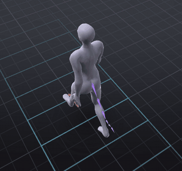
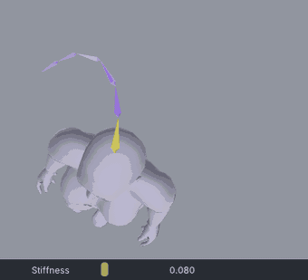
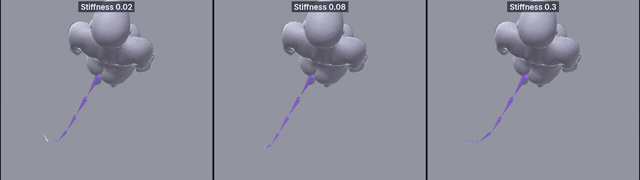
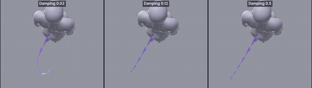
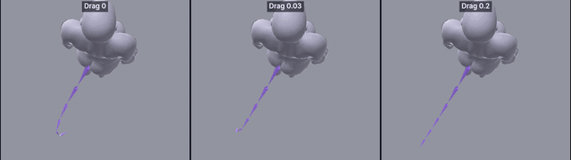
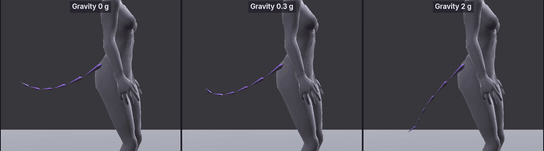
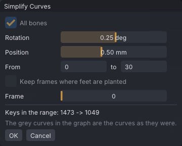
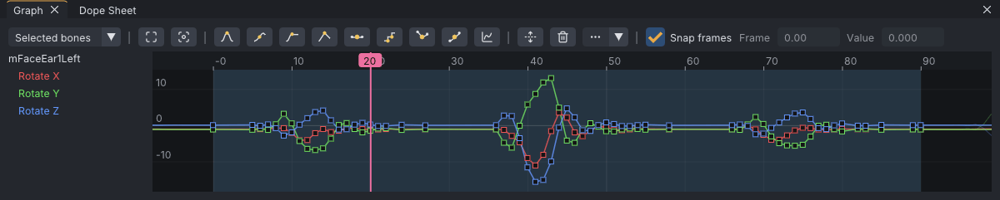

# Dynamics: tails, ears and hair

An advanced tutorial, the first of four on [[Dynamics]]: parts of the body that swing, bounce and settle on their own,
simulated by VATs and baked to keys. This part explains what dynamics is and what Second Life can play, puts a tail on
a walk, shows what every setting does with side-by-side comparisons, and ends with ears on a head turn. It assumes the
Beginner tutorials: you can select a bone, play the timeline and read the Graph panel.

> Related articles: [[Dynamics]], [[Overlap]], [[Loop tools]], [[Graph editor]], [[Export to Second Life]]

The series:

1. **Dynamics: tails, ears and hair** (this page): what dynamics is, a tail on a walk, the settings compared, ears.
2. [[Dynamics: wings]]: wing tips lagging the roots on a flap.
3. [[Dynamics: soft-body jiggle]]: the belly, chest and buttocks on a jump landing.
4. [[Dynamics: editing, re-baking and export]]: hand edits, re-baking, keyed overlap under the simulation, export.

## What you will make

*The finished tail on a one-second walk, on the treadmill, baked to keys. The tip moves last: that delay is the point.*

| Part | Start | Finished |
|---|---|---|
| A tail on a walk | `dynamics-walk-start.vat` | `dynamics-walk-tail.vat` |
| Trying the settings | `dynamics-swish.vat` | `dynamics-tail-heavy.vat`, `dynamics-tail-whippy.vat` |
| Ears on a head turn | `dynamics-ears-start.vat` | `dynamics-ears.vat` |

## What dynamics is

### Secondary motion

When a body moves, the parts that are only attached to it, a tail, ears, hair, soft tissue, do not move by themselves.
They are dragged along. They start late, overshoot when the body stops, swing back and settle. Animators call this
*secondary motion*, and name two parts of it:

- **Follow-through:** a loose part keeps going after the body stops, then settles.
- **Overlap:** the parts of a chain move at different times; each part starts a little after the one it hangs from, so
  the tip of a tail moves last.

You can key secondary motion by hand, frame by frame, and for acting (a tail that curls on purpose) you should. For
passive motion it is slow work and easy to get wrong. Dynamics simulates it instead: you animate the body, and VATs
works out how the loose parts follow.

### How VATs simulates a chain

A chain is a bone and the bones below it, for example `mTail1` to `mTail6`. VATs follows a point at the tip of each
bone (for a collision volume, its centre). 120 times a second, each point:

1. keeps moving the way it was moving;
2. loses part of that speed to **Drag**, and part of its speed *relative to the animation* to **Damping**;
3. is pulled a fraction of the way towards where the animation puts it: **Stiffness**;
4. falls a little: **Gravity**;
5. is put back at the bone's length from its parent, since a tail does not stretch, and pushed out of the body's
   collision volumes by **Radius**. No bone turns more than 720° a second faster than the animation turns it, and
   none bends further from its animated pose than **Bend limit** when that is set.

The bones are solved from the root out, and each bone is pulled towards where the animation would put it *relative to
its already-swinging parent*. The delays add up down the chain, so the tip lags most: overlap, for free.

The numbers are fractions per step, and there are 120 steps a second. **Stiffness** `0.08` closes 8% of the gap to the
animated pose every 1/120 s. Small numbers still act fast.

### What Second Life can play

Second Life plays keys, not physics. An `.anim` file holds rotations and positions at points in time, nothing more, so
VATs *bakes* the simulation: it samples the chain on every frame and writes the result as ordinary keys. What you see
after baking is what Second Life plays, on everyone's screen, the same every time.

That has costs:

- **Every baked bone is a track in the file.** The Bento skeleton has 6 tail bones, 4 wing bones and a fan bone per
  wing, 2 ear bones per ear, and collision volumes for soft parts. Bake only the bones your mesh uses.
- **Baked keys are dense.** A swing changes every frame, so a baked bone keeps many keys. Baking this walk's tail adds
  about 1,400 bytes to a 4,200-byte file. That is nothing against the 250,000-byte limit, but a long dance with
  a tail, wings and jiggle adds up; [[Dynamics: editing, re-baking and export]] shows how to trim it.
- **A keyed bone overrides the wearer's own.** While the animation plays, it owns every bone it keys, at its
  priority. A tail swing in a walk replaces whatever the wearer's tail HUD does with that tail. See
  [[Animation priority]].
- **Only rigged meshes move.** Tail, wing and ear bones move something only when the worn tail, wings or ears are
  rigged to those Bento bones. The Linden body has none of them: in VATs you see them as bones.

## Usage

### 1. Open the walk and check it

[Open the example](example:dynamics-walk-start.vat): the walk from [[Loop tools]], made to walk in place: two strides
in one second, 30 frames at 30 frames per second, looping, priority 4. An AO walk walks in place: Second Life moves the
avatar at its walking speed, 3.2 m/s, and the animation only moves the body. That speed is far faster than a person
walks, so the stride is long and quick. The tail bones are keyed in a relaxed shape, down from the hips and curving
back up, and nothing else moves them yet.

Press **3** for the right view, choose **View → Treadmill → Show Treadmill** and press **Space**. Watch a planted foot:
from the moment the heel touches down in front, it slides backwards under the body, keeping pace with the treadmill's
lines, until it pushes off behind. That is a forward walk in place: the ground runs backwards under the feet. The hips
dip after each heel strike, rise over the planted foot and turn with the swinging leg; the chest turns against them
and the arms swing against the legs.

> **Note:** **Why start from good motion.** Dynamics only reacts to the body. A stiff or floaty walk gives a stiff or
> floaty tail; no setting fixes that. Finish the body first.

Press **Ctrl+S** and save the project as `tail-walk`: you come back to it in step 6.

### 2. Show the tail and add a chain

1. Click the **Picker** tab, then **Extras** at the top and **Tail** in the canvas's bottom-left corner. The tail is a
   dotted line of six dots out behind the figure, drawn hollow while the tail is hidden.
2. Click the dot where the tail meets the body. Its tooltip says **Tail 1** (`mTail1`). The dot turns the accent
   colour, and the tail appears in the view: six bones hanging from the back of the hips. Once it shows, a click on
   the tail's first bone in the view selects it too.
3. Choose **Tools → Dynamics...**. The window may open over the view: drag it by its title bar to the right, over
   **Properties**, so you can watch the tail.
4. Press **Add Chain from Selected Bone**.

The list shows `mTail1 +5`: the chain runs from `mTail1` through the five bones after it. It is selected, and the
settings below it read the **Tail** preset:

| Setting | Tail preset |
|---|---|
| **Bones** | 6 |
| **Stiffness** | 0.080 |
| **Damping** | 0.120 |
| **Drag** | 0.030 |
| **Gravity** | 0.30 g |
| **Radius** | 0.030 m |

> **Note:** The tail bones are hidden at first. A click on a hidden group's dot in the **Picker** shows the group;
> **View → Bones → Show Tail Bones** does the same, and only then does the **Bones** list list them.

### 3. Preview

**Preview while playing** is ticked. Press **Q** (the Select tool), so the rotate rings round the selected tail bone
are out of the way, and press **Space**: the tail swings behind the walk, a little later than the hips,
the tip last. Stop, then drag the playhead along the timeline: the tail snaps back to its keyed shape, because the
preview only runs while the clip plays.

### 4. See what each setting does

The walk moves the hips gently, which suits a tail but hides the differences between settings. To learn the settings,
use a test motion that starts and stops sharply.

[Open the example](example:dynamics-swish.vat) (save the walk first if asked): the hips swing 25° to one side in 8
frames and stop, hold, then swing back, over a two-second loop. The feet stay planted and the chest turns back
against the hips. It has the same **Tail** chain, not baked. Click `mTail1 +5` in the **Dynamics** window and press
**Space**. Keep it playing, and change one setting at a time by dragging its slider: the preview follows the new value
at once.

Try it on **Stiffness**, looking from above (**7**, **View → Camera → Top**), where the side-to-side swing shows best. Grab
the **Stiffness** knob and drag it a few pixels to the left, until it reads about `0.03`. The tail stops following the
hips closely: it trails further behind each swing, curls at the tip and takes longer to come back. Drag it back to
`0.080`, or press **Ctrl+Z**.

*Dragging **Stiffness** while the swish plays. The slider runs from 0 to 1, so the useful values sit in its first
third: move a few pixels at a time.*

> **Tip:** Drag anywhere on a slider: the value moves from where it is, so a click never changes it. To type an
> exact value, double-click the slider (or **Ctrl+click** it), type it and press **Enter**. Hold **Shift** while
> dragging to go faster, **Alt** to go slower.

The comparisons below are the swish, baked three times with one setting changed and the others at the **Tail**
preset, seen from above with the avatar facing up. Drag each slider yourself as you read, and watch for the same
change.

#### Stiffness: how hard the tail follows

*Stiffness 0.02, 0.08 (the preset) and 0.3.*

Low **Stiffness** gives a lazy, heavy tail that trails far behind and takes long to come back. High **Stiffness**
gives a tail that follows the hips closely, like a stiff brush. Most tails sit between 0.03 and 0.15.

> **Note:** Above about 0.2, raise **Damping** with it for a calm tail: at 0.3 with the preset's damping the tip
> overshoots and flicks at the end of each swing. It stays a tail: no bone turns more than 720° a second faster than
> the hips turn it, so even **Stiffness** 1 with no damping swings hard without flailing.

#### Damping: how quickly the swing calms down

*Damping 0.02, 0.12 (the preset) and 0.5.*

**Damping** takes energy out of the swing, not out of the following: it slows the tail's motion *relative to the
animation*. Low damping keeps the tail swinging and curling long after the body stops. High damping lets it follow
and stop with no swing back, like something moving through water.

#### Drag: air resistance

*Drag 0, 0.03 (the preset) and 0.2.*

**Drag** slows *all* the tail's motion, the following as well as the swing. A high drag makes the tail trail behind
every move, as a long, bushy or wet tail does. Unlike damping, drag also makes the tail lag behind a body that keeps
moving.

#### Gravity: weight

*Gravity 0, 0.3 and 2 g, on a softer tail (**Stiffness** 0.03), seen from the side.*

**Gravity** pulls the chain down, in multiples of Earth's gravity. Stiffness fights it, so gravity shows most on a
soft chain: 2 g lowers the tip of this tail by 34 cm at **Stiffness** 0.03, but by 12 cm at the preset's 0.08. Use it
for weight: a heavy tail droops and bounces; a light one keeps its shape.

#### Radius: keeping out of the body

**Radius** is the distance the chain keeps from the body's collision volumes (the ellipsoids **View → Show Collision
Volumes** draws). A point pushed into a volume by the swing is pushed back out to that distance.

There is no comparison here because none of these motions brings the tail into the body: the tail hangs behind the
buttocks and swings sideways. Radius matters when a swing drives a chain into the body, for example a tail
whipping forward between the legs. A volume that already holds the point's place in the keyed pose is ignored (the
ears start inside the head, for example), so a very large **Radius** can switch collision off for the parts
nearest the chain. Keep it at a few centimetres.

#### Bones: how much of the tail swings

**Bones** is how many bones down the chain are simulated, from the first. Set it to 3 and only `mTail1` to `mTail3`
swing; `mTail4` to `mTail6` keep their keys and ride on the end. Use it for a tail whose tip is keyed by hand.

### 5. Recipes

Starting points for common tails, and the values this tutorial uses for the walk:

| Tail | Stiffness | Damping | Drag | Gravity | Radius | Example |
|---|---|---|---|---|---|---|
| Heavy (a big cat, a dragon) | 0.03 | 0.12 | 0.05 | 1.5 g | 0.04 m | `dynamics-tail-heavy.vat` |
| Medium, on a walk | 0.05 | 0.20 | 0.03 | 0.5 g | 0.03 m | `dynamics-walk-tail.vat` |
| Light and whippy (a small animal) | 0.15 | 0.25 | 0.02 | 0.1 g | 0.02 m | `dynamics-tail-whippy.vat` |

[Open the example](example:dynamics-tail-heavy.vat): the heavy tail, baked: it droops, trails far behind and swings
slowly.
[Open the example](example:dynamics-tail-whippy.vat): the light, whippy tail, baked: it follows quickly and snaps into
place.
Each has its chain in the **Dynamics** window: click it to read the values, **Unbake** and drag the sliders to try
others.

> **Tip:** Change one setting at a time, and play the loop a few times after each change. Two settings that fight
> (high stiffness with high gravity, low damping with high drag) are hard to judge together.

### 6. Set the walk's values and bake

1. Open the walk you saved in step 1 (**File → Open Recent**). The chain is still there: chains are saved with the
   project.
2. Click `mTail1 +5` in the **Dynamics** window, press **3** for the side view and play. Leave it playing while you
   tune the tail by eye, one slider at a time (leave **Drag** and **Radius** as they are):
   - drag **Stiffness** a little to the left, until the tail stops following the hips like a brush and lags a beat
     behind them;
   - drag **Damping** to the right, until the tip stops whipping round on every step but still swings;
   - drag **Gravity** to the right, until the tail hangs a little lower and bounces with the hips twice a cycle.
3. Press **Bake**. The status bar says `Baked mTail1 to keys`, the list reads `mTail1 +5  (baked)`, and the button
   now reads **Re-bake**.

> **Check:** the finished walk uses **Stiffness** about `0.05`, **Damping** about `0.20` and **Gravity** about `0.5 g`.
> Anything close reads the same; double-click a slider to type a value if you want these exactly.

Stop, then drag the playhead slowly along the timeline: the tail keeps its swing without the preview, because the
motion is keys now. Click `mTail1 +5` again: the timeline shows a key on most frames.

> **Note:** **Why Damping 0.2.** This walk is brisk: the hips drop four times a second. With the softer tail
> at **Damping** 0.1, the tip whips round on every step, and after baking **Animation Check** lists
> `mTail6 turns 98 degrees between two kept keys`. More damping keeps the swing and calms the tip.

> **Note:** **Why baking loops cleanly.** With **Loop** on, VATs runs the simulation round the loop twice before it
> records, so the swing has settled into its rhythm and the last frame leads into the first. A tail simulated from a
> standing start would jump at the seam.

### 7. Clean up after baking

1. **The loop seam.** With **Loop** on, a red tick at **Loop out** on the timeline means a jump at the wrap (see
   [[Loop tools#Finding a seam]]). There is none: the bake looped cleanly. The status bar shows no **Check**
   badge: the [[Animation check]] finds nothing in the baked walk.
2. **Fewer keys, if you will edit them.** Press **Esc** to clear the selection, then choose **Edit → Simplify
   Curves...**. With nothing selected, **All bones** is ticked. The dialog reads `Keys in the range: 1473 -> 1049`. Press
   **OK**.

*Simplify Curves on the baked walk.*

Simplify turns the dense baked keys into curves with fewer keys you can move by hand. It does not make the upload
smaller: the export samples every frame again and keeps what its own **Reduce keys** tolerance needs (for this walk,
the file stays 5,614 bytes). Skip it unless you mean to edit the curves. **Re-bake** throws it away, since the
bake starts again from the keys the chain had before the first bake.

### 8. Ears on a head turn

[Open the example](example:dynamics-ears-start.vat): the avatar stands and looks left, holds, looks right, holds and
looks ahead again, over three seconds. Each turn takes 7 frames and dips the head 6° in the middle, so the head
travels on an arc rather than sliding round; the neck and chest follow a frame or two later.

1. In the **Picker**, click **Face**. Each ear has two dots just outside the face's outline: the lower one is the
   ear's root. The avatar faces you, so its left ear is on the right. Click the lower dot on the right; its tooltip
   says **Left Ear 1** (`mFaceEar1Left`). The face bones appear in the view: two short bones stand up at the sides of
   the head.
2. In the **Dynamics** window, press **Add Chain from Selected Bone**. The list shows `mFaceEar1Left +1` and the
   settings read the **Ears** preset: **Stiffness** 0.200, **Damping** 0.250, **Drag** 0.020, **Gravity** 0.10 g,
   **Radius** 0.010 m.
3. Make them long, soft ears: drag **Stiffness** left to about `0.1` (half of what it reads) and **Damping** left to
   about `0.15`.
4. Click **Swap Sides** (the two arrows in the Picker's bottom-right corner): the selection moves to **Right Ear 1**.
   Add a second chain and drag its sliders to the same values.
5. Press **Bake All** (it appears when there are two chains or more). The status bar says `Baked 2 chains to keys`.

*The left ear's rotation after baking. The head's turns end at frames 13, 43 and 74; the ear swings on for 6 to 8
frames after each one, then settles.*

Play from the front. At each turn the ears stay behind, swing past when the head stops, and settle. The ear bones are
short, 3 to 4 cm, so the Graph shows the motion better than the view: click **Left Ear 1** in the Picker again,
point at the Graph and press **A** (**Frame All**). Then drag the playhead across the end of a turn and watch the
ear's curves swing on after the head has stopped.

> **Note:** **Ears need rigged ears.** The Linden head is not rigged to the Bento ear bones, so its ears do not move.
> Animal ears and elf ears made for Bento heads are; on them the swing shows.

> **Note:** **Hair.** Second Life has no hair bones. A rigged hair can only swing on the bones its maker rigged it to,
> which can be the head, neck and chest (then it cannot swing on its own) or spare Bento bones such as the ears, the
> tail or the wings. Check the hair's listing or ask its maker; then add a chain on those bones as here.

## Check your result

Play your baked walk from behind and above, and look for:

- the tail hangs down from the hips and curves back up, a little lower than its keyed shape;
- it sways from side to side behind the hips, a moment after them, the tip last;
- the tip swings and settles; it never whips round or folds back on itself;
- the status bar shows no **Check** badge: the Animation Check finds nothing.

[Open the example](example:dynamics-walk-tail.vat) to compare with the finished walk: your tail should swing about as
far and as late as its tail, not match it to the degree.

> **Check:** the example's chain reads **Stiffness** 0.05, **Damping** 0.20, **Drag** 0.03, **Gravity** 0.5 g,
> **Radius** 0.03 m. Values near these give the same look.

[Open the example](example:dynamics-ears.vat) for the head turn with both ears baked: in the Graph, each ear swings
about 10° each way for 6 to 8 frames after every turn, then settles.

## Tips and tricks

- Test settings on a sharp start and stop, like the swish; tune the real animation afterwards.
- For a tail that acts (a curl, a flick), key those moves on `mTail1` and let the chain add follow-through on top:
  see [[Dynamics: editing, re-baking and export]].
- **Overlap** in the preset row suits follow-through on a limb or the spine, with little swing back and no droop.
  For a delay on keys you set yourself, **Tools → Overlap...** does it without simulation (see [[Overlap]]).

## Troubleshooting

### The tail is not in the view

The tail bones are hidden. Click a tail dot in **Picker → Extras → Tail**, or choose **View → Bones → Show Tail Bones**.
Typing `mTail1` in the **Bones** list's filter also finds it, dimmed while the tail is hidden; clicking it selects it
and shows the tail.

### A slider moves past the value I want

A drag across the whole slider and half as far again covers its range, and **Drag** spreads its small values (0.01
to 0.1) over most of the slider. For finer steps hold **Alt** while you drag; or double-click the slider and type.

### The tail tip whips round or folds back

**Stiffness** is high for the **Damping**, or **Damping** is very low. Raise **Damping** until **Animation Check** no
longer lists `turns ... degrees between two kept keys` on the tail. There are no bend limits: a chain can fold as far
as the simulation pushes it.

### The tail doesn't move in the preview

The clip is not playing, **Preview while playing** is off, or the chain is baked. See [[Dynamics#Troubleshooting]].

## See also

- Previous: [[The polish pass]]
- Next: [[Dynamics: wings]]
- [[Dynamics]]
- [[Overlap]]
- [[Loop tools]]

Category: Getting started
Order: 23
