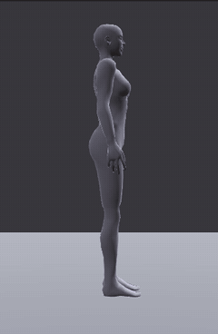
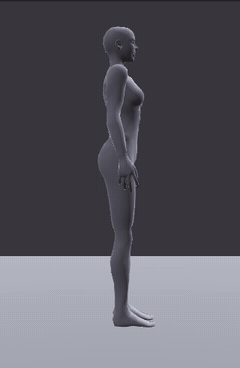

# Standing jump

An advanced tutorial: a jump on the spot, from the crouch before it to the stand after it. You look at the
anticipation, put the hips on a real free-fall arc with **Jump Arc**, check the landing and the balance,
and add follow-through to the arms. The key poses are given; this page is about the timing and the physics
between them.

> Related articles: [[Balance#Jump Arc]], [[Overlap]], [[Graph editor]], [[Animation priority]]

## What you will make

*The finished jump: 48 frames, 1.6 s.*

A 48-frame jump (1.6 s at 30 frames per second) that plays once: a stand, a crouch, the takeoff, 0.4 s in the
air on a free-fall arc, the landing, and back to the stand. The finished project is
[Open the example](example:jump-finished.vat).

## Usage

### 1. Open the key poses

[Open the example](example:jump-poses.vat) (`jump-poses.vat`), press **3** for the right view and play it
(**Space**). Step through the keys with **.**:

| Frame | Pose | What to see |
|---|---|---|
| 0 | stand | |
| 10 | crouch | hips 26 cm down, body leaning forward, arms swung back |
| 14 | takeoff | on the toes, legs straight, arms swung forward |
| 20 | air | legs tucked |
| 26 | landing | on the toes, arms forward |
| 30 | absorb | hips 22 cm down, knees bent |
| 38 | rise | nearly standing |
| 48 | stand | as frame 0 |

The legs and hips also have breakdown keys at frames 5, 11 to 13, 27, 28 and 34: they roll the feet over the
toes and keep them on the floor between the poses.

Something is wrong in the air: the avatar floats up slowly, hangs, and drifts down.

### 2. Read the anticipation

The crouch takes 10 frames; the push from the crouch to the takeoff takes 4.

> **Why:** anticipation is the move before the move. A body has to go down to go up, and the arms swing
> back before they throw the body up. Slow into the crouch, fast out of it: the difference in speed is
> what reads as effort. A deeper or longer crouch reads as a bigger jump.

### 3. Put the hips on a free-fall arc

A body in the air moves as gravity says, whatever it does with its arms and legs: its height follows a
parabola, fast leaving the ground, slowest at the top, fast coming down.

1. Choose **Tools → Jump Arc...**.
2. Set **Takeoff** to `14` and **Landing** to `26` (type them, or go to the frame and press **Current
   Frame**). Leave **Gravity** at `9.81 m/s²`, and **Forward travel** and **Keep lateral motion** ticked.
3. The window reads `0.40 s in the air, the hips rise 18.6 cm`.
4. Press **Apply Jump Arc**. The status bar says `Jump Arc: 0.40 s in the air, the hips rise 18.6 cm`.

Time in the air and height are tied: 0.4 s up and down means about 19 cm, not the 37 cm the key at frame 20
asks for.

Play: the avatar leaves the ground fast and hangs only for a moment at the top. Select **mPelvis** and open
the [[Graph editor]] (**Ctrl+G**): **Translate Z** is now a key on every frame from 14 to 26, on a curve.

*Before Jump Arc, then after: the same poses, with the hips on a free-fall arc.*

> **Why:** everyone knows how things fall, so a wrong arc reads as floating even when nobody can say why.
> The key at frame 20 put the hips 37 cm above the takeoff; to go that high the avatar would need 0.56 s in the air, not 0.40.
> Either the time or the height has to give, and **Jump Arc** keeps your time.

### 4. Check the landing

The landing takes 4 frames from the toes touching (26) to the bottom of the absorb (30), then 18 to stand
up again.

1. Go to frame `30` and look at **View → Centre of Mass** (on in a new session): green, over the feet.
2. Choose **Tools → Animation Check...**. It reads `No problems found.`: no foot goes more than 2 cm through
   the floor, and no joint bends past what a body can do.

> **Why:** the legs catch the body the way they threw it: fast into the bend, then a slow rise as the
> muscles take the weight. A landing with no absorb looks like the avatar weighs nothing; one that goes
> too deep for too long looks exhausted.

### 5. Add follow-through to the arms

The arms stop dead with the body at the landing. Let them carry on a little:

1. Choose **Tools → Overlap...**.
2. Type `Shoulder` in **Filter bones...** at the top of the **Bones** tab and click **mShoulderLeft**: the
   window's **Chain** reads `mShoulderLeft, mElbowLeft, mWristLeft`.
3. Double-click the **Delay** slider, type `2` and press **Enter** (`2.0 frames`). Tick **Settle at the end**
   and press **Apply Overlap**. The status bar says `Overlap applied down 3 bones`.
4. Click **mShoulderRight** and press **Apply Overlap**; the settings stay as you left them.

Play: the forearms swing on past the shoulders at the top of the throw and at the landing, and settle as the
avatar stands.

> **Why:** follow-through is the other half of anticipation: what was moving keeps moving after the part
> that drove it stops. **Settle at the end** brings the arms back to their pose by the last frame, so the
> jump ends still.

### 6. Get it ready for Second Life

- **Priority** `4` and **Loop** off, already set in **Properties → Animation**: the jump plays once, from a
  gesture or a HUD, over the AO's stand. See [[Animation priority]].
- **Ease in** and **Ease out** `0.30 s`: the jump blends in from the stand and back out to it.
- Tick **View → Preview as SL Plays It** and play: the file as Second Life plays it, over a green ghost.

Save the project with **File → Save As...**.

## Check your result

| Where | Value |
|---|---|
| **Properties → Animation** | **Last frame** `48`, **Loop** off, **Priority** `4`, **Ease in** and **Ease out** `0.30 s` |
| **mPelvis**, **Translate Z** in the graph | a key on each frame from 14 to 26; highest, about `0.236` m, at frame 20 |
| Frame 30 | the centre of mass green over both feet |

Compare with the finished project: [Open the example](example:jump-finished.vat). The jump after step 3, on
its arc but without the follow-through: [Open the example](example:jump-arc.vat).

## Tips and tricks

- A lower **Gravity** makes a moon jump; the window shows how high the hips go before you apply it.
- To jump forwards, key the hips further forward at the landing than at the takeoff: **Forward travel** moves
  them at an even speed in between, as a body in the air does.
- An AO plays a jump in pieces: **Pre Jumping** (the crouch), **Jumping** (in the air) and **Landing**. Make
  each a clip in [[Clips]] from the frames of this one.

## Troubleshooting

### Jump Arc says Pick a takeoff frame at least 2 frames before the landing

**Landing** is not at least 2 frames after **Takeoff**. Check both boxes.

### The feet leave the ground before the takeoff frame

The hips rise faster than the legs straighten. Go to the frame, lower the hips (**mPelvis**, **Offset** Z), or
move **Takeoff** earlier and apply again.

### The arms keep swinging at the last frame

**Settle at the end** was not ticked. Undo (**Ctrl+Z**) and apply again with it.

## See also

- Previous: [[Run cycle production]]
- Next: [[Tutorials]]
- [[Balance]]
- [[Overlap]]

Category: Getting started
Order: 28
