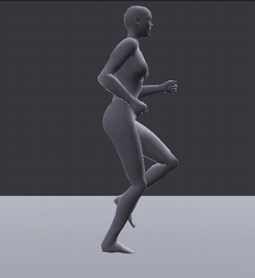
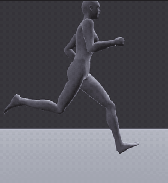
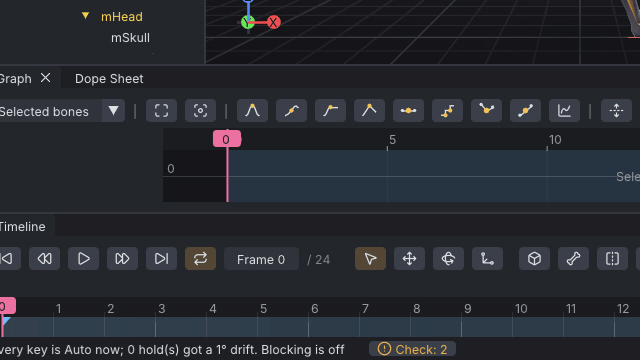
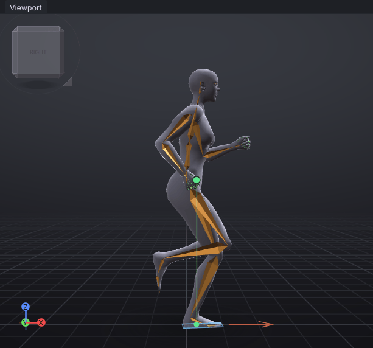
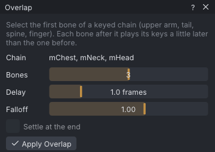
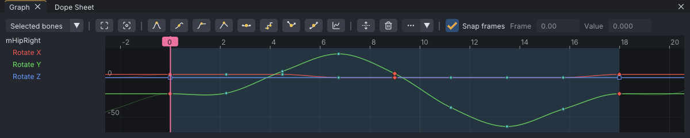
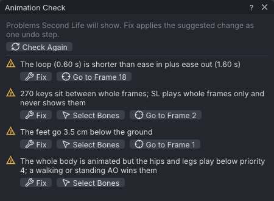
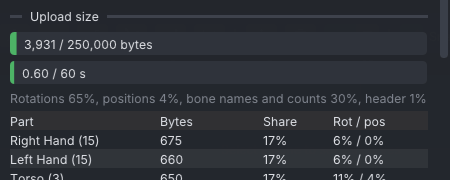

# Run cycle production

An advanced tutorial: take a run from blocked key poses to an animation ready for an AO. You time the
cycle to Second Life's run speed on the treadmill, check the loop and the feet, add overlap and look at the
balance, clean the curves, and set what Second Life needs: priority, eases and the upload size. It builds on
[[A walk cycle for your AO]], so the key poses are given and this page is about the production
pass.

> Related articles: [[Loop tools]], [[Overlap]], [[Balance]], [[Animation check]], [[Export to Second Life]]

## What you will make

*The finished run: 18 frames, looping, in place, timed for SL Run speed, 5.13 m/s.*

An 18-frame run (0.60 s at 30 frames per second) that stays in place, as an AO needs it, and whose stride
matches Second Life's run speed, so the feet do not slide. The finished project is
[Open the example](example:run-cycle.vat).

## Run versus walk

A run is not a fast walk. Look for these in the key poses:

| | Walk | Run |
|---|---|---|
| Feet on the ground | always one, twice both | one or none: a **flight** phase with both feet off the ground |
| One foot's contact | over half the cycle | a third of it or less |
| Hips | highest at passing, over a straight leg | lowest just after contact (the knee takes the landing), highest in flight |
| Lean | upright | the body leans into the run |
| Arms | swing loosely | bent about 90° at the elbow and driven, opposite to the legs |

## Usage

### 1. Open the blocked run

[Open the example](example:run-blocked.vat) (`run-blocked.vat`). It has eight key poses, one every 3
frames, on **Stepped** keys, so each pose holds until the next. Press **3** for the right view and play
(**Space**): the poses snap from one to the next.

*Blocking: the poses and their order, before any in-betweens.*

Step through them with **.** (next key) and look at each:

| Frame | Pose | What to see |
|---|---|---|
| 0 | contact, right foot | the right heel lands in front of the hips, toes up; the left leg trails |
| 3 | down | the right foot flat under the body, knee bent: the hips' lowest point |
| 6 | push-off | the right toe the last part on the ground, the leg straightening behind |
| 9 | flight | both feet off the ground |
| 12 | contact, left foot | frame 0 with the sides swapped |
| 15, 18, 21 | down, push-off, flight | the left leg's turn |
| 24 | | the same as frame 0, so the loop closes |

Click any keyed bone, such as **mPelvis** in the **Bones** tab, to see its keys on the timeline: the contacts
are tagged **Extreme** (red diamonds), the other poses **Breakdown** (teal circles); see
[[Keys and timeline#Blocking and key tags]].

> **Why:** blocking fixes what happens and when before the computer fills in the frames between. A pose
> that reads badly here reads badly in the finished run too.

### 2. Turn the blocking into curves

Choose **Edit → Convert Blocking to Spline**. The status bar says `Every key is Auto now; 0 hold(s) got a 1°
drift. Blocking is off`. Play: the run now moves smoothly, but slowly, like a jog in slow motion. The poses
are a run's; the timing, 24 frames, is a walk's.

### 3. Time the cycle to SL's run speed

A run for an AO stays in place: Second Life moves the avatar at its own speed, and the animation only has to
look as if it covers that ground. When a foot is planted, the body passes over it at the speed the animation
implies; if that is not the speed Second Life moves the avatar at, the feet slide.

1. Open **View → Treadmill** and click **SL Run (5.13 m/s)**. The menu stays open.
2. Read **The cycle**: `Stride 3.08 m, cycle 0.80 s` and `Implied speed 3.86 m/s (75% of 5.13)`.
3. Click **Stretch Time** under **Match Cycle to Speed**. The status bar says `The cycle is now 18 frames
   long: 5.21 m/s, 102% of 5.13`, and **Last frame** and **Loop out** in **Properties → Animation** read `18`.
4. Open **View → Treadmill** again: `Stride 3.13 m, cycle 0.60 s` and `Implied speed 5.21 m/s (102% of 5.13)`.
5. Click **Show Treadmill** and play. Blue lines scroll backwards under the avatar at 5.13 m/s; a planted
   foot moves with them.

*Stretch Time squeezes the 24 frames into 18: the keys move from every 3 frames to every 2¼.*

The keys now sit a quarter of a frame apart from whole frames: contact 0, down 2.25, push-off 4.5, flight 6.75, left
contact 9, and so on to 18. Second Life plays whole frames only, so it plays the curves at 2, 3, 4 and 5; the keys
between them stay where the stretch put them (the [[Animation check]] lists them, step 5).

> **Why:** a stride is fixed by the poses (how far the foot travels under the body), so the speed is set
> by the time the stride takes. At 5.13 m/s, a 3.1 m stride (two steps) takes 0.60 s, 18 frames at 30 fps. The
> treadmill reads the stride on the soles: the part of each foot on the floor, heel, then ball, then toes.
> **Stretch Time** keeps the stride and changes the time; within about 5% of the speed is close enough to
> see no sliding.

### 4. Check the loop and keep it in place

1. Choose **Tools → Loop Tools → Make Loop Seamless**. The status bar says `The loop was already seamless`:
   frame 18 is frame 0 again, and **Loop-Aware Tangents** (on in the same menu) carries each curve's slope
   across the seam.
2. Choose **Tools → Loop Tools → Remove Hip Travel (In Place)**. The status bar says `Removed hip travel:
   0.00 m/s forward, 0.00 m/s sideways (0.00 m/s)`: the hips move up, down and sideways, never forward.

> **Why:** an AO's run must stay in place. If the hips travelled, the avatar would run ahead of where Second
> Life puts it and snap back every 0.60 s. A run for a cutscene or a dance can travel; see [[Loop tools#Walking in place]].

To see the run cover ground, open **Tools → Loop Tools**, set the speed box to `5.13` (double-click it and
type), press **Add Travel Forward** and play from a distance: the planted foot stays on one spot. Press
**Esc** to close the menu and **Ctrl+Z** to take the travel out again.

### 5. Check the feet and the balance

Feet first. Choose **Tools → Animation Check...**. Two findings are about the stretch and the feet:

- `270 keys sit between whole frames`: the keys the stretch moved off whole frames (step 3). Its **Fix** (**Snap
  Keys to Whole Frames**) would move the contacts by up to half a frame and change the speed; leave it, since the
  export samples the curves at whole frames anyway.
- `The feet go 3.5 cm below the ground`, at frames 1 and 10: the heel of the landing foot, which lands heel first
  with its toes up and digs in as the foot rolls down. Look from the side (**3**) at frame 1 with **.** and **,**.
  Its **Fix** (**Raise the Hips**) would lift the whole run and the feet off the floor at the down pose; turn the
  ankle's toes down a little at frame 1 (and at 10 for the left) instead, or leave it: it lasts a frame.

The check measures the soles: the back of the heel, the ball and the tip of the toes, where the body's feet are.

Then the balance. **View → Centre of Mass** is on in a new session: a dot at the body's centre of mass, a
plumb line to the floor and the outline of the planted foot.

*Frame 2, the down pose: the centre of mass is over the foot.*

| Frame | Centre of mass | Why |
|---|---|---|
| 0 | no outline | only the heel touches the floor |
| 1 | red, behind the foot | the foot lands ahead of the body and brakes it |
| 2, 3 | green, over the foot | the body passes over the foot |
| 4, 5 | red, ahead of the foot | the foot pushes the body on |
| 6 to 9 | nothing | flight: nothing supports the body |

> **Why:** a run is a controlled fall: balanced only for a moment in the middle of each contact. A run that
> stays green the whole contact looks like it is braking; one that never turns green at the down pose has
> the foot too far ahead or behind. Do not use **Tools → Auto-Balance...** on a run: it would pull the
> hips back over the foot on every frame and take the lean out.

### 6. Add overlap to the chest, head and arms

In the key poses the chest, neck and head, and each arm, move as one piece. Overlap makes each part follow
the one it hangs from a frame later.

1. Choose **Tools → Overlap...**.
2. In the **Bones** tab click **mChest**. The window's **Chain** reads `mChest, mNeck, mHead`. Leave **Bones**
   `3`, **Delay** `1.0 frames` and **Falloff** `1.00`, and press **Apply Overlap**. The status bar says
   `Overlap applied down 3 bones`.
3. Type `Shoulder` in **Filter bones...** at the top of the **Bones** tab, click **mShoulderLeft** (the chain
   reads `mShoulderLeft, mElbowLeft, mWristLeft`) and press **Apply Overlap**.
4. Click **mShoulderRight** (scroll the list down if it is hidden) and press **Apply Overlap**.

The neck has no keys of its own, so overlap leaves it alone and the head plays 2 frames after the chest.

*One frame of delay per bone: at 18 frames a cycle, more looks rubbery.*

Play: the head settles a frame after each landing, and the forearms whip slightly at the end of each swing.

> **Why:** a body is not rigid. What hangs from something else starts late and stops late; that delay is
> what makes a run look heavy and loose instead of mechanical. With **Loop** on, overlap reads round the
> loop, so the seam stays seamless ([[Overlap#Looping clips]]).

### 7. Clean up the curves

Overlap bakes the bones it delays to a key on every frame. Simplify them back to a few keys, so the curves
stay easy to edit:

1. Click empty space in the viewport, so nothing is selected.
2. Choose **Edit → Simplify Curves...**. **All bones** is ticked; leave **Rotation** `0.25` deg and
   **Position** `0.50` mm. The dialog reads `Keys in the range: 549 -> 331`. A running knee bends past 90°, near
   gimbal lock, so the knees are fitted as rotations; their few keys already fit, so they keep them.
3. Press **OK**. The status bar says `Simplified: 549 keys to 331`.

Then check the curves that carry the run. Click **mHipRight** (type `Hip` in **Filter bones...**) and look at
the [[Graph editor]] (**View → Graph Editor**, **Ctrl+G**, if it is hidden):

*The right thigh's swing, **Rotate Y**: back to 30° at frame 7, forward to −60° at frame 13.*

**Rotate Y** is one wave per cycle: the thigh swings back through the contact and push-off (0 to 7) and
forward through the swing (7 to 13), and the curve runs through frame 18 into frame 0 with no kink. It
is flatter from 0 to 2: the planted foot holds the thigh while the body passes over it. **Rotate X** is the
small roll that brings the foot under the body on each contact. Select **mPelvis** to see the hips' height:
its **Translate Z** dips after each contact and rises through each flight (click **Translate Z** in the list
to see it alone; in metres, it is flat next to the rotations in degrees).

> **Why:** a curve shows timing the view hides. A second bump in a swing, or one step's curve different from
> the other's, would show as a limp.

### 8. Get it ready for Second Life

**Priority.** An AO plays its run instead of its walk and stand, so they do not compete: **Priority** `3` in
**Properties → Animation** is enough. See [[Animation priority]].

**Ease in and out.** The run starts from whatever the avatar was doing, usually a walk. **Ease in** blends
it in over that time; too long and the legs drift for several steps, `0` and the avatar pops into the first
pose.

1. Open **Tools → Animation Check...** (or press **Check Again**). Besides the two from step 5, it reads `The loop
   (0.60 s) is shorter than ease in plus ease out (1.60 s)`.
2. In **Properties → Animation** (scroll the panel down if needed), double-click **Ease in**, type `0.25` and
   press **Enter**; do the same for **Ease out**. Press **Check Again**:
   that finding is gone.

*The run's findings before the eases are set.*

The other finding, `The whole body is animated but the hips and legs play below priority 4; a walking or
standing AO wins them`, is meant for animations that play beside an AO, such as a dance; this run is the AO's
own. Tell the check so: choose **Tools → Clips (AO Sets)...** and set the clip's **AO state** to **Running**.
The finding goes: the AO plays its run instead of its stand or walk, so nothing competes for the legs.

**Upload size.** Choose **File → Export SL .anim...** and scroll to **Upload size**: about `3,920 / 250,000
bytes` and `0.60 / 60 s`, both green. The fists take over a third of it: 15 finger bones each.

*A run is small; a long dance is not. See [[Export to Second Life#Check the upload size]].*

**See it as SL plays it.** Tick **View → Preview as SL Plays It**: the body plays the exported file, over a
green ghost of your animation. They should match.

**Try it as your run (viewer).** In the [[VATs Editor (viewer)]], **Tools → Loop Tools → Test as My Run**
plays the animation as your avatar's run while you move it with the usual keys, and measures your ground
speed against the cycle's; see [[Loop tools#Testing as your walk (viewer)]]. The app has no such command.

Save the project with **File → Save As...**.

## Check your result

| Where | Value |
|---|---|
| **Properties → Animation** | **Last frame** `18`, **Loop** ticked, **Loop in** `0`, **Loop out** `18`, **Priority** `3`, **Ease in** `0.25 s`, **Ease out** `0.25 s` |
| **View → Treadmill** (SL Run) | `Stride 3.08 m, cycle 0.60 s`, `Implied speed 5.13 m/s (100% of 5.13)` |
| Timeline | no red tick at frame 18 |
| **Tools → Clips (AO Sets)...** | the clip's **AO state** is **Running** |
| **Tools → Animation Check...** | the keys between whole frames, and the heel 3.5 cm into the floor at frames 1 and 10 (step 5) |
| Right view, frame 2 | the centre of mass green over the right foot |

Compare with the finished project: [Open the example](example:run-cycle.vat). The run after step 3, timed
but not yet polished: [Open the example](example:run-timed.vat).

## Troubleshooting

### Stretch Time gives another length

The treadmill measures the feet as you left them: moving a foot or the hips changes the stride. The cycle
only needs to be close to the speed; if **Implied speed** reads within about 5% of 5.13, keep it. Keys
between whole frames after a stretch are flagged by **Animation Check** (**Snap Keys to Whole Frames**).

### The treadmill says No foot contacts found

No foot's sole comes within 3 cm of the floor for two frames in the loop. Check that **Loop** is on and that a
foot is planted at frames 0 to 2.

### The feet slide on the treadmill

The implied speed is not the treadmill's. Check the speed is **SL Run**, then press **Stretch Time** again.

### Overlap is greyed out or does nothing

A limb in the chain uses IK, or the selected bone has no children: see [[Overlap#Troubleshooting]].

### The run pops when it starts in-world

**Ease in** is `0`. Set it to `0.25`.

## See also

- Previous: [[Turns for an AO]]
- Next: [[Standing jump]]
- [[Tutorials]]
- [[Loop tools]]
- [[Overlap]]

Category: Getting started
Order: 27
