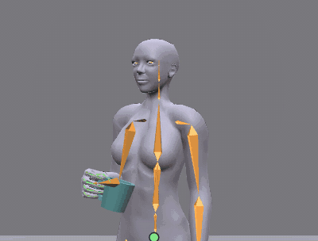
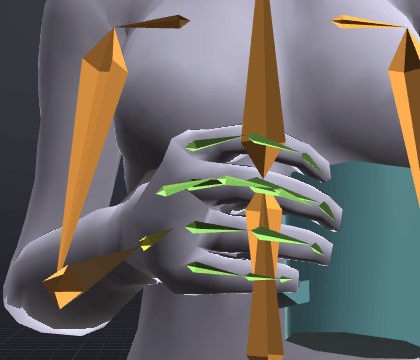
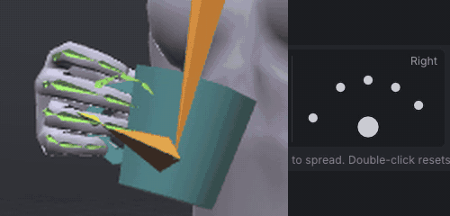
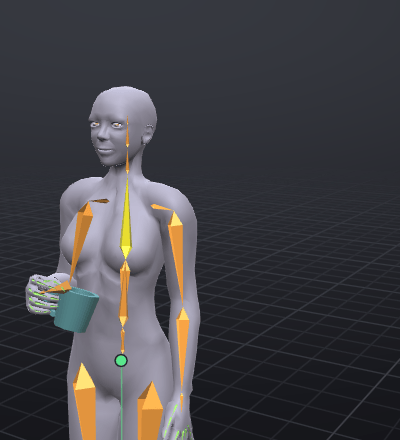
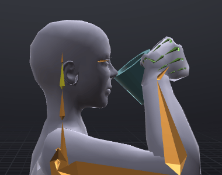
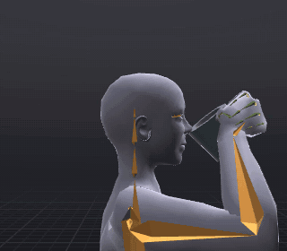

# Sip from a mug

A routine tutorial: a short gesture with a prop, the kind that goes in a café's chairs or a drink HUD. The
avatar holds the starter **Mug**, dips it, lifts it to the lips, tips the head back to drink and lowers it
again. On the way you put a prop in the hand, shape the grip with the [[Hand poser]], bind the hand to the
head while drinking, and use two of the oldest tricks in animation: *anticipation* and *settle*.

> Related articles: [[Props]], [[Hand poser]], [[Hold and bind]], [[Keys and timeline]], [[Graph editor]], [[Animation priority]]

## What you will make

*The finished sip, 2.4 seconds. Watch the small dip before the lift and the small sink after it.*

72 frames at 30 fps, not looping, priority 4, ease 0.30 s in and out. Nine keys on the right arm and head, and
one pin: the right wrist rides the head from frame 20 to 48. The start point is
[Open the example](example:sip-start.vat) (steps 1 to 4 done) and the finished sip is
[Open the example](example:sip-mug.vat).

## Usage

The steps give every value to type. To type into a **Properties** box, double-click it (or **Ctrl+click**),
type and press **Enter**; see [[First steps]]. Keys in this tutorial are all made by typing, so each box you
change keys the bone on the current frame by itself.

### 1. Set up the clip

1. Start a new project (**Ctrl+N**).
2. **Inventory → Starter poses**: click **Relaxed Stand**. The status bar says `Applied Relaxed Stand at frame 0`.
3. In **Properties → Animation** set **Last frame** `72`, **Priority** `4`, **Ease in** `0.30 s` and
   **Ease out** `0.30 s`. **Loop** stays off: a sip plays once.

> **Why:** Priority 4 lets the sip take the arm and head from a stand at 3 or below while the rest of the
> body keeps your AO's stand. Short eases (a new project's 0.30 s), because a gesture of 2.4 s would spend
> most of its time fading in and out with the 0.8 s that Second Life's own uploader suggests.

### 2. Put the mug in the hand

1. In the **Inventory** tab, type `Mug` into the filter box and scroll down to **Starter props → Cups**.
2. Double-click **Mug**. The status bar says `Added Mug on Right Hand`.

**Properties → Prop** shows **Mug** (**static**), **Parent** **Right Hand**, **Position** `-0.005`, `-0.012`,
`-0.083` and **Rotation** `-90.0°`, `0.0°`, `-90.0°`: the starter mug knows its grip, its handle in the fist. It is attached to the
**Right Hand** attachment point, so it goes wherever the hand goes, and in Second Life you wear a real mug on
the same point. See [[Props]].

### 3. Shape the grip

1. Still in **Inventory → Starter poses**, filter for `Grip` and **Shift+click** **Grip (Cylinder)**. A
   plain click poses the left hand; **Shift+click** the right, the hand that holds the mug.
   The fingers close round the mug's handle.

   
   *The grip from the front (**1**): four fingers through the handle, the thumb over it.*

2. Press **H** (**Tools → Hand Poser**). The **Hands** window opens at the bottom right of the view.
3. Optional, for a lighter touch: in the **Right** half, drag the **Pinky** dot (the outermost small dot)
   up and to the right. The pinky straightens and lifts away from the handle.

*Each finger has a dot: drag down to curl, sideways to spread. The example leaves the pinky in the grip.*

Press **H** again to close the window. **Ctrl+Z** takes a finger drag back in one step (**Pose Fingers**).

> **Why:** A grip reads as holding only when the fingers wrap the object. A starter shape gets you most of the
> way; one finger changed gives the hand a character. See [[Hand poser]].

### 4. Key the resting hold at frame 0

Check that the frame box reads **Frame 0**, then set these **Rotation** values in **Properties → Bone**,
selecting each bone in the **Bones** tab (type its name into **Filter bones...**):

| Bone | Rotation |
|---|---|
| **mShoulderRight** | `72`, `0`, `20` |
| **mElbowRight** | `0`, `0`, `100` |
| **mWristRight** | `0`, `0`, `0` (press **S**) |
| **mHead** | `0`, `0`, `0` (press **S**) |

**mWristRight** and **mHead** are already at `0`, `0`, `0`, and typing a value a box already has keys nothing.
Select each and press **S** (**Edit → Set Key**) instead: **Properties** then says **Keyed at this frame**.

The mug is held in front of the stomach. The wrist and head need their starting key: without one, their first
key later on (the head's at frame 8, the wrist's at 20) would hold them there on every frame before it.

*Frame 0, the hold. This is where the sip starts and where it ends.*

### 5. Anticipate, then lift

1. Type `8` into the frame box (click it, type, **Enter**). Set:

   | Bone | Rotation |
   |---|---|
   | **mShoulderRight** | `74`, `0`, `18` |
   | **mElbowRight** | `0`, `0`, `92` |
   | **mHead** | `0`, `4`, `0` |

   The mug dips a little and the eyes go down to it.
2. Go to frame `20` and set:

   | Bone | Rotation |
   |---|---|
   | **mShoulderRight** | `-13`, `-48`, `63` |
   | **mElbowRight** | `0`, `-46`, `112` |
   | **mWristRight** | `-6`, `-25`, `-35` |
   | **mHead** | `0`, `0`, `0` |

   The mug is at the lips, its rim tipped towards the mouth: the upper arm comes forward and across, the
   elbow bends, the forearm turns (the middle box) and the wrist bends so the mug's open side faces the face.

   
   *Frame 20 from the right (**3**). The rim touches the lips without going into the face; check from the
   front (**1**) too.*

> **Why:** *Anticipation* is a small move the other way before the main one: a dip before a lift, a crouch
> before a jump. It tells the eye something is about to happen, and it makes the lift look like it has
> weight. Keep it small and short, here 8 frames and a few degrees.

### 6. Drink: bind the hand to the head

While drinking, the head tips back and the mug must stay at the lips. Rather than keying the arm to follow
the head frame by frame, bind the wrist to the head.

1. Stay on frame `20`. Select **mHead**.
2. Filter for `WristRight` and **Shift+click** **mWristRight**, so it is selected second.
3. Choose **Tools → Bind to Selected Bone from Here**. The status bar says `mWristRight now rides mHead`, and
   **Properties → Bone** says **Pinned to mHead from frame 20**.
4. Select **mHead** again and key its tip back:

   | Frame | mHead Rotation |
   |---|---|
   | `34` | `0`, `-14`, `0` |
   | `40` | `0`, `-14`, `0`: press **S** |
   | `46` | `0`, `0`, `0` |

   At frame 40 the head is at `-14` already, held from frame 34. Typing a value a box already shows keys
   nothing, so press **S** (**Edit → Set Key**) to key the hold: without that key the head would start coming
   forward straight after frame 34, with no pause to drink.

5. Go to frame `48`, select **mWristRight** and choose **Tools → Release from Here**. The status bar says
   `mWristRight follows its own bone again from frame 48`.

*Only the head is keyed between 20 and 46; the arm bends to keep the hand with it.*

> **Why:** A *bind* makes one point ride another from a frame on, keeping the distance and angle it had.
> Animate the thing that leads (the head) and let the thing that follows (the hand) come along. At the
> release, the arm is keyed where the bind left it, so nothing jumps. See [[Hold and bind]].

### 7. Lower and settle

1. Go to frame `60` and set:

   | Bone | Rotation |
   |---|---|
   | **mShoulderRight** | `72`, `0`, `20` |
   | **mElbowRight** | `0`, `0`, `92` |
   | **mWristRight** | `0`, `0`, `0` |

   The mug comes down a little past the hold.
2. Go to frame `68`. Select **mShoulderRight** and press **S**: it is at `72`, `0`, `20` already, and the key
   keeps it there. Set **mElbowRight** to `0`, `0`, `100`: back on the hold.
3. Press **Home**, then **Space** to play.

> **Why:** A *settle* is the end of a move going slightly past where it stops, then easing back. Real arms
> have weight, so they do not stop dead. The overshoot here is 8° on the elbow; more looks springy, less
> looks mechanical.

### 8. Export

Press **Ctrl+E**, type `Sip` in **Name** and press **Export SL .anim**. The top line reads
`Length 2.40 s, priority 4, ease 0.30 / 0.30 s`. In Second Life, wear a mug on your right hand and play the
animation; the mug is not part of the file.

## Check your result

[Open the example](example:sip-mug.vat) and compare, selecting the bone and going to the frame:

| Frame | Bone | Rotation |
|---|---|---|
| 0 | **mShoulderRight** | `72.0°`, `0.0°`, `20.0°` |
| 8 | **mElbowRight** | `0.0°`, `0.0°`, `92.0°` |
| 20 | **mShoulderRight** | `-13.0°`, `-48.0°`, `63.0°` |
| 20 | **mWristRight** | `-6.0°`, `-25.0°`, `-35.0°` |
| 34 | **mHead** | `0.0°`, `-14.0°`, `0.0°` |
| 60 | **mElbowRight** | `0.0°`, `0.0°`, `92.0°` |
| 68 | **mElbowRight** | `0.0°`, `0.0°`, `100.0°` |

At frame 30, **mWristRight** says **Pinned to mHead from frame 20 to 48**. The timeline shows keys at 0, 8, 20,
34, 40, 46, 48, 60 and 68. **Properties → Animation**: **Last frame** 72, **Loop** off, **Priority** 4,
eases `0.30 s`.

## Troubleshooting

### The mug appears on the left hand, or floating at the feet

A double-click on **Mug** puts it on **Right Hand**. Dragging it onto the view attaches it where you drop it:
drop it on the right hand, or set **Properties → Prop → Parent** to **Right Hand**.

### The grip went on the wrong hand

A plain click on a starter hand pose poses the left hand. **Ctrl+Z**, then **Shift+click** it for the right.

### The arm moves before frame 0's hold, or the head nods at the start

A bone whose first key is later in the clip holds that pose from frame 0. Key **mWristRight** and **mHead**
at frame 0, as in step 4.

### "Bind to Selected Bone from Here" is greyed out

It needs exactly two bones: the one to ride first (**mHead**), then the hand with **Shift+click**.

### The mug goes into the face, or stops short of the lips

Look at frame 20 from the side (**3**) and the front (**1**): the rim should just touch the lips. Change
**mElbowRight**'s third box a few degrees (more bend brings the mug in) and **mWristRight**'s third box (it
tips the mug), before you bind.

### The mug leaves the lips while the head tips back

The bind starts after the head starts moving. Select **mWristRight**: the pin must start at frame 20, before
the first head key at 34. Drag the start of its band in the [[Graph editor]] to move it.

### The arm snaps at frame 48

The release keys the arm where the bind left it. If you moved keys after releasing, release again: select
**mWristRight**, choose **Tools → Delete Pin**, and redo step 6.

## See also

- [[Props]]
- [[Hand poser]]
- [[Hold and bind]]
- Previous: [[A sit pose for furniture]]
- Next: [[A walk cycle for your AO]]

Category: Getting started
Order: 14
