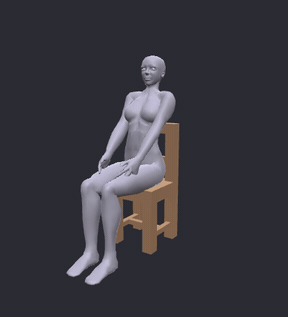
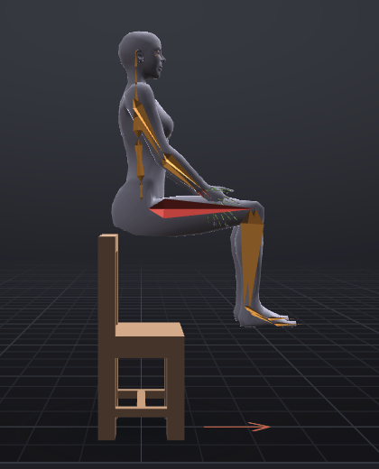
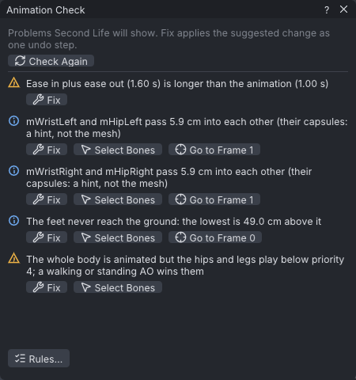
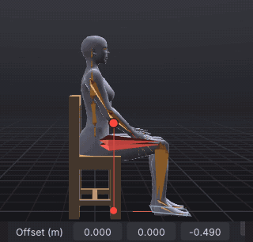
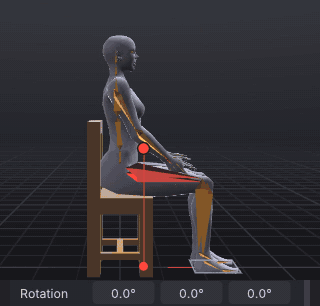
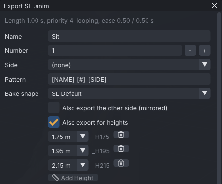

# A sit pose for furniture

A routine tutorial: a sit for a chair, the kind a furniture maker puts in every seat. You pose the avatar
on the starter **Chair**, plant the feet on the floor and the hands on the thighs with pins, lean the back
into the chair, and export it as a static pose at priority 4, in three extra heights so tall and short
avatars sit as well as yours. It follows the beginner tutorials: you know how to select a bone, type a
value in **Properties** and scrub the timeline.

> Related articles: [[Hold and bind]], [[IK]], [[Props]], [[Animation priority]], [[Animation check]], [[Export to Second Life]], [[Couples and groups]]

## What you will make

*The finished pose, filmed with **File → Export Listing Media...**. It is one pose, held: only the camera moves.*

One pose keyed at frame 0 and held for a 1-second loop, priority 4, ease 0.50 s in and out. It exports as
`Sit_01.anim` plus `Sit_01_H175.anim`, `Sit_01_H195.anim` and `Sit_01_H215.anim`. The finished project is
[Open the example](example:sit-chair.vat); open it at any point to compare.

## Usage

### 1. Put a chair in the scene

1. Start with a new project (**File → New**, **Ctrl+N**).
2. Open the **Inventory** tab, type `Chair` into its filter box and scroll down to **Starter props →
   Seating**.
3. Double-click **Chair**. The status bar says `Added Chair in the world`, and **Properties → Prop**
   shows **Chair**, **Parent** **World**, **Position** `0.000`, `0.000`, `0.450`.

The chair stands where the avatar stands: its seat is under the hips, as the sit target of a real chair
puts you. The prop is only there to pose against; it is not part of the exported animation (see
[[Props]]).

### 2. Start from the Sitting pose

1. Check that the frame box reads **Frame 0**.
2. Right-click empty space in the viewport and choose **Poses → Starter poses → Sitting**. The status bar
   says `Applied Sitting at frame 0`.
3. Move the pointer over the viewport and press **3** for the **Right** view.

The thighs are level and the shins hang down, but the whole body floats: the hips are still at standing
height, above the chair's back rest, and the feet are in the air.

*Frame 0 after **Sitting**: the pose is right, the height is not.*

> **Note:** The thighs are drawn red. Red bones are ones the [[Animation check]] finds touching each other,
> here the hands resting on the thighs. For a sit that is what you want; the colour is a hint, not an
> error.

> **Why:** A starter pose sets only rotations. Where the body is comes from the hips' position, which a
> pose leaves alone, so every sit starts by putting the hips where the seat is.

### 3. Put the feet on the floor

The fastest way to find the floor is the [[Animation check]], which measures it for you.

1. Choose **Tools → Animation Check...**, or click **Check** in the status bar.
2. Next to **The feet never reach the ground: the lowest is 49.0 cm above it**, press **Fix**. The status
   bar says `Animation Check: Drop the Hips by 49.0 cm`.
3. Close the window with its **×**.

*The check before the fix. The other lines are dealt with in step 8.*

Select **mPelvis** in the **Bones** tab: **Properties → Bone → Offset (m)** reads `0.000`, `0.000`,
`-0.490`. The feet now rest on the floor, and the thighs have sunk into the seat.

### 4. Hold the feet where they are

Now the feet are right and the hips are not. Pin the feet first, then fix the hips: the legs bend for you.

1. In the **Bones** tab, type `AnkleLeft` into **Filter bones...** and click **mAnkleLeft**.
2. Choose **Tools → Hold in World from Here**. The status bar says
   `mAnkleLeft is held in place from frame 0`, the row reads **mAnkleLeft [pinned]** in light blue, and
   **Properties → Bone** says **Pinned in the world from frame 0**.
3. Do the same for **mAnkleRight**.

> **Why:** A pin on a foot holds it through the leg's [[IK]]: whatever the hips do, the hip, knee and ankle
> turn so the foot stays on its spot. This is *ground contact*: a foot that slides or sinks is the first
> thing a viewer notices in a sit.

### 5. Raise the hips onto the seat

1. Clear the filter and click **mPelvis**.
2. Press **Q** for the **Select** tool, so no gizmo covers the legs.
3. Drag the third **Offset (m)** box to the right until it reads about `-0.430`, or double-click it, type
   `-0.43` and press **Enter**.

*The feet do not move: the pins hold them, and the knees bend to make up the difference.*

Look from the side: the thighs sit on top of the seat, not in it, and the feet are flat on the floor.
That is *seat contact*: the body's weight is on the seat.

### 6. Rest the hands on the thighs

The Sitting pose already lays the hands on the thighs. Bind them there, so they stay when the body moves.

1. Filter for `HipLeft` and click **mHipLeft** (the left thigh).
2. Filter for `WristLeft` and **Shift+click** **mWristLeft**, so it is selected second.
3. Choose **Tools → Bind to Selected Bone from Here**. The status bar says
   `mWristLeft now rides mHipLeft`, and **Properties → Bone** says **Pinned to mHipLeft from frame 0**.
4. Do the same with **mHipRight** and **mWristRight**.

> **Why:** A hand held *in the world* stays put even when the leg under it moves; a hand *bound* to the
> thigh moves with it. Bind a hand to what it touches. See [[Hold and bind]].

### 7. Lean back into the chair

A body sitting bolt upright looks posed. Let the back take some weight.

1. Filter for `Torso` and click **mTorso**.
2. Set the second **Rotation** box to `-12` (drag it to the left, or double-click and type).
3. Click **mHead** and set its second **Rotation** box to `12`, so the eyes are level again.

*The chest goes back; the hands stay on the thighs, and the arms straighten a little to let them.*

> **Why:** The head counters the lean. People keep their eyes level; when you turn the body, turn the head
> back by the same amount unless the character is meant to look up or down.

### 8. Make it a static pose

A sit is a *static pose*: one pose that holds for as long as the avatar sits. In Second Life that is a
looping animation whose frames are all the same.

1. In **Properties → Animation**, tick **Loop**. **Loop in** is 0 and **Loop out** 30.
2. Set **Priority** to `4`.
3. Set **Ease in** and **Ease out** to `0.5`: half a second to settle into the sit and out of it. Together
   they must not be longer than the 1-second loop, or the **Animation Check** warns.
4. Open **Tools → Animation Check...** again. Two notes remain, that each wrist and thigh "pass 3.1 cm into each other". That is the hand resting on
   the thigh; the note says it is a hint about the bones' capsules, not the mesh. Close the window.

> **Why:** Every key is at frame 0, so every frame of the loop is the same pose. Priority 4 beats the
> sits of an AO, which run at 3 or below, so your pose wins on every bone it keys; see
> [[Animation priority]].

### 9. Export, with heights

1. Press **Ctrl+E**. Type `Sit` in **Name**.
2. Tick **Also export for heights**. Three rows appear, `1.75 m`, `1.95 m` and `2.15 m`.
3. **Saves as** now lists `Sit_01.anim`, `Sit_01_H175.anim`, `Sit_01_H195.anim` and `Sit_01_H215.anim`.
4. Press **Export SL .anim** and choose a folder when asked.

*Each height adds a file whose name ends in the height: `_H175`, `_H195`, `_H215`.*

Further down, **Upload size** reads `640 / 250,000 bytes`: a static pose is tiny, because each bone has one
key.

> **Why:** Second Life seats every avatar at the same sit target, whatever its size. On a 2.15 m avatar
> your pose would push the feet through the floor. Each height file is baked on a body of that height, and
> the pins are solved again on it, so the feet reach the floor and the hands stay on the thighs. Put the
> files in the chair's menu as sizes: short, medium, tall.

### 10. Fit it to the furniture

The pose sits the avatar at its own origin. In-world, a sit system (AVsitter2 or nPose) seats it from a
position and rotation in its notecard; see [[Couples and groups#Sit systems (AVsitter and nPose)]].

- In the app the chair's seat is at the avatar's origin, so the pose fits a seat whose sit target is where
  the starter chair's is. On your own furniture, move the sitter in the sit system's own adjust mode until
  the thighs meet the seat; the animation stays as it is.
- For two or more avatars, **Tools → Actors (Couples and Groups)...** writes the sit system's lines for
  you, under **Sit systems (furniture)**: type the seat's offset from the root prim into **Sit target (m)**
  and **Rotation (deg)** and copy the AVsitter2 or nPose lines. With one actor the window shows only
  "One actor. Add a partner to start a couple or group scene."

> **Note:** In the [[VATs Editor (viewer)]] you can sit on the real furniture before opening the editor.
> The **Actors** window then has a **Your seat** section: **Use as the Sit Target** reads where you sit,
> and **Place on Furniture Point** or **Settle on Furniture** put a hand or foot on the furniture itself.
> The app has no in-world furniture.

## Check your result

[Open the example](example:sit-chair.vat) and compare:

| Where | Value |
|---|---|
| **mPelvis → Offset (m)** | `0.000`, `0.000`, `-0.430` |
| **mTorso → Rotation** | `0.0°`, `-12.0°`, `0.0°` |
| **mHead → Rotation** | `0.0°`, `12.0°`, `0.0°` |
| **mAnkleLeft**, **mAnkleRight** | **Pinned in the world from frame 0** |
| **mWristLeft**, **mWristRight** | **Pinned to mHipLeft** (**mHipRight**) **from frame 0** |
| **Properties → Animation** | **Loop** ticked, 0 to 30, **Priority** 4, **Ease in** and **Ease out** `0.50 s` |
| **Ctrl+E** top line | `Length 1.00 s, priority 4, looping, ease 0.50 / 0.50 s` |
| **Upload size** | `640 / 250,000 bytes` |

Scrub the timeline: nothing moves. Play it: nothing moves either, which is what a static pose should do.

## Troubleshooting

### The thighs sink into the seat, or float above it

The hips are too low or too high. Select **mPelvis** and change the third **Offset (m)** box a centimetre
at a time; look from the **Right** view (**3**), where the seat's top edge is a straight line. The pinned
feet stay on the floor whatever you do.

### The feet slide when I raise the hips

The ankles are not pinned at this frame. Select **mAnkleLeft**: **Properties → Bone** should say
**Pinned in the world from frame 0**. If it does not, go to frame 0 and choose **Tools → Hold in World
from Here** again.

### "Bind to Selected Bone from Here" is greyed out

It needs exactly two items: the bone to ride first (the thigh), then the hand, with **Shift+click**. The
hint reads "Select the bone to ride, then Shift-click the point to pin".

### A hand floats above the thigh on a tall avatar

The height files are solved again for each body, but a sit exported without **Also export for heights** is
not. Export again with it ticked, and use the file that matches the avatar.

### The avatar sits too high or low in-world

The sit target of the furniture differs from the starter chair's. Adjust the sit system's offset for that
seat, not the animation: the pose stays right for every chair.

## See also

- [[Hold and bind]]
- [[Animation check]]
- [[Export to Second Life#Export for other heights]]
- Previous: [[A breathing idle that loops]]
- Next: [[Sip from a mug]]

Category: Getting started
Order: 13
