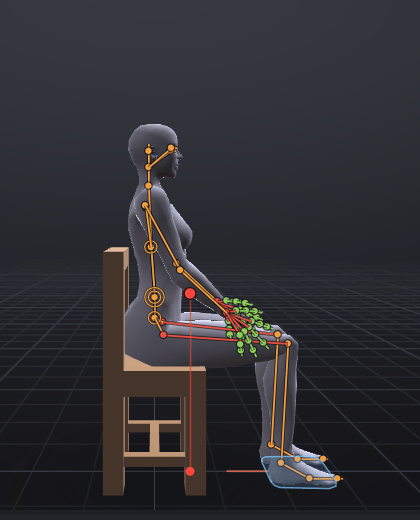
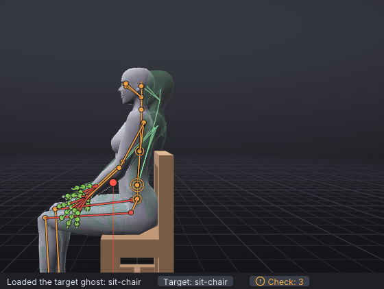

# A sit pose for furniture

A routine tutorial, about 15 minutes: a sit for a chair, the kind a furniture maker puts in every seat. You sit the
avatar on the starter **Chair** in one click, bind the hands to the thighs, lean the back into the chair by dragging,
and export it as a static pose at priority 4, in three extra heights so tall and short avatars sit as well as yours.
It follows the beginner tutorials: you know how to select a bone and drag a ring of the rotate gizmo.

> Related articles: [[Props]], [[Hold and bind]], [[Target ghost]], [[Animation priority]], [[Animation check]], [[Export to Second Life]], [[Couples and groups]]

## What you will make

*The finished pose, filmed with **File → Export Listing Media...**. It is one pose, held: only the camera moves.*

One pose keyed at frame 0 and held for a 1-second loop, priority 4, ease 0.50 s in and out. It exports as
`Sit_01.anim` plus `Sit_01_H175.anim`, `Sit_01_H195.anim` and `Sit_01_H215.anim`. The finished project is
[Open the example](example:sit-chair.vat); open it at any point to compare.

## Usage

### 1. Put a chair in the scene

1. Start with a new project (**File → New**, **Ctrl+N**).
2. Open the **Inventory** tab and type `chair` into **Filter by name...** at its top. **Starter props → Seating**
   shows **Chair** and **Armchair**.
3. Double-click **Chair**. The status bar says `Added Chair in the world`, and **Properties → Prop** shows it.

The chair stands where the avatar stands, its seat under the hips, as the sit target of a real chair puts you. The
prop is only there to pose against; it is not part of the exported animation (see [[Props]]).

### 2. Sit on it

Press **Sit on This** in **Properties → Prop**. (Or right-click empty space in the view and choose **Sit on Chair**,
or choose **Tools → Sit on Seat**.)

In one step VATs puts the avatar in the **Sitting** starter pose, drops the hips until the feet reach the floor, holds
both feet there, and raises the hips until the thighs rest on the seat, the knees bending to keep the feet down. The
status bar says what moved, for example `Sat on Chair in the Sitting pose: the hips down 45 cm onto the seat at 46 cm,
the feet held on the floor`. **Ctrl+Z** takes it all back.

*The **Sitting** pose alone floats: a pose turns bones, it does not move the body. **Sit on This** puts the body on
the seat.*

Press **3** with the pointer over the view to look from the side. Click a foot: **Properties → Bone** says
**Pinned in the world from frame 0**. Each held foot has a light blue pin label in the view.

> **Why:** A pin on a foot holds it through the leg's [[IK]]: whatever the hips do, the hip, knee and ankle turn so
> the foot stays on its spot. This is *ground contact*: a foot that slides or sinks is the first thing a viewer notices
> in a sit. The thighs resting on the seat is *seat contact*: the body's weight is on the chair.

### 3. Show the target

[Show the target](target:sit-chair.vat)

The finished sit appears as a green ghost. Its legs and hips sit inside yours already; its back leans against the chair
and its head is turned a little. The next steps close that gap.

### 4. Rest the hands on the thighs

The Sitting pose lays the hands on the thighs. Bind them there, so they stay on the thighs when the body moves.

1. With the pointer over the view, press **Ctrl+3** to look from her left side (the cube says **LEFT**), and zoom in
   on the hips with the wheel. Her left hand and thigh are nearest you.
2. Right-click her left hand and choose **Bind mWristLeft · Left Hand to...**. A badge at the top of the view says
   `Click the bone mWristLeft rides`.
3. Point at her left thigh between the hip and the hand, where nothing covers it: the label says
   `mHipLeft · Left Thigh`. Click. The status bar says
   `mWristLeft · Left Hand now rides mHipLeft · Left Thigh from frame 0`.
4. Press **3** to look from her right side, and do the same with the right hand and the right thigh.

*Two clicks: the hand's menu, then the thigh. **Esc** or a right-click cancels while the badge shows.*

> **Why:** A hand held *in the world* stays put even when the leg under it moves; a hand *bound* to the thigh moves
> with it. Bind a hand to what it touches. See [[Hold and bind]].

### 5. Lean back into the chair

A body sitting bolt upright looks posed. Let the back take some weight.

1. Open the **Picker** tab. Hover the dots on the spine until the tooltip says **Torso** (the lowest; it also offers
   **Click again: Pelvis**), and click once. **mTorso · Torso** is selected.
2. Press **E** for the **Rotate** tool, and **F** with the pointer over the view to frame the torso. You are still
   looking from the side.
3. Press on the **green** ring where it passes in front of the belly and drag up: the back leans back. Stop when the
   shoulders lie in the ghost's, against the chair's back rest, and the distance is green.

*The back goes back; the hands stay on the thighs, and the arms straighten a little to let them.*

> **Check:** about `-12°` on the second **Rotation** box.

### 6. Level the eyes

Leaning back tips the head up with it. Turn it back so she looks ahead, and a little to one side.

1. Click the **Head** dot, the top one in the Picker. Press **F** with the pointer over the view to frame it.
2. Still from the side, drag its **green** ring down at the front: the face tips forward until the head lies in the
   ghost's.
3. Press **1** for the front, and drag the **blue** ring (the flat oval round the neck) along its front edge so the
   face turns a little to her left (your right), into the ghost. The distance turns green.

> **Why:** The head counters the lean. People keep their eyes level; when you turn the body, turn the head back by
> about the same amount unless the character is meant to look up or down. The small turn to one side keeps the pose
> from looking like a statue.

### 7. Relax the hands

1. Press **Esc** to select nothing, open the **Inventory** tab and type `surface` into **Filter by name...**.
2. Right-click **Resting on Surface** (under **Starter poses**) and choose **Both Hands**: the fingers lie flatter, as a
   hand does on a leg.
3. Clear the filter with its **×**.

### 8. Make it a static pose

A sit is a *static pose*: one pose that holds for as long as the avatar sits. In Second Life that is a looping
animation whose frames are all the same.

1. In **Properties → Animation**, tick **Loop**: **in 0** and **out 30** appear beside it.
2. Set **Priority** to `4`.
3. Set **Ease in** and **Ease out** to `0.5`: half a second to settle into the sit and out of it. Together they must
   not be longer than the 1-second loop, or the **Animation Check** warns.
4. Click **Check** in the status bar (or **Tools → Animation Check...**). Two notes remain, that each wrist and thigh
   "pass ... into each other". That is the hand resting on the thigh; the note says it is a hint about the bones'
   capsules, not the mesh. Leave them (their **Fix** would lift the hands off the thighs) and close the window.

> **Why:** Every key is at frame 0, so every frame of the loop is the same pose. Priority 4 beats the sits of an AO,
> which run at 3 or below, so your pose wins on every bone it keys; see [[Animation priority]]. Below 4, the Check
> would warn that a walking or standing AO wins the legs, and its **Fix** sets 4.

### 9. Export, with heights

1. Press **Ctrl+E**. Type `Sit` in **Name**. The **Priority** field reads `4`.
2. Open **Also Write** and tick **Also export for heights**. Three rows appear, `1.75 m`, `1.95 m` and `2.15 m`.
3. **Saves as** now lists `Sit_01.anim`, `Sit_01_H175.anim`, `Sit_01_H195.anim` and `Sit_01_H215.anim`.
4. Press **Export .anim** and choose a folder when asked.

*Each height adds a file whose name ends in the height: `_H175`, `_H195`, `_H215`.*

Further down, **Upload size** is well under a kilobyte: a static pose is tiny, because each bone has one key.

> **Why:** Second Life seats every avatar at the same sit target, whatever its size. On a 2.15 m avatar your pose
> would push the feet through the floor. Each height file is baked on a body of that height, and the pins are solved
> again on it, so the feet reach the floor and the hands stay on the thighs. Put the files in the chair's menu as
> sizes: short, medium, tall.

### 10. Fit it to the furniture

The pose sits the avatar at its own origin. In-world, a sit system (AVsitter2 or nPose) seats it from a position and
rotation in its notecard; see [[Couples and groups#Sit systems (AVsitter and nPose)]].

- In the app the chair's seat is at the avatar's origin, so the pose fits a seat whose sit target is where the starter
  chair's is. On your own furniture, move the sitter in the sit system's own adjust mode until the thighs meet the
  seat; the animation stays as it is.
- For two or more avatars, **Tools → Actors (Couples and Groups)...** writes the sit system's lines for you, under
  **Sit systems (furniture)**: type the seat's offset from the root prim into **Sit target (m)** and **Rotation (deg)**
  and copy the AVsitter2 or nPose lines. With one actor the window shows only "One actor. Add a partner to start a
  couple or group scene."

> **Note:** In the [[VATs Editor (viewer)]] you can sit on the real furniture before opening the editor. The **Actors**
> window then has a **Your seat** section: **Use as the Sit Target** reads where you sit, and **Place on Furniture
> Point** or **Settle on Furniture** put a hand or foot on the furniture itself. The app has no in-world furniture.

## Check your result

Look at yours from the side with the target showing: the back against the chair, the thighs on the seat, the feet flat
and the hands on the thighs, all inside the ghost. Scrub the timeline: nothing moves, which is what a static pose
should do. Then [Open the example](example:sit-chair.vat) and compare:

- **mAnkleLeft** and **mAnkleRight** say **Pinned in the world from frame 0**; **mWristLeft** and **mWristRight** say
  **Pinned to mHipLeft** (**mHipRight**) **from frame 0**.
- **Properties → Animation**: **Loop** ticked, 0 to 30, **Priority** 4, **Ease in** and **Ease out** `0.50 s`.
- **Ctrl+E**'s top line: `Length 1.00 s, priority 4, looping, ease 0.50 / 0.50 s`.

> **Check:** the example's hips are at `-0.446` on the third **Offset (m)** box of **mPelvis** (Sit on This put them
> there), the torso at `-12°` on its second **Rotation** box, and the head at about `10°` on the second and `8°` on the
> third.

## Troubleshooting

### Sit on This says the chair is not under the thighs

The chair was moved away from the avatar, or the avatar from the chair. **Ctrl+Z** back to where the chair was added,
or select the chair and set its **Position** to `0`, `0` and its height again; the seat must be under the avatar, as a
sit target puts it.

### The thighs sink into the seat, or float above it

The seat of your own chair is higher or lower than the starter chair's: press **Sit on This** again once your chair is
in place; it measures the seat under the thighs. To nudge by hand, select **mPelvis** and drag the third
**Offset (m)** box a centimetre at a time; the held feet stay on the floor whatever you do.

### The feet slide when the hips move

The feet are not held at this frame. Click a foot: **Properties → Bone** should say **Pinned in the world from frame
0**. If it does not, go to frame 0 and choose **Tools → Hold in World from Here** with the foot selected.

### The right-click menu has no Bind ... to...

The right-click was on another bone. Right-click the hand itself; the menu's title names the body part. Or select the
hand (in **Bones**, filter `left hand`) and choose **Tools → Bind to...**.

### A hand floats above the thigh on a tall avatar

The height files are solved again for each body, but a sit exported without **Also export for heights** is not.
Export again with it ticked, and use the file that matches the avatar.

### The avatar sits too high or low in-world

The sit target of the furniture differs from the starter chair's. Adjust the sit system's offset for that seat, not
the animation: the pose stays right for every chair.

## See also

- [[Props#Sit on a seat]]
- [[Hold and bind]]
- [[Animation check]]
- [[Export to Second Life#Export for other heights]]
- Previous: [[A breathing idle that loops]]
- Next: [[Sip from a mug]]

Category: Getting started
Order: 13
