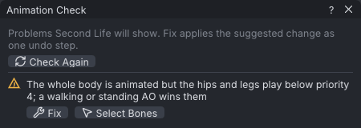
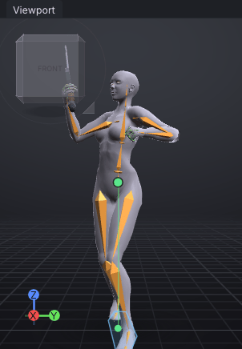
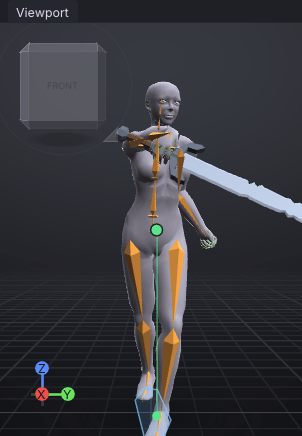
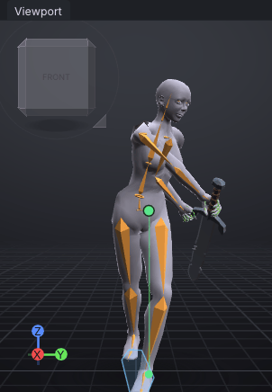
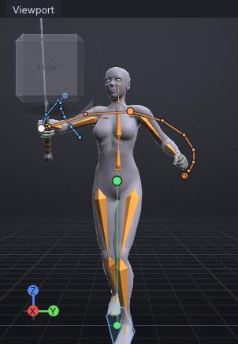
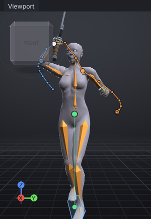
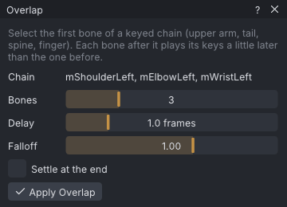

# Melee: a sword swing

An advanced tutorial: a one-handed diagonal cut with the starter **Sword**, from a ready stance through
anticipation, a fast strike on an arc, impact, follow-through and recovery, with the hips turning and shifting
over planted feet and the free arm pulling back. It is blocked pose to pose, then smoothed, checked with a motion path and
exported as a non-looping attack at priority 4. It assumes the Beginner tutorials: you can select a bone, type
rotation values and play the timeline.

> Related articles: [[Keys and timeline]], [[Motion paths]], [[Overlap]], [[Hold and bind]], [[Animation priority]], [[Balance]]

## What you will make

*The finished swing, 48 frames at 30 frames per second (1.6 s), played twice.*

| Frames | Phase | What happens |
|---|---|---|
| 0 | Ready | Sword in front of the belly, point up and forward; left foot forward |
| 0–12 | Anticipation | Hips and chest turn to the right, the weight goes back; the sword is cocked above the right shoulder |
| 12–18 | Strike | Six frames: the hips turn first, the sword rises overhead (frame 15) and cuts down on the diagonal |
| 18 | Impact | Arm extended in front, blade crossing to the left, weight on the front foot |
| 18–30 | Follow-through | The blade carries on down past the left hip, outside the leg, point back, and settles |
| 30–48 | Recovery | Back to the ready pose |

## Usage

### 1. Open the start point

[Open the example](example:sword-start.vat): the start of this tutorial. It has:

- the ready pose keyed at frame 0 and again at frame 48, so the swing ends where it begins: the sword held in
  front of the belly, point up at head height, the left hand loosely closed;
- a fighting stance: left foot forward, right foot back on its toes, the hips turned a little to the right;
- both ankles held in the world from frame 0 (see [[Hold and bind]]), so when the hips move, the knees bend and
  the feet stay planted;
- the starter **Sword** on the **Right Hand** attachment point, its grip in the right hand, closed in the
  **Grip (Cylinder)** starter shape: a one-handed sword, about a metre long, held in one fist just below the guard
  (click it: **Properties → Prop** shows **Position** `0.280`, `-0.012`, `-0.015` and **Rotation** `0.0°`, `90.0°`,
  `0.0°`, the grip the starter prop comes with);
- every key **Stepped**, as **Blocking** keys them (see [[Keys and timeline#Blocking and key tags]]).

Click the **Bones** tab and scroll down: **mAnkleLeft [pinned]** and **mAnkleRight [pinned]** are light blue. The
sword is a prop: it shows in the view and saves with the project but is not part of the exported animation (see
[[Props]]).

Press **Ctrl+S** now and name the project `sword-swing`; the export at the end takes its name from it.

### 2. Set the playback settings first

In **Properties → Animation** set:

| Field | Value |
|---|---|
| **Loop** | off (as it is) |
| **Priority** | `4` |
| **Ease in** | `0.2` |
| **Ease out** | `0.4` |

The status bar shows **Check: 1** before you change **Priority**. Click it: the **Animation Check** window says why.

*The check before **Priority** is set to 4. After it, the window says **No problems found**.*

> **Note:** **Why priority 4 and no loop.** An attack plays once, on top of whatever the avatar was doing, and must
> win every bone it keys, legs included, against a stand or walk (usually priority 2 or 3). Priority 4 does
> that; 5 and 6 are treated as 4 by some viewers, so they buy nothing (see [[Animation priority]]). **Loop** stays
> off so the swing plays once. The short **Ease in** lets the strike start almost at once; the longer **Ease
> out** hands the body back to the AO gently.

### 3. Turn on Blocking

Press **Blocking** on the timeline bar (the square icon right of **Set Key**), or choose **Edit → Blocking**. Every
key you set from now on is **Stepped**: it holds until the next key, so playback jumps from pose to pose.

> **Note:** **Why block first.** Pose to pose means deciding the few poses that tell the story, and their
> timing, before any in-betweens. Stepped keys show the timing plainly; smooth curves would hide a weak pose
> behind motion.

To key a bone: type part of its name in **Filter bones...** in the **Bones** tab (for example `ShoulderRight`),
click the bone, then double-click each box of **Properties → Bone → Rotation**, type the value and press **Enter**.
For **mPelvis**, also fill the three **Offset (m)** boxes under **Rotation**.

### 4. Key the anticipation at frame 12

Click frame **12** in the timeline, then key these seven bones:

| Bone | Rotation (X, Y, Z) | Offset (m) |
|---|---|---|
| **mPelvis** | `0`, `0`, `-32` | `-0.04`, `-0.02`, `-0.07` |
| **mTorso** | `0`, `-5`, `-20` | |
| **mShoulderRight** | `51`, `-56`, `4` | |
| **mElbowRight** | `0`, `-59`, `96` | |
| **mWristRight** | `19`, `-25`, `-24` | |
| **mShoulderLeft** | `-28`, `16`, `18` | |
| **mElbowLeft** | `0`, `0`, `-112` | |

*Frame 12, the anticipation.*

> **Note:** **Why anticipation.** A move reads when it is prepared: the body winds up the opposite way first. The
> hips and chest turn away from the target, the sword is cocked above and behind the right shoulder, point up
> and back, and the hips sink back over the rear foot, so the cut has somewhere to come from. The left fist comes
> forward, guarding and balancing the sword arm.

### 5. Key the impact at frame 18

Click frame **18** and key:

| Bone | Rotation (X, Y, Z) | Offset (m) |
|---|---|---|
| **mPelvis** | `0`, `0`, `10` | `0.04`, `0.01`, `-0.08` |
| **mTorso** | `0`, `12`, `15` | |
| **mShoulderRight** | `-13`, `29`, `79` | |
| **mElbowRight** | `0`, `-17`, `5` | |
| **mWristRight** | `57`, `12`, `-35` | |
| **mShoulderLeft** | `-71`, `9`, `34` | |
| **mElbowLeft** | `0`, `0`, `-44` | |

*Frame 18, the impact.*

> **Note:** **Why only six frames.** Timing is the number of frames a move takes. The wind-up took 12 frames
> (0.4 s); the strike takes 6 (0.2 s). The contrast is what makes a hit look fast and heavy. Watch the dot at the
> hips in the view: the hips moved 8 cm forward over the front foot, and the dot stays green because the weight
> is still over the feet (see [[Balance]]).

> **Note:** **Why the hips go first.** A real cut starts from the ground: the hips turn towards the target, then
> the chest, then the arm straightens and the wrist turns the edge through, each part a little after the one
> before, and the weight moves onto the front foot. Here the hips turn 42° and the chest 35° more between frames 12
> and 18, while the left arm pulls back to help the turn.

### 6. Key the follow-through at frame 24 and hold it to 30

1. Click frame **24** and key:

| Bone | Rotation (X, Y, Z) | Offset (m) |
|---|---|---|
| **mPelvis** | `0`, `0`, `20` | `0.05`, `0.02`, `-0.09` |
| **mTorso** | `0`, `25`, `28` | |
| **mShoulderRight** | `28`, `26`, `145` | |
| **mElbowRight** | `0`, `20`, `5` | |
| **mWristRight** | `10`, `3`, `-35` | |
| **mShoulderLeft** | `-78`, `4`, `35` | |
| **mElbowLeft** | `0`, `0`, `-62` | |

2. With the pointer over the view, press **Ctrl+Shift+A** (**Select → Select Keyed on Frame**). The status bar
   says `Selected 7 bones and 0 IK handles`.
3. Choose **Edit → Tag Keys Here → Hold**.
4. Press **Ctrl+C** (**Edit → Copy Pose**): `Copied 7 item(s)`.
5. Click frame **30** and press **Ctrl+V** (**Edit → Paste Pose**): `Pasted the pose at frame 30`.
6. Choose **Edit → Tag Keys Here → Hold** again. The timeline shows violet bars at 24 and 30.

*Frame 24, the follow-through.*

> **Note:** **Why follow-through.** A blade does not stop at the target: the arm carries on and the body turns
> after it, then it settles. The cut finishes low on the left, the arm across the body and the forearm rolled
> over, the blade down outside the left leg with its point back, clear of both thighs. The two **Hold** keys keep
> that settled pose from 24 to 30; a hold that is exactly still looks frozen, so the next step makes it drift.

> **Note:** **Where the poses come from.** They were checked against a real cut: a free motion capture take of
> swordplay from the CMU Graphics Lab database, looked at only, not copied. The hand travels the same path, from
> high on the right, through the front at belt to chest height, to low beside the left hip; the hips wind 30° to
> 40° away and turn 20° past the front at the end, and the chest bends over the follow-through. The capture is a
> slow rehearsal, about half a second from the top of the wind-up to the hit; a cut in earnest takes the 6 frames
> used here.

### 7. Play the blocking, then convert it

Press **Home**, then **Space**. The avatar snaps from ready to wind-up to impact to follow-through and back to
ready at 48. Judge the timing now: it is the cheapest moment to change it.

> **Tip:** While blocked, **Check** may list a bone that `turns` a large number of `degrees between two kept keys`.
> Those jumps are the stepped keys; they go when you convert.

Choose **Edit → Convert Blocking to Spline**. The status bar says
`Every key is Auto now; 15 hold(s) got a 1° drift. Blocking is off`. Play again: the poses now flow into each other,
easing in and out of every key, and the settled pose drifts slightly from 24 to 30.

If you skipped the steps so far, [Open the example](example:sword-keys.vat): this is the project at this point.

### 8. Check the arc with a motion path

1. Select **mWristRight**.
2. Tick **View → Motion Path → Show Motion Path**. The path of the wrist appears: blue before the current frame,
   orange after.
3. Press **1** for the front view and click frame **15**.

*Frame 15 before the breakdown: the sword swings in from the side.*

Between the wind-up and the impact the computer takes the shortest way, so the hand drops out to the right at
shoulder height and the path runs straight across the chest. A cut needs an arc: the sword should rise over the
head and come down on the target.

4. At frame **15**, key a breakdown on the arm:

| Bone | Rotation (X, Y, Z) |
|---|---|
| **mShoulderRight** | `-46`, `-45`, `56` |
| **mElbowRight** | `0`, `-88`, `101` |
| **mWristRight** | `-6`, `-25`, `-26` |

*Frame 15 after the breakdown: the path rises over the head, then curves down.*

> **Note:** **Why a breakdown.** Key poses say *where*; the breakdown between them says *how it gets there*.
> One key in the middle of a move is often all an arc needs. Tick **View → Motion Path → Frame Numbers** to see
> the spacing too: the dots between 15 and 18 are far apart (fast), those between 24 and 30 bunched (settling).

### 9. Let the free arm trail (overlap)

1. Select **mShoulderLeft**.
2. Choose **Tools → Overlap...**. **Chain** reads `mShoulderLeft, mElbowLeft, mWristLeft`.
3. Set **Delay** to `2.0 frames`, leave **Bones** at `3` and **Falloff** at `1.00`, and tick **Settle at the end**.
4. Press **Apply Overlap**: `Overlap applied down 3 bones`.

*The **Overlap** window for the left arm.*

The forearm now moves two frames after the upper arm: when the body whips round at the strike, the hand lags
and then catches up. **mWristLeft** has no keys, so it is left alone.

> **Note:** **Why overlap.** Parts of the body do not all start and stop together; loose parts follow the part
> that drives them. It is the difference between an arm that swings and an arm that is carried. For a
> simulated swing instead, see the **Overlap** preset in [[Dynamics]].

### 10. Export

Press **Ctrl+S**, then **Ctrl+E** (**File → Export SL .anim...**). The top line reads
`Length 1.60 s, priority 4, ease 0.20 / 0.40 s`: no `looping`. Press **Export SL .anim** and pick a folder when asked.
The file is `sword-swing_01.anim`. See [[Export to Second Life]].

## Tips and tricks

- **A two-swing combo.** Join a second swing on where the first one ends: select everything (**Ctrl+A**), mark the
  whole clip on the timeline with **Shift+drag** from frame 0 to 48, and choose **Edit → Save Clip of Selected
  Bones...**; name it `sword swing`. In **Inventory → Poses → Clips**, right-click **sword swing** and choose
  **Paste, Matching Poses...**. Untick **Align the hips** (the feet are pinned, so the hips must not turn) and
  press **Insert**. The window says `Cut at frame 42, where sword swing's frame 1 lands.` and the clip becomes 89
  frames long: the second cut starts from the recovery of the first. See [[Project library#Inserting with matched poses]].
- **Attacking on the move.** This swing keys the legs (the pins become leg keys on export), so an AO walk loses
  them while it plays. For a swing while walking, leave the pelvis and legs out and key only the torso and arms,
  as in [[One-handed gun hold]].
- **Eyes on the target.** Key **mHead** against the body's turn (for example Z `30` at frame 12 and `-20` at
  frame 18), so the head stays on the target while the hips and shoulders wind up and unwind.

## Check your result

[Open the example](example:sword-swing.vat): the finished swing.

1. **Properties → Animation**: **Last frame** 48 (**1.60 seconds**), **Loop** off, **Priority** 4, **Ease in** 0.20 s,
   **Ease out** 0.40 s.
2. Select **mShoulderRight** and press **.** (**Next Key**) from frame 0: keys at 12, 15, 18, 24, 30 and 48. At
   frame 15, **Rotation** reads `-46.0°`, `-45.0°`, `56.0°`.
3. Select **mPelvis** at frame 18: **Offset (m)** reads `0.040`, `0.010`, `-0.080`.
4. The status bar shows no **Check**.
5. Tick **View → Preview as SL Plays It**: the **As SL Plays It** window reads `6,214 bytes, 43 bones, 598 rotation
   and 29 position keys`. The legs count because the pins are baked into them, and both hands' fingers because
   both hands are posed.

## Troubleshooting

### Typing a value keys the wrong bone

**Properties → Bone** always edits the bone named at its top. Check the name before typing; the filter in the
**Bones** tab only narrows the list, it does not select.

### A foot slides or lifts while the hips move

The leg cannot reach: a hip offset of much more than 5 cm forward pulls the rear leg straight. Keep the **Offset**
values in the tables, and check that both ankles still say **[pinned]** in the **Bones** tab.

### The centre of mass turns red

The hips went outside the feet. Move **mPelvis** back towards the middle of the stance, or run **Tools →
Auto-Balance...** on the frames (see [[Balance]]).

### Paste Pose pasted on every bone

Nothing was selected, so **Ctrl+C** copied the whole pose. Undo, press **Ctrl+Shift+A** at frame 24 first, then copy.

### Shift+drag moved the loop flag and ticked Loop

The drag started on the **Loop in** flag at the top of the timeline strip. Press **Ctrl+Z**, then **Shift+drag**
along the lower half of the strip.

### Tag Keys Here is greyed out

It needs a selection: "Select a bone first". Press **Ctrl+Shift+A** with the pointer over the view.

## See also

- Previous: [[Two-handed rifle hold]]
- Next: [[Tutorials]]
- [[Keys and timeline#Blocking and key tags]]
- [[Motion paths]]
- [[Overlap]]

Category: Getting started
Order: 19
