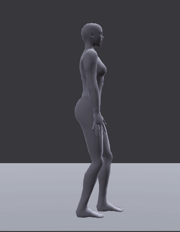
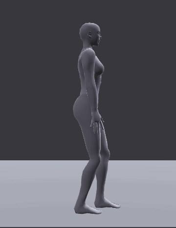
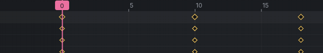
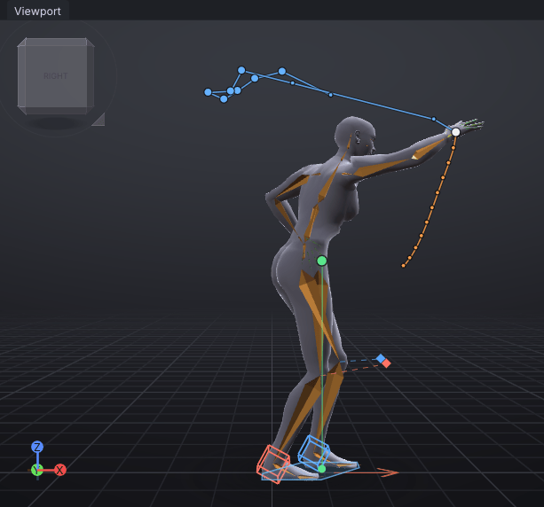
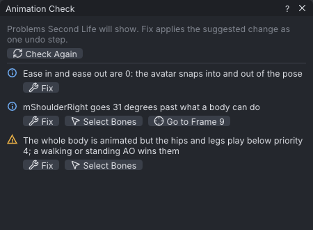
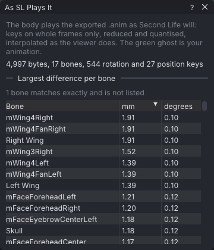
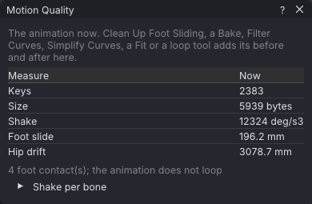
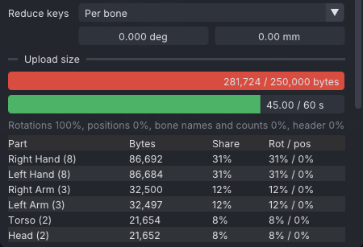

# The polish pass

An advanced tutorial: a throw, taken from a rough blocking pass to a finished animation that plays in Second Life
the way it looks in VATs. You smooth the blocking, fix the timing in the dope sheet, shape a breakdown and check
the arc of the hand, then let the Animation Check catch what the eye misses. Last, you clean up a captured take
and fit an animation that is too big to upload. It follows [[Dance to the beat]]; [[Melee: a sword swing]] blocks a
strike with the same anticipation, arc and follow-through, and this pass is how you would finish it.

> Related articles: [[Keys and timeline]], [[Dope sheet]], [[Motion paths]], [[Graph editor]], [[Animation check]], [[Preview as SL plays it]], [[Export to Second Life]]

## What you will make

*The finished throw: a slow wind-up, a fast release, a follow-through that carries on past the target, and a settle.*

A 44-frame overarm throw at 30 fps, the left foot forward and both feet planted. The start is a *blocking pass*:
five key poses on stepped keys, each held until the next, all tagged **Extreme**:

| Frame | Pose |
|---|---|
| 0 | ready: standing, weight between the feet |
| 10 | wind-up: weight back, hips and chest turned away, throwing hand behind the head, the other arm pointing at the target |
| 18 | release: weight driven onto the front foot, the arm forward and high |
| 26 | follow-through: bent over the front leg, the hand across the body to the other hip |
| 44 | recovery: standing again |

[Open the example](example:polish-start.vat)

## Steps

### 1. Read the blocking, then go to spline

1. Open the start example and press **Space**. The body pops from pose to pose: blocking shows *what* happens and
   *when*, with nothing in between.
2. Choose **Edit → Convert Blocking to Spline**. Every key gets the **Auto** tangent, and **Blocking** on the
   timeline bar turns off.
3. Play again. The throw now moves, but everything travels at the same even speed and the arm swings round like a
   windmill.

*Stepped blocking, then spline: the poses are the same, the in-betweens are the computer's guess.*

> **Why:** pose-to-pose animators block first because a pose is cheap to change and a curve is not. Spline is where
> the computer invents every frame between your poses, and it invents them evenly. The rest of the polish pass is
> taking that timing back.

### 2. Retime in the dope sheet

The wind-up (0 to 10) and the release (10 to 18) take about the same time, so the throw has no snap. A throw is a
slow build and a fast release.

1. Click **Select All** at the top of the **Bones** tab, then click the **Dope Sheet** tab at the bottom.
2. In the **Summary** row, click the third diamond, the release at frame 18. It turns yellow: every key on that
   frame is selected.
3. Drag it left three frames, to 15, and let go. With **Snap frames** ticked it lands on a whole frame (**Move
   Keys**, one undo step); the ruler's numbers are every 5 frames, so 15 is the one right above it.
4. Play. The release is now 5 frames instead of 8, and the arm cracks through. Too fast or too slow for your taste?
   Drag the diamond a frame either way and play again: this is the place to try it.

*The whole body's release pose moved three frames earlier.*

> **Why:** *timing* is how many frames an action takes, and it is what makes a movement feel heavy or light, lazy
> or violent. Three frames is a small edit that changes the whole throw. The dope sheet is the place for it
> because it moves every bone's keys at once without touching a pose.

### 3. Shape the in-between with a breakdown

Between the wind-up (10) and the release (15), the computer moves everything evenly. A thrower holds the wind-up a
moment, then explodes.

1. Keep every bone selected. Drag the playhead (the pink tab on the timeline's ruler) to frame 12, two frames after
   the wind-up key at 10: the red marks along the timeline's foot are the keys.
2. Drag the **Tween** slider on the timeline bar, right of **Blocking**, to the left until it reads about **Tween
   20%**, and let go. The slider is short, so a small move goes a long way; anything from 15% to 25% is right. The
   status bar says, for example, "Tween 18%: keyed 9 item(s) at frame 12": the nine bones with a key on both sides.
3. A teal circle on the timeline marks the new **Breakdown** keys at frame 12. Drag the playhead back and forth
   across 10 to 15: the body lingers near the wind-up, then goes.

> **Why:** a *breakdown* is the pose that decides how you get from one key to the next. At 20% the body is still
> near the wind-up two frames later, so it *eases out* of the wind-up slowly and covers the rest in three frames:
> that is *slow in and slow out*, and it is what makes the release read as fast.

> **Tip:** instead of the slider, press **Shift+E**, move the mouse left or right (hold **Ctrl** for 10% steps) and
> click. Start the playhead drag on the pink tab, not at the far left of the ruler's foot: there, on a clip that
> does not loop, you would pick up the **Loop in** flag and turn **Loop** on (**Ctrl+Z** puts it back).

### 4. Check the arc with a motion path

1. In the **Picker** tab, click the dot at the end of the arm on the left of the chart (the avatar faces you, so its
   right hand is on your left; the tooltip says **Right Hand**). Choose **View → Motion Path → Show Motion Path**.
   Press **3** (**View → Camera → Right**) to see the thrower from the side, and drag the playhead to 15, the release key.
2. The path shows ten frames either side of the current one: blue before, orange after, a white dot now, and bigger
   dots on keyed frames. The blue dots loop round behind the head (the wind-up), then run far apart, almost in a
   line, to the release: the hand is fast there. After the release the orange dots curve down in front of the body
   and close up as the arm slows.
3. Tick **Whole Clip** in the same menu to see all 44 frames at once, and **Frame Numbers** to number the keyed
   dots. Scrub the playhead from 10 to 26 and watch the white dot run along the path: it should sweep in a curve, fast
   in the middle.

*The finished throw at frame 15, the release, from the right. The spacing of the dots is the speed: far apart is fast, close together is slow.*

> **Why:** living things move in *arcs*, because joints turn. A hand that travels in a straight line between two
> poses looks mechanical. A fast stretch can be nearly straight, because the eye barely sees it; a slow stretch that
> goes straight or kinks wants a breakdown moved off the line.

### 5. Let the Animation Check catch the rest

[Open the example](example:polish-mid.vat)

If you are starting here, open this example: it is the throw after steps 1 to 3. The status bar shows an amber
**Check: 3**.

1. Choose **Tools → Animation Check...**. It lists three findings:
   - "Ease in and ease out are 0: the avatar snaps into and out of the pose" (Info);
   - "mShoulderRight goes 31 degrees past what a body can do" (Info), on the frames of the wind-up;
   - "The whole body is animated but the hips and legs play below priority 4; a walking or standing AO wins them"
     (Warning).
2. Press **Fix** on the first finding: **Ease in** and **Ease out** become `0.30 s`.
3. Press **Go to Frame** on the second to see the wind-up (frame 9 in the example; a frame or so either side if you
   made the breakdown yourself): the arm is twisted further back than a shoulder turns.
   Press **Fix** (**Key the Joint Inside Its Limits**): the shoulder is keyed at its limit on each frame it was past
   it, and the hand now goes up over the head.
4. Press **Fix** on the last: **Priority** becomes `4`. The window says "No problems found." and the badge goes.

*Three findings, each with a one-click fix that is one undo step.*

> **Why:** these are the problems you only see in-world, or only when you look closely: a throw that snaps in
> because nothing blends it from the stand before, a shoulder wrenched past what a body can do (easy to key when
> you pose a hand and let the angles fall where they may), legs that your AO takes over because the priority is
> too low. Each **Fix** is an ordinary edit, so **Ctrl+Z** takes it back if you meant it.

### 6. Watch it as Second Life will play it

1. Choose **View → Preview as SL Plays It**. The **As SL Plays It** window opens: the body now plays the exported
   `.anim`, and your own animation is a green ghost.
2. The window reads "4,997 bytes, 17 bones, 544 rotation and 27 position keys". The table lists how far each bone
   ends up from your animation: under 2 mm and a tenth of a degree, too small to see.
3. Play. The ghost and the body move as one. Close the window to turn the preview off.

*What the export keeps: every difference is under 2 mm.*

> **Why:** export thins your keys and rounds them to the file's precision. Usually nothing shows, but on a fast
> move with keys far apart the in-world arc can cut a corner. Check here before you spend L$ on an upload.

> **Note:** the bones at the top of the table may be ones you never animated, such as `mWing4Right` or the face
> bones. They hang from the chest and the head, so a tiny difference there reaches their tips.

### 7. Clean up a captured take

Motion capture and retargeted animations come with a key on every frame and some shake. Here a walk made from a
motion file shows what to do.

[Open the example](example:retarget-walk.vat)

1. Open the walk example, choose **Tools → Motion Quality...** and read the **Now** column: **Keys** `2383`,
   **Shake** `12324 deg/s3`.

*The captured walk as it comes in. After each clean-up step the window shows **Before**, **After** and **Change**.*

2. Click **Select All** in the **Bones** tab. In the **Graph** panel, open **More** (the three dots) and choose
   **Filter Curves...**. Set **Filter** to **Butterworth**, keep **Cutoff** `6.0 Hz`, and press **OK**. **Motion
   Quality** now shows the step's **Before** and **After**: **Shake** falls by 5%, **Keys** rise to `4393`, a key on
   every frame.
3. Choose **Edit → Simplify Curves...** and press **OK** with the defaults (**Rotation** `0.25 deg`, **Position**
   `0.50 mm`). The status bar says "Simplified: 4026 keys to 423", and **Motion Quality** shows **Keys** `4393` →
   `790`, **Size** `11251 bytes` → `6339 bytes`.

> **Why:** filter first, then simplify. Jitter bigger than the simplify tolerance looks like real motion, so it
> would keep many keys. With the shake gone, a few keys describe the motion, and a few keys are something you can
> go on editing by hand, as you did in steps 2 and 3.

### 8. Fit a heavy animation under 250 KB

Second Life refuses a `.anim` of 250,000 bytes or more. This example is a 45-second idle whose **Reduce keys** was
set to 0 and 0 (keep every frame), which makes it too big.

[Open the example](example:polish-heavy.vat)

1. Open the example and choose **File → Export SL .anim...**. Under **Upload size** the first bar is red:
   `281,724 / 250,000 bytes`. The status bar's **Check** badge is red too: the **Upload size** rule is an Error.
2. Press **Fit to 250 KB**, under the table. **Reduce keys** becomes `0.075 deg` and `0.75 mm`, the bar turns green
   at `14,404 / 250,000 bytes`, and a line under the button says how far the fitted file differs from your
   animation: "Fits at 0.075 deg / 0.75 mm: 14,404 bytes. Largest change 2.4 mm (mWing4Right), 0.31 deg
   (mHandIndex3Left)." As in step 6, a wing bone you never keyed can top the list: it hangs from the chest.

*Before the fit: the hands' 16 finger bones take 62% of the file. **Fit to 250 KB** is below this table.*

> **Why:** a file stores keys, and a key on every frame of every bone adds up fast. Leaving out keys that the
> viewer's own in-betweens reproduce within a hair costs nothing you can see. When fitting needs more than a few
> millimetres, split the animation instead (see [[Time editing#Split a dance]]).

## Check your result

[Open the example](example:polish-finished.vat) to compare with the finished throw, or
[show it as the target](target:polish-finished.vat) over yours and play them together: the green body and yours
should wind up, release and follow through on the same frames.

- **Playing:** a slow wind-up, then the arm cracks through in about five frames, and the hand runs on a curved path
  the whole way (look at the motion path from the side).
- **The dope sheet, everything selected:** the release keys five frames after the wind-up (at 15), a breakdown
  just after the wind-up (a teal circle on the timeline), and the extra keys **Key the Joint Inside Its Limits**
  added to the shoulder during the wind-up.
- **The Check badge:** gone ("No problems found.").
- **As SL Plays It:** the ghost and the body move as one.

> **Check:** the finished example has keys at 0, 10, 12, 15, 26 and 44, Last frame `44`, **Loop** off, Priority `4`,
> Ease in and Ease out `0.30 s`, and exports to about 4,997 bytes with every bone within 2 mm.

## Troubleshooting

### Tween says it needs a key before and after this frame

The selected bones have no key on one side of the playhead. Drag the playhead between two keys (12 lies between 10
and 15).

### Loop turned on when I dragged the playhead

The drag started on the **Loop in** flag, which sits at frame 0 on the ruler's foot while **Loop** is off. **Ctrl+Z**
undoes it; drag the pink tab at the top of the ruler instead.

### The dope sheet is empty

No bone is selected and the drop-down says **Selected bones**. Click **Select All** in the **Bones** tab, or pick
**All animated bones**.

### Fit to 250 KB is greyed out

The file already fits; the button only works while the file is over the size limit or longer than 60 seconds.

### Still over the limit after Fit to 250 KB

The keys you set are always kept, so an animation keyed on most frames can stay too big even at `5 deg` and
`50 mm`. Simplify its curves first (step 7), or use **Split into Parts...**, which then appears.

Next: finish your own blocking the same way, for example the swing from [[Melee: a sword swing]], or go back to
the [[Tutorials]] list.

Category: Getting started
Order: 22
