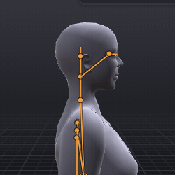
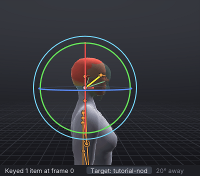
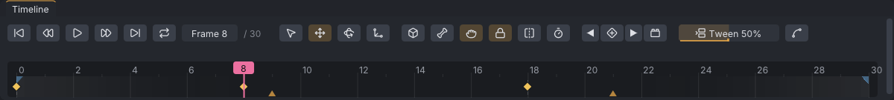
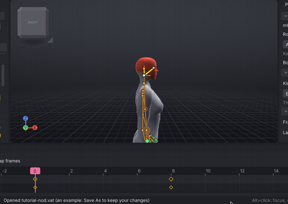
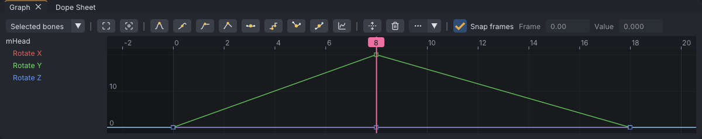
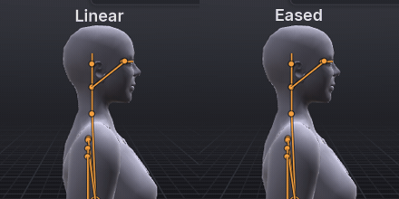

# Timing and spacing: a head nod

Beginner tutorial 2 of 3, about 15 minutes. You animate a nod: the head goes down and comes back up in just over half
a second. It is the smallest real animation there is, and it teaches the two ideas every other animation rests on:
**timing** (how many frames a move takes) and **spacing** (how far it goes on each of those frames). You key the nod by
dragging the head onto a green ghost, retime it by dragging its keys, and see its spacing by scrubbing and as a curve
in the [[Graph editor]].

> Related articles: [[Your first pose]], [[Target ghost]], [[Keys and timeline]], [[Dope sheet]], [[Graph editor]], [[Motion paths]]

## What you will make

*The finished nod, from the side. The head eases out of rest, eases into the bottom of the nod, and eases back.*

Three keys on the head over 30 frames (one second at 30 frames per second): straight at frame 0, down at frame 8,
straight again at frame 18. Frames 18 to 30 hold still.

## Steps

### 1. Set up the stand

1. Choose **File → New** (**Ctrl+N**); answer **Don't Save** if it asks.
2. Right-click empty space in the view and choose **Poses → Starter poses → Relaxed Stand**.
3. With the pointer over the view, press **3** to see the avatar from the side. A nod reads best in profile.

### 2. Show the target

[Show the target](target:tutorial-nod.vat)

The finished nod appears as a green ghost. Click **8** on the timeline's ruler: the ghost's head is down. Click
**0**: it is back inside yours. Press **Space** to play and again to stop: the ghost nods and your avatar stands
still. Your job is to make yours nod with it.

### 3. Key the start

1. Open the **Picker** tab and click the top dot, the head: **mHead · Head** is selected.
2. Check that the frame box reads **Frame 0** (press **Home** if not).
3. Press **S** (**Edit → Set Key**, or the **Set Key** button on the timeline bar, a diamond with a plus). The status
   bar says `Keyed 1 item at frame 0`, and a diamond appears at frame 0 on the timeline.

The head has not moved, so why key it? Because a bone's only key holds it on every frame, before and after. Without a
key at frame 0, the nod you key next would already be there at frame 0.

> **Why:** This key is the start of the move. Animators think in **poses at frames**: where the body is, and when.
> Everything between is worked out by the program.

### 4. Key the bottom of the nod

1. Click **8** on the ruler. The ghost's head is down; yours is not.
2. Press **E** for the **Rotate** tool, and **F** with the pointer over the view to frame the head.
3. Press on the **green** ring, the circle that faces you, where it passes in front of the face, and drag down. The
   head tips forward. Stop when it lies inside the ghost's head and the status bar's distance turns green.

*Press on the ring, not inside it: the inside turns the head freely, in every direction at once.*

A second diamond appears at 8.

> **Check:** about `20°` on the second **Rotation** box in **Properties → Bone**, Rotate Y, the nodding axis.

### 5. Key the way back up

1. Click **18** on the ruler. The ghost's head is up again.
2. Drag the green ring back up until the distance reads `0°` or `1°`.

*Three keys. The small triangles at the ends are **Ease in** and **Ease out**, which are about how Second Life blends
the whole animation in and out; they are not the easing of this lesson.*

### 6. Play it

Press **Space** to play and **Space** again to stop. **Home** jumps to frame 0. Your head and the ghost's nod
together: a nod, a pause while frames 18 to 30 hold, and the next nod. Click the **Target:** button in the status bar
to hide the ghost and watch yours alone.

> **Why (timing):** The head takes 8 frames (0.27 s) to go down and 10 frames (0.33 s) to come back. Down is the
> effort of the gesture, so it is a little quicker; the return is relaxed. Fewer frames make a move sharper and more
> urgent, more frames make it calmer or heavier.

> **Why (holds):** Frames 18 to 30 are a **hold**: no key changes anything, so the head stays still. A hold gives the
> viewer time to read a gesture before the next one starts. Without it, nod after nod runs together into a bobbing
> head.

### 7. Change the timing by dragging a key

Timing lives in where the keys sit. Move one and the nod changes character.

1. Click the **Dope Sheet** tab, beside **Graph** at the bottom. It has a row for the head, with a diamond for each
   key.
2. Click the diamond at **8** to select it (it turns yellow), then drag it left to **4**. Play: the head now snaps down
   and drifts back up, an eager "yes!".
3. Drag it right to **14** and play: a slow, heavy nod, sleepy or doubtful.
4. Drag it back to **8**. (**Ctrl+Z** undoes each move too.)

*Only the time moves; the head goes down as far as before. With **Snap frames** ticked, keys land on whole frames.*

### 8. Read the curve

Click the **Graph** tab. It draws the head's rotation over time: time runs left to right, the angle bottom to top.
Click **Rotate Y** in its list on the left to see only the nod's curve.

*Rotate Y. The curve is flat at every key.*

The curve is flat where it leaves frame 0, flat at the top at frame 8, and flat again as it arrives at frame 18. A
flat curve means the value is hardly changing: the head is moving slowly there. In the middle of each stretch the
curve is steep: the head is moving fast. This slow-fast-slow shape is called **easing**: the head *eases out* of one
pose and *eases in* to the next.

### 9. Feel the spacing

1. Press **Home**. Put the pointer on the timeline's ruler at frame 0, press, and drag slowly to frame 8, one frame at a
   time, watching the head (and the second **Rotation** box, if you like).
2. Drag on from 8 to 18 the same way.

The head hardly moves over the first frames, swings through the middle ones, and creeps into the bottom of the nod;
the same again on the way up. How far it travels on each frame is **spacing**: small steps near the keys, big steps
in the middle, which is the steep part of the curve. Timing says *when* the head arrives; spacing says *how* it gets
there.

> **Check:** in the example, the head is at about `1°` at frame 1, `3°` at frame 2, `10°` at frame 4 (halfway in
> half the time) and `19°` at frame 7: a degree a frame at each end, more than three in the middle.

> **Why (spacing):** Nothing with weight starts or stops instantly. A head, an arm, a car: each speeds up out of a
> still pose and slows down into the next. Small steps near the keys and big steps in the middle are what make motion
> look like it has mass.

> **Why (arcs):** The head turns about the neck joint, so the top of the head travels on a curve, not a straight line.
> Almost every natural motion follows an arc. Because VATs animates rotations, turning a joint gives you arcs for
> free; on bigger moves, such as an arm swing, check them with a [[Motion paths|motion path]], a line of dots, one per
> frame, that shows the arc and the spacing at once.

### 10. Try it without easing

1. In the **Graph** panel, drag a box across all three keys of the Rotate Y curve, starting in empty space: press left
   of frame 0 above the curve and release right of frame 18 below it. The keys turn yellow.
2. Press **Linear** on the graph's toolbar (two straight lines meeting at a key; it is named when the panel is wide,
   and its tooltip names it otherwise).

The curve becomes straight lines: every frame moves the head the same distance. Scrub it as in step 9 and feel the
difference.

*Linear: the same keys, even spacing, sharp corners.*

Play it. The head starts moving at full speed, hits the bottom of the nod and bounces back as if it had struck
something, then stops dead at 18. Compare the two side by side:

*The same three keys: Linear on the left, eased on the right.*

### 11. Put the easing back

With the three keys still selected, press **Auto**, the first curve-shape button (a hill, flat on top). The S-shaped
curve returns. (**Ctrl+Z** undoes the Linear change as well.)

**Auto** is the shape VATs gives every new key: smooth, and flat at each peak and valley. Of the other buttons,
**Flat** makes the curve level at a key, for a stronger ease, and **Stepped** holds each key until the next (useful for
planning; see [[Keys and timeline#Blocking and key tags]]). The **Ease** button applies standard easing shapes to the
span between two selected keys; see [[Graph editor#Easing presets]]. You can also drag a key's tangent handles in the
graph to shape the ease by hand; see [[Graph editor]].

## Check your result

Play yours with the target showing: your head and the ghost's should move as one. Then
[Open the example](example:tutorial-nod.vat) for the finished nod, or
[Open the example](example:tutorial-nod-linear.vat) for the linear version of step 10, and compare the curves with yours.

> **Check:** the example's keys are at 0, 8 and 18, with Rotate Y at `0°`, `20°` and `0°`. At frame 2 it reads `3.1°`
> in the eased nod and `5.0°` in the linear one: the eased head has barely started.

## Troubleshooting

### The head turns sideways or tilts instead of nodding

You dragged the red or blue ring, or the inside of the ball. **Ctrl+Z**, look from the side (**3**) and drag the green
ring: the one that turns yellow under the pointer and faces you as a full circle.

### The nod is already there at frame 0

The key at frame 0 is missing, so the frame 8 key rules the whole clip. Go to frame 0, drag the head back up into the
ghost (this keys it), and play again.

### A diamond in the dope sheet will not move

Only selected keys move. Click the diamond first, then drag it.

### Linear changed only one key

Only one key was selected. Drag the box again from empty space so that it covers all three keys; clicking a key
selects just that one.

## Next

[[A breathing idle that loops]]: slow, subtle motion that repeats forever, and your first export.

## See also

- [[Tutorials]]
- [[Keys and timeline]]
- [[Dope sheet]]
- [[Graph editor]]
- [[Motion paths]]

Category: Getting started
Order: 11
