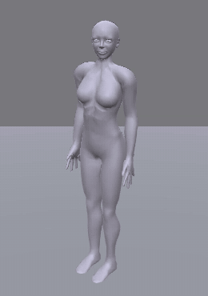
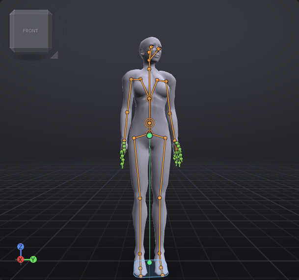
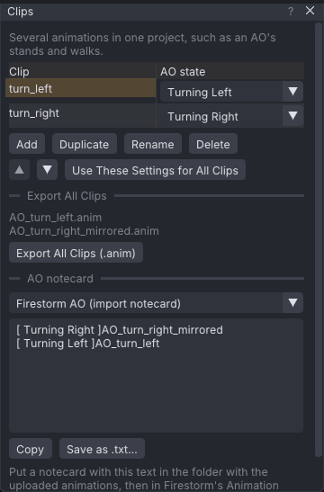

# Turns for an AO

A routine tutorial: make the two turning animations of an AO, **Turning Left** and **Turning Right**, from one
set of keys. You start from small steps in place, make the body lead into the turn, then use a second clip
exported mirrored for the other direction, and fill in the AO notecard.

> Related articles: [[Clips]], [[Mirror, flip and reverse]], [[Posing]], [[Preview as SL plays it]]

## What you will make

*turn_left. turn_right is the same keys, exported mirrored.*

A project with two clips: `turn_left`, a 24-frame loop of small steps with the head 20°, the chest 8° and the
hips 4° turned to the avatar's left, and `turn_right`, a copy exported with left and right swapped. The
finished project is [Open the example](example:turn-left.vat).

Second Life plays **Turning Left** or **Turning Right** while the avatar stands and turns on the spot (the
left or right arrow key, or **A** and **D**). The avatar's turning comes from Second Life; the animation only
has to look like a turn: the feet shuffle, and the body looks and leans the way it is going.

> **Note:** Second Life has no animation state for walking sideways, so an AO has no strafe animation:
> moving sideways plays the walk. The AO states are listed in [[Clips#Write an AO notecard]].

## Usage

### 1. Open the steps

[Open the example](example:turn-steps.vat) (`turn-steps.vat`) and play it (**Space**). It is a 24-frame loop:
the right foot lifts by frame 6 and is down at 12, the left lifts by 18 and is down at 24, and the hips sway
over the standing foot. These are the walk's steps with no stride: the feet come down where they lifted.

### 2. Make the body lead into the turn

A body turns from the top: the eyes and head first, then the chest, then the hips, and the feet follow.

1. Press **Home** so the frame box reads **Frame 0**.
2. In the **Bones** tab, click **mHead**. In **Properties → Bone → Rotation**, double-click the third box
   (Rotate Z), type `20` and press **Enter**. The head turns to the avatar's left.
3. Click **mChest** and set its third **Rotation** box to `8`.
4. Click **mPelvis** and set its third **Rotation** box to `4`.

Each bone now has one key, at frame 0, so it holds that turn for the whole loop. Play: the avatar steps
round to its left.

*20°, 8° and 4°: each part turns less than the one above it.*

> **Why:** the head leads because we look where we are going; each part below it turns less, so the twist
> spreads down the spine instead of the body turning like a statue on a turntable.

### 3. Name the clip and give it its AO state

1. Choose **Tools → Clips (AO Sets)...**. The one clip is called `Clip`.
2. Press **Rename**, type `turn_left` and press **Enter**.
3. In its **AO state** column, pick **Turning Left**.
4. In **Properties → Export**, type `AO` in **Name** and `[NAME]_[CLIP]` in **Pattern**. The window's
   **AO notecard** now reads `[ Turning Left ]AO_turn_left`.

### 4. Make the other direction by mirroring

1. In the **Clips** window press **Duplicate**: a copy called `turn_left 2` is now the clip you edit.
2. Press **Rename**, type `turn_right`, press **Enter**, and pick **Turning Right** as its **AO state**.
3. In **File → Export SL .anim...**, open **Also Write** and tick **Export mirrored (left and right swapped)**.

The keys of `turn_right` are still the left turn's; only its exported file is mirrored. Check it with **View →
Preview as SL Plays It**: the body plays the file as Second Life will, turned to its right, over a green ghost
of the keys, turned to its left.

*Two clips, one set of keys. The mirrored file's name ends in `_mirrored`.*

> **Why:** one set of keys for both turns means every later fix, a better step or a different lead, is made
> once. With **Export mirrored** the right-hand file is made from the left-hand keys each time you export.

### 5. Export both and write the notecard

In the **Clips** window, **Export All Clips** lists `AO_turn_left.anim` and `AO_turn_right_mirrored.anim`.
Press **Export All Clips (.anim)** and pick a folder. Under **AO notecard**, pick your AO's format and press
**Copy** or **Save as .txt...**; see [[Clips#Write an AO notecard]].

## Check your result

| Where | Value |
|---|---|
| **Properties → Bone**, frame 0 | **mHead** Rotation Z `20.0°`, **mChest** `8.0°`, **mPelvis** `4.0°` |
| **Properties → Animation** | **Last frame** `24`, **Loop** ticked, **Priority** `3` |
| **Tools → Clips (AO Sets)...** | `turn_left` (**Turning Left**), `turn_right` (**Turning Right**) |
| **Export SL .anim → Also Write** of `turn_right` | **Export mirrored (left and right swapped)** ticked |
| **View → Preview as SL Plays It** on `turn_right` | the body turned to its right, the ghost to its left |
| **Tools → Animation Check...** | no priority finding: the clips' AO states are turns, and an AO plays its turns instead of its stand, so 3 is enough (see [[Run cycle production]]) |

Compare with [Open the example](example:turn-left.vat).

## Tips and tricks

- A turn can come from your walk too: duplicate the walk clip, run **Tools → Loop Tools → Remove Hip Travel (In
  Place)** on it, and make the leg swings smaller at each key, so the feet land where they lifted.
- Keep the turn's steps small and its loop short: the key is often held for only a moment.
- Put the right hand's turn on **Side** instead of the `_mirrored` suffix: set **Side** `Left` and a pattern
  with `[SIDE]`; the mirrored file then gets `Right`. See [[Export to Second Life#Name the files]].

## Troubleshooting

### The mirrored clip turns the same way

**Export mirrored** is ticked on the wrong clip, or not at all. Switch to `turn_right` in the **Clips** window
and check **Properties → Export**. The preview and export follow it; the keys and the ghost never change.

### The AO notecard is empty

No clip has an **AO state**. Pick one in the **Clips** window.

## See also

- Previous: [[A walk cycle for your AO]]
- Next: [[Run cycle production]]
- [[Clips]]
- [[Mirror, flip and reverse]]

Category: Getting started
Order: 18
