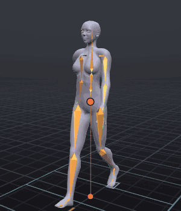
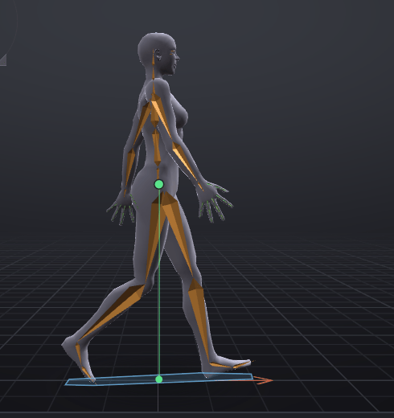
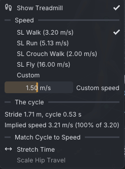
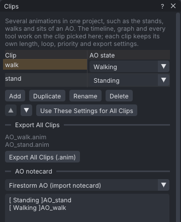

# A walk cycle for your AO

A routine tutorial: the walk every AO needs. You key the four classic poses of one step (*contact*, *down*,
*passing* and *up*), paste them mirrored to make the second step, close the loop, check the walk on the
treadmill, and put it in an AO set with a stand and a notecard. It is the longest of the routine tutorials,
and the one that teaches the most animation.

> Related articles: [[Loop tools]], [[Time editing]], [[Mirror, flip and reverse]], [[Clips]], [[Keys and timeline]], [[Animation check]]

## What you will make

*Two steps a cycle, 0.53 s, walking in place on the treadmill at Second Life's walking speed.*

One cycle of 16 frames at 30 fps, looping, the left foot forward at frame 0 and the right at frame 8. The
planted foot slides back at about 3.0 m/s, the speed Second Life moves a walking avatar (3.20 m/s), so the feet
do not skate in-world. It is the `walk` clip of a two-clip AO set with a `stand`, and
exports as `AO_walk.anim` and `AO_stand.anim` with a Firestorm AO notecard. The first step alone is
[Open the example](example:walk-first-step.vat), and the finished set is
[Open the example](example:walk-cycle.vat).

## Before you start: the four poses

A walk is a controlled fall: each step the body tips forward and a leg swings out to catch it. Animators
break one step into four poses and key them evenly:

| Frame | Pose | What happens |
|---|---|---|
| 0 | **Contact** | The front heel touches down; the back foot is on its toes. Both feet on the ground, legs widest. |
| 2 | **Down** | The front leg takes the weight and bends; the body is at its lowest. |
| 4 | **Passing** | The body is over the standing leg; the other leg swings past it, knee high. |
| 6 | **Up** | The standing leg pushes off; the body is at its highest, about to fall into the next contact. |

Frame 8 is contact again, with the legs swapped: the second step is the first one mirrored. Frame 16 is
frame 0 again, and the loop closes.

> **Why:** Keys at contact, down, passing and up pin down everything that matters in a walk: where the feet
> are, how high the body is, and where the weight is. The computer fills in between them. The up and down of the
> hips is what gives a walk its weight; a walk with level hips looks like it glides.

## Usage

Values are typed into **Properties → Bone → Rotation** (and **Offset (m)** for the hips): select the bone in
the **Bones** tab, double-click the box, type and press **Enter**. Each typed value keys the bone on the current
frame. Go to a frame by typing it into the frame box on the **Timeline** bar. On the legs, only the second
**Rotation** box changes; leave the first and third at `0`.

### 1. Set up the clip

1. Start a new project (**Ctrl+N**).
2. In **Properties → Animation** set **Last frame** `16` and tick **Loop**. Check **Loop out**: it must read
   `16`. Then set **Ease in** and **Ease out** to `0.25 s`.

> **Why:** Second Life moves a walking avatar at 3.20 m/s, about twice as fast as a person walks. For the feet
> not to skate, the walk must cover that ground: long strides, quickly. 16 frames at 30 fps is 0.53 s for two
> steps, the brisk rhythm of SL's own walk. The eases must fit inside the loop: a looping animation eases in
> once, when it starts, and out once, when it stops.

### 2. Key the contact pose at frame 0

At **Frame 0**, select **mPelvis** and press **Animate Position** under its **Rotation** to give it
**Offset (m)** boxes. Then set:

| Bone | Rotation | Offset (m) |
|---|---|---|
| **mPelvis** | `0`, `0`, `-4` | `0`, `0`, `-0.025` |
| **mTorso** | `0`, `0`, `8` | |
| **mHipLeft** | `0`, `-18`, `0` | |
| **mKneeLeft** | `0`, `4`, `0` | |
| **mAnkleLeft** | `0`, `-5`, `0` | |
| **mHipRight** | `0`, `11`, `0` | |
| **mKneeRight** | `0`, `35`, `0` | |
| **mAnkleRight** | `0`, `4`, `0` | |
| **mShoulderLeft** | `-75`, `20`, `0` | |
| **mShoulderRight** | `75`, `-20`, `0` | |
| **mElbowLeft** | `0`, `0`, `-10` | |
| **mElbowRight** | `0`, `0`, `10` | |

Press **3** with the pointer over the view to look from the right. The avatar faces right, towards +X.

*Contact. Negative hip values swing a leg forward, positive ones back.*

> **Why:** The arms swing against the legs: left leg forward, right arm forward. The hips turn with the forward
> leg (`-4`) and the chest turns back against them (`8`): the counter-twist that makes a walk look alive
> instead of marching.

### 3. Key down, passing and up

Go to each frame in turn and set only what the table lists; everything else carries on from its keys.

| Bone | Frame 2 (down) | Frame 4 (passing) | Frame 6 (up) |
|---|---|---|---|
| **mPelvis** Offset (m) | `0`, `0.012`, `-0.032` | `0`, `0.018`, `0.012` | `0`, `0.010`, `0.031` |
| **mPelvis** Rotation | | `0`, `0`, `0` | |
| **mTorso** | | `0`, `0`, `0` | |
| **mHipLeft** | `0`, `-17`, `0` | `0`, `3`, `0` | `0`, `9`, `0` |
| **mKneeLeft** | `0`, `23`, `0` | `0`, `8`, `0` | `0`, `17`, `0` |
| **mAnkleLeft** | `0`, `-11`, `0` | `0`, `-4`, `0` | `0`, `2`, `0` |
| **mHipRight** | `0`, `5`, `0` | `0`, `-14`, `0` | `0`, `-22`, `0` |
| **mKneeRight** | `0`, `48`, `0` | `0`, `63`, `0` | `0`, `22`, `0` |
| **mAnkleRight** | `0`, `35`, `0` | `0`, `4`, `0` | `0`, `-8`, `0` |
| **mShoulderLeft** | | `-75`, `0`, `0` | |
| **mShoulderRight** | | `75`, `0`, `0` | |

Scrub from 0 to 8: the left foot stays on the ground and slides back under the body as it would on a
treadmill, while the right leg swings through with its knee high and reaches forward.

> **Why:** Look at the planted foot while you scrub. In a walk in place, a foot on the ground must slide
> backwards at an even speed, as if the ground were moving under it; that is what makes the walk go forward
> once Second Life moves the avatar. If it jerks, or creeps forward, adjust the hips' height at that pose.
> The second **Offset** box sways the hips a little over the standing leg, where the weight is.

### 4. Paste the second step, mirrored

1. Choose **Select → Select None** (**Esc** with the pointer over the view). With a bone selected, the range
   commands work on that bone only.
2. **Shift+drag** along the timeline strip from frame 0 to frame 7. A yellow band marks the range.
3. Choose **Edit → Time → Copy Range**. The status bar says `Copied frames 0 to 7`.
4. Type `8` into the frame box.
5. Choose **Edit → Time → Paste Range Mirrored**. The status bar says `Paste Range Mirrored at frame 8`.

Frames 8 to 15 are now the first step with left and right swapped: the right foot comes down in front at
frame 8. See [[Time editing]].

> **Why:** A walk is symmetric: the second step is the first one on the other side. Mirroring saves half the
> work and keeps the two steps even, so the avatar does not limp.

### 5. Close the loop

1. Choose **Tools → Loop Tools**. Leave **Blend** at **end key only**.
2. Click **Make Loop Seamless**. The status bar says `Loop made seamless on 12 channels`.

Every channel now ends at frame 16 exactly where it started at frame 0, with the same slope, so the loop wraps
without a pop. The red tick at frame 16 on the timeline, which lists the channels that jump, is gone. See
[[Loop tools]].

### 6. Check it on the treadmill

1. Choose **View → Treadmill → Show Treadmill**. Blue lines scroll under the avatar while it plays, at
   **SL Walk** speed, 3.20 m/s.
2. Open **View → Treadmill** again. Under **The cycle** it reads **Stride 1.71 m, cycle 0.53 s** and
   **Implied speed 3.21 m/s (100% of 3.20)**.
3. Press **Space** to play. The planted foot should keep pace with the lines, not skate over them.

*Under **The cycle**, the treadmill measures the walk from its foot contacts: 100% of SL's walking speed.*

To see the walk go somewhere, open **Tools → Loop Tools**, type `3.21` in the box beside **Add Travel
Forward** and click it: the hips now travel forward at the walk's own speed. Play it from the **Right** view:
each planted foot now stays on its spot while the body passes over it, which is how the walk looks in-world.
Then choose **Tools → Loop Tools → Remove Hip Travel (In Place)**. The status bar says
`Removed hip travel: 3.21 m/s forward, 0.00 m/s sideways (3.21 m/s)` and the walk is back in place.

> **Why:** An AO walk must walk in place. Second Life moves the avatar at its own speed; hip travel in the
> animation would pull the body ahead of where the viewer puts it, and snap it back every loop.
> **Remove Hip Travel** is the fix for a walk that travels, such as a motion capture take.

> **Note:** In the [[VATs Editor (viewer)]], **Tools → Loop Tools → Test as My Walk** lets you walk your own
> avatar in-world with this animation as its walk, and reports the speed you actually walk at. The app has no
> such command; the treadmill is its stand-in. See [[Loop tools#Testing as your walk (viewer)]].

### 7. Make it an AO set

1. Choose **Tools → Clips (AO Sets)...**. The table lists one clip, `Clip`.
2. Double-click its name, type `walk` and press **Enter**. Set its **AO state** to **Walking**.
3. In **Properties → Export**, set **Name** to `AO` and **Pattern** to `[NAME]_[CLIP]`, so each clip exports
   under its own name.
4. Press **Add**. A new empty clip, `Clip 2`, is added with the walk's settings. Rename it `stand` and set its
   **AO state** to **Standing**.
5. With `stand` selected, click **Relaxed Stand** in **Inventory → Starter poses**, and set **Priority** to `2`.
6. Under **AO notecard**, leave **Firestorm AO (import notecard)** selected. The box reads
   `[ Standing ]AO_stand` and `[ Walking ]AO_walk`.
7. Press **Export All Clips (.anim)** and choose a folder, then **Save as .txt...** for the notecard.

*The set, ready to export. Upload the files, keep their names, and import the notecard in Firestorm's AO.*

> **Tip:** The stand is a single pose held here; for a real AO, give it a breath and a sway
> with the [[Idle layer]].

## Check your result

[Open the example](example:walk-cycle.vat) and compare:

| Where | Value |
|---|---|
| frame 4, **mKneeRight** | `0.0°`, `63.0°`, `0.0°` |
| frame 6, **mPelvis → Offset (m)** | `0.000`, `0.010`, `0.031` |
| frame 8, **mHipRight** | `0.0°`, `-18.0°`, `0.0°` (frame 0's **mHipLeft**) |
| frame 8, **mPelvis → Rotation** | `0.0°`, `0.0°`, `4.0°` (frame 0's, mirrored) |
| **View → Treadmill → The cycle** | **Stride 1.71 m, cycle 0.53 s**, **Implied speed 3.21 m/s (100% of 3.20)** |
| **Clips** | `walk` **Walking**, `stand` **Standing** |

The timeline shows no red tick at frame 16. **Tools → Animation Check...** has no priority warning for
`walk`: its AO state is **Walking**, and the AO plays it instead of its stand, so nothing else competes for
the legs.

## Troubleshooting

### The avatar walks backwards

The legs are the wrong way round: negative **mHip** values swing a leg forward. At frame 0 the left hip is
`-18` (forward) and the right `11` (back). Scrub: the planted foot must slide *backwards* under the body.

### The feet skate in-world

The walk covers less ground than Second Life moves the avatar. Compare **Implied speed** under **View → Treadmill →
The cycle** with 3.20 m/s: **Match Cycle to Speed → Stretch Time** speeds the cycle up to match; a longer stride
(more hip swing at contact) does it without speeding the steps.

### A foot sinks into the floor or floats

The hips are at the wrong height for that pose. Change **mPelvis → Offset (m)**'s third box by a centimetre
at a time at that key, and scrub again. The planted foot's heel and toe should just touch the ground line in the
**Right** view.

### The loop pops at frame 16

The seam was not closed after an edit. Hover the red tick at frame 16 to see which channels jump, then run
**Tools → Loop Tools → Make Loop Seamless** again.

### The arms swing with the legs, not against them

The shoulder signs are swapped. With the left leg forward, **mShoulderLeft**'s second box is positive (arm back)
and **mShoulderRight**'s negative (arm forward).

### Only one leg changed after the paste

A bone was selected when you copied, so only that bone's keys were copied. **Ctrl+Z** twice, choose
**Select → Select None**, and copy the range again.

### Paste Range Mirrored is greyed out

Copy a range first (**Edit → Time → Copy Range** with a yellow band on the timeline); the paste commands
stay greyed until something is copied.

## See also

- [[Loop tools]]
- [[Clips]]
- [[Time editing]]
- Previous: [[Sip from a mug]]
- Next: [[One-handed gun hold]]

Category: Getting started
Order: 15
