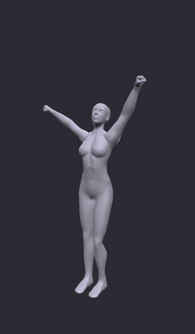
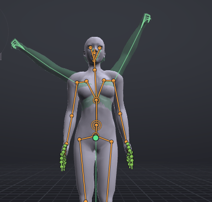
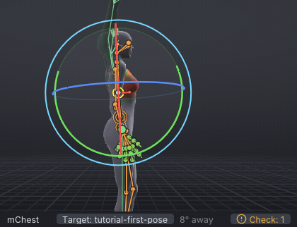
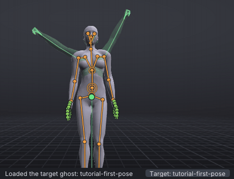
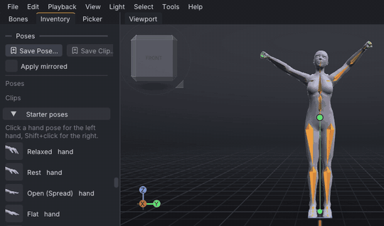

# Your first pose

Beginner tutorial 1 of 3, about 15 minutes. You build one strong, still pose, **Victory**: the weight on one leg,
the chest lifted, one fist thrown high and the other arm lower, the chin up. On the way you pick bones three ways,
turn them by dragging the rotate gizmo's rings onto a green ghost of the finished pose, copy one side onto the other,
and keep the pose in your pose library for any project. It assumes you have done [[First steps]].

> Related articles: [[First steps]], [[Target ghost]], [[Posing]], [[Picker]], [[Pose library]], [[Mirror, flip and reverse]]

## What you will make

*Victory, seen all the way round.*

A **pose** is the position of the whole body at one moment. In VATs, as in every animation program, a pose is stored
as **keys**: one key per bone, holding that bone's rotation at one frame. This tutorial keys everything on frame 0.
The next tutorial moves between poses over time.

## Steps

### 1. Start from a stand with the weight on one leg

1. Choose **File → New** (**Ctrl+N**), and answer **Don't Save** if it asks.
2. Right-click empty space in the view and choose **Poses → Starter poses → Contrapposto**.

The arms drop from the T shape to the sides, the hips tilt over the right leg and the left knee bends. The status bar
says `Applied Contrapposto at frame 0`.

The status bar's **Check** badge turns amber: the [[Animation check]] notes that the legs are keyed at a priority an
AO's stand would beat. That matters for an animation you upload, not for a pose you keep in your library; leave it.

> **Why:** The skeleton's rest pose is the T shape, which no person ever stands in. *Contrapposto*, the weight on
> one leg with the hips and shoulders tilted against each other, is how sculptors have made a still figure look alive
> for 2,500 years. Starting from it means every bone you do not touch already looks natural.

### 2. Show the target

[Show the target](target:tutorial-first-pose.vat)

A see-through green Victory appears over your avatar: the **target ghost**. It is the pose this page builds; your
own avatar stays as it is. With a bone selected, the status bar says how far it is turned from the ghost, for example
`30° away`, in green once it is within 5°. It measures each bone against the one above it, so work from the hips
outward, as the steps do: get the chest right before the arms, the arms before the hands.

*Your avatar and the ghost at the start. Everything you change from here closes the gap.*

### 3. Lift the chest: pick a bone in the Picker

1. Open the **Picker** tab, beside **Bones**. Its **Body** page shows the body from the front, with a dot on every
   joint. Hover a dot to see its name.
2. Click the **Chest** dot, the third up the spine. **mChest · Chest** is selected.
3. Press **E** for the **Rotate** tool (or its button on the timeline bar).
4. With the pointer over the view, press **3** to look from the side.
5. Press on the **green** ring where it passes in front of her chest, and drag upwards. The chest leans back a
   little, the ribs lifting. Stop when the chest lines up with the ghost's and the distance is green.

*A small move: a few degrees. Drag slowly, and watch the distance.*

> **Check:** about `-8°` on the second **Rotation** box in **Properties → Bone**.

### 4. Throw the left arm up: pick a bone in the view

1. Press **1** to look from the front. The avatar faces you, so her left arm is on **your right**.
2. Click her left upper arm, between the shoulder and the elbow. The status bar says
   `mShoulderLeft · Left Upper Arm`.
3. Press on the **red** ring below the arm and drag up and outwards, round the shoulder. The whole arm swings up, the
   forearm and hand coming with it. Keep going past level until the arm lies in the ghost's raised arm, high and
   a little out to the side.

*One long drag along the red ring. Let go, press again on the ring and drag on if you run out of room.*

> **Why:** Turn the big bone first, then the smaller ones below it. The shoulder carries the elbow and the hand with
> it, so posing from the body outwards saves work. Animators call this working down the chain.

> **Check:** about `65°` on the first **Rotation** box (it was `-77°`).

### 5. Copy the arm to the other side

With the left upper arm still selected, choose **Edit → Mirror Bone to Other Side** (**M**). The right arm goes up
too, the mirror image of the left, and the status bar says what was mirrored.

### 6. Break the symmetry: pick a bone in the Bones list

Both arms up the same reads stiff. Bring the right one down.

1. Open the **Bones** tab and type `right upper arm` into **Filter bones...**. The list finds bones by their plain
   names too: **mShoulderRight** Right Upper Arm is outlined. Press **Enter** to select it.
2. In the view, press on its **red** ring below the arm and drag towards the body: the arm swings down. Stop when it
   lies in the ghost's lower arm.
3. Clear the filter with the **×** at the end of the box.

> **Why:** A pose that is the same on both sides looks stiff and mechanical; animators call it *twinning*. Real
> people are never exactly symmetrical. One arm higher, the head turned, the weight on one foot: small differences
> make a pose read as alive.

> **Check:** about `-40°` on the first **Rotation** box.

You have now picked a bone three ways: on its dot in **Picker**, by clicking it in the view, and by name in
**Bones**. They all select the same bone; use whichever is quickest.

### 7. Chin up, towards the fist

1. Click the top dot in the **Picker** (**Head**). In the view the head is small and the eyes sit in front of it, so
   the Picker is the sure way to get it.
2. With the pointer over the view, press **3** to look from the side and **F** to frame the head.
3. Drag the **green** ring, on its front edge, upwards: the face tips up. Stop when the head lines up with the
   ghost's.
4. Press **1** for the front. Drag the **blue** ring (the flat oval round the neck) along its front edge, towards the
   high fist: the face turns that way. Stop once the distance is green.

> **Check:** about `-14°` on the second box and `13°` on the third.

### 8. Make fists

1. Press **Esc** to select nothing.
2. Open the **Inventory** tab, type `fist` into **Filter by name...** at its top, and find **Fist** under **Starter
   poses**.
3. Right-click **Fist** and choose **Both Hands**. Both hands close. (A plain click closes the left hand,
   **Shift+click** the right.)
4. Clear the filter with its **×**.

> **Why:** Hands finish a pose. Open, relaxed hands on raised arms read as surprise; fists read as triumph. When a
> pose looks almost right but not quite, look at the hands and the head first.

Click the **Target:** button in the status bar to hide the ghost and look at your pose on its own; click it again
to bring the ghost back.

### 9. Save the pose to your library

1. Check that nothing is selected (**Esc**): with no selection, **Save Pose...** saves the whole body.
2. Right-click empty space in the view and choose **Save Pose...** (it is also a button in **Inventory → Poses**). A
   **Name** window asks for a **Name for this pose**.
3. Type `Victory` and press **Enter**. The status bar says `Saved pose Victory`.

To prove it works, choose **Edit → Reset Whole Pose**: the avatar goes back to the T shape. Now right-click empty
space and choose **Poses → Victory**: the whole pose comes back, and the status bar says `Applied Victory at frame 0`.
It is also listed under **Inventory → Poses**, where a double-click applies it.

*Save, reset, re-apply.*

The library is shared by every project, so **Victory** is there next time you start VATs, ready to double-click onto
any frame. See [[Pose library]] for clips, mirrored applying and ghosts.

## Check your result

With the target showing, select each bone you posed and read the status bar: every one should be green. Then
[Open the example](example:tutorial-first-pose.vat) to compare side by side. The example's angles are in the
**Check** notes above; anything within a few degrees of them looks the same.

## Troubleshooting

### The arm went the wrong way, or twisted

You dragged a different ring, or along the ring the other way. Press **Ctrl+Z** and try again. The ring under the
pointer turns yellow before you press: check its colour first. The inside of the ball turns the bone freely, which is
hard to control; press on the ring's line itself.

### The whole arm moved instead of turning

The **Move** tool was active (the Second Life controls start with it), so the drag pulled the hand and the arm
followed. **Ctrl+Z**, then press **E** for the **Rotate** tool.

### The distance will not go green

The bone above it is off, and the distance measures each bone against its parent, so the ghost's arm is somewhere
else. Select the parent (**Up**, **Select → Select Parent**), match it first, then come back.

### Mirror Bone to Other Side changed nothing

Nothing was selected, or the selection was not on one side. Select the left upper arm and press **M** again.

### Save Pose saved only a few bones

Bones were selected when you pressed **Save Pose...**, so it saved just those; the item's kind reads **selection**
instead of **pose**. Right-click it, choose **Delete**, press **Esc** and save again.

### Clicking in the view selects the wrong bone

Bones overlap, especially inside the body. Click the same spot again to reach the bone underneath, or pick it in
**Bones** or **Picker**.

## Next

[[Timing and spacing: a head nod]]: two poses and the motion between them.

## See also

- [[Tutorials]]
- [[Posing]]
- [[Picker]]
- [[Pose library]]
- [[Target ghost]]

Category: Getting started
Order: 10
