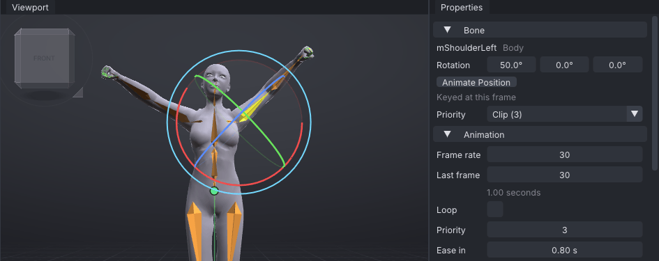
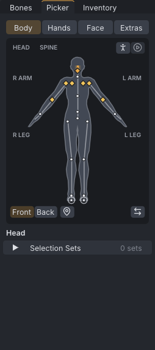

# Your first pose

Beginner tutorial 1 of 3. You build one strong, still pose, **Victory**: both arms up in fists,
one higher than the other, the chin lifted. On the way you learn to move the camera, pick bones
three ways, turn them with the rotate gizmo, copy one side onto the other, and keep the pose in
your pose library for any project. It assumes you have done [[First steps]].

> Related articles: [[First steps]], [[Posing]], [[Picker]], [[Pose library]], [[Mirror, flip and reverse]]

## What you will make

*Victory, seen all the way round. Every value is in "Check your result" below.*

A **pose** is the position of the whole body at one moment. In VATs, as in every animation
program, a pose is stored as **keys**: one key per bone, holding that bone's rotation at one frame.
This tutorial keys everything on frame 0. The next tutorial moves between poses over time.

## Steps

### 1. Start from a relaxed stand

1. Start VATs, or choose **File → New** (**Ctrl+N**) and answer **Don't Save** if it asks.
2. Right-click empty space in the viewport and choose **Poses → Starter poses → Relaxed Stand**.

The arms drop from the T shape to the sides, and the status bar says
`Applied Relaxed Stand at frame 0`. A **Blend** slider appears on the timeline bar for a few
seconds; leave it alone (see [[Pose library#Blending a pose after applying it]]).

> **Why:** The skeleton's rest pose is the T shape, which no person ever stands in. Starting from a
> natural stand means every bone you do not touch already looks right.

### 2. Look around

The viewport is a camera you can move without changing the animation. The Industry keys:

| To | Do |
|---|---|
| Orbit round the avatar | **Alt + left drag** |
| Pan (slide sideways) | **Alt + middle drag** |
| Zoom | Mouse wheel, or **Alt + right drag** |
| Look from the front | **1**, or click a face of the cube at the top left |
| Frame the selected bone | **F** |
| Frame the whole avatar | **A** |

Press **1** now: the avatar faces you. Her left arm is on **your right**, as with a person
standing opposite you.

> **Tip:** Camera moves are not edits, so **Ctrl+Z** never undoes them. If you get lost, press
> **A** and then **1**.

### 3. Pick a bone from the list

1. Open the **Bones** tab on the left.
2. Type `ShoulderLeft` into **Filter bones...**. The tree shrinks to **mCollarLeft** and
   **mShoulderLeft**.
3. Click **mShoulderLeft**, the upper arm.

The rotate gizmo appears round the shoulder, and **Properties → Bone** shows **mShoulderLeft**
with **Rotation** `-78.0°`, `0.0°`, `0.0°` and **Keyed at this frame**: Relaxed Stand keyed it.

### 4. Raise the arm with the gizmo

The gizmo has a ring for each axis: red turns around X, green around Y, blue around Z. The pale
outer ring turns around your line of sight.

1. Put the pointer on the **red** ring below the shoulder, on the side away from the body; the ring
   turns yellow when it is under the pointer.
2. Drag along the ring, up and outwards. The arm swings up and the first **Rotation** box counts up.
3. To get an exact value, double-click the first **Rotation** box, type `50` and press **Enter**.

*Click the bone, drag its red ring, then type the exact angle.*

The arm points up and out at 50°. Dragging a ring and typing a value both key the bone at the
current frame; there is nothing else to press. Hold **Ctrl** while dragging to turn in 5° steps.

*The shoulder at X 50°, seen in the finished example. Your right arm is still down at this point.*

> **Why:** Raise the big bone first, then the smaller ones below it. Turning the shoulder carries
> the elbow and hand with it, so posing from the body outwards saves work. Animators call this
> working down the chain.

### 5. Bend the elbow

1. Press **Down** (**Select → Select Child**): the selection moves from the shoulder to its child,
   **mElbowLeft**. **Up** goes back to the parent.
2. Double-click the third **Rotation** box (`-12.0°`), type `-35` and press **Enter**.

The forearm bends in towards the head.

### 6. Copy the arm to the other side

Choose **Edit → Mirror Left to Right**. Both arms are up, and the status bar says
`Mirror Left to Right at frame 0`.

Mirroring copies every animated bone of the left side onto the right, with the angles flipped. Type
`ShoulderRight` into **Filter bones...** and click **mShoulderRight**: its **Rotation** reads
`-50.0°`, `0.0°`, `0.0°`. The X angle changed sign, because the right arm turns the other way to
match.

> **Tip:** **Edit → Mirror Bone to Other Side** (**M**) mirrors only the selected bones; the whole
> page is in [[Mirror, flip and reverse]].

### 7. Break the symmetry

With **mShoulderRight** still selected, set the first **Rotation** box to `-35`. The right arm
drops a little below the left.

> **Why:** A pose that is the same on both sides looks stiff and mechanical; animators call it
> *twinning*. Real people are never exactly symmetrical. One arm higher, the head tipped, the weight
> on one foot: small differences make a pose read as alive.

### 8. Tilt the head with the picker

1. Open the **Picker** tab, beside **Bones**. Its **Body** page shows the body from the front, with a
   dot on every joint.
2. Click the top dot, on the head. It turns the accent colour and **mHead** is selected; joints keyed
   at this frame show a yellow diamond.
3. Set **Rotation** to `-8`, `-12`, `0`: the first box tilts the head to the side, the second lifts
   the chin.

*The picker, with **mHead** selected. Shift+click adds a bone to the selection.*

You have now picked a bone three ways: by name in **Bones**, by clicking it in the viewport, and on
its dot in **Picker**. Use whichever is quickest; they all select the same bone.

### 9. Make fists

1. Press **Esc** (**Select → Select None**).
2. Open the **Inventory** tab and type `Fist` into **Filter by name...** at its top. Scroll down to
   **Starter poses**.
3. Click **Fist** (a **hand** pose): the left hand closes. **Shift+click** it: the right hand
   closes, and the status bar says `Applied Fist at frame 0 (mirrored)`.
4. Clear the filter box again.

> **Why:** Hands finish a pose. Open, relaxed hands on raised arms read as surprise; fists read as
> triumph. When a pose looks almost right but not quite, look at the hands and the head first.

### 10. Save the pose to your library

1. Check that nothing is selected (**Esc**): with no selection, **Save Pose...** saves the whole body.
2. In **Inventory → Poses**, press **Save Pose...**. A **Name** window asks for a
   **Name for this pose**, with `Whole pose` filled in and selected.
3. Type `Victory` and press **Enter**.

The status bar says `Saved pose Victory`, and **Victory** appears under **Poses** with the kind
**pose**.

To prove it works, choose **Edit → Reset Whole Pose**: the avatar goes back to the T shape. Now
double-click **Victory** under **Poses**: the whole pose comes back, and the status bar says
`Applied Victory at frame 0`.

*Save, reset, re-apply.*

The library is shared by every project, so **Victory** is there next time you start VATs, ready to
double-click onto any frame. See [[Pose library]] for clips, mirrored applying and ghosts.

## Check your result

[Open the example](example:tutorial-first-pose.vat) to compare. Click each bone in the **Bones**
tab (clear **Filter bones...** first) and read **Rotation** in **Properties → Bone**:

| Bone | Rotation (X, Y, Z) |
|---|---|
| **mShoulderLeft** | `50.0°`, `0.0°`, `0.0°` |
| **mElbowLeft** | `0.0°`, `0.0°`, `-35.0°` |
| **mShoulderRight** | `-35.0°`, `0.0°`, `0.0°` |
| **mElbowRight** | `0.0°`, `0.0°`, `35.0°` |
| **mHead** | `-8.0°`, `-12.0°`, `0.0°` |
| **mCollarLeft**, **mCollarRight** | `-5.0°` and `5.0°` on X, from Relaxed Stand |

Every bone reads **Keyed at this frame**, and the fingers are curled into fists. If one value
differs, select that bone and type the value from the table.

## Troubleshooting

### The arm went the wrong way

You dragged a different ring, or dragged along the ring the other way. Press **Ctrl+Z** and try
again, or type the value: typing is always exact.

### Typing into a Rotation box does nothing

The boxes are drag controls. Double-click (or **Ctrl+click**) one to type, then press **Enter**;
**Esc** cancels. A single click and drag changes the value by dragging.

### Mirror Left to Right changed nothing on the right

It copies only bones that are animated on one side or the other. After Relaxed Stand and steps 4 and
5 the left arm is keyed; if you started from the T shape without Relaxed Stand, key the arm first.

### Save Pose saved only a few bones

Bones were selected when you pressed **Save Pose...**, so it saved just those; the item's kind reads
**selection** instead of **pose**. Right-click it, choose **Delete**, press **Esc** and save again.

### Clicking in the viewport selects the wrong bone

Bones overlap, especially inside the body. Click the same spot again to reach the bone underneath, or
pick it in **Bones** or **Picker**.

## Next

[[Timing and spacing: a head nod]]: two poses and the motion between them.

## See also

- [[Tutorials]]
- [[Posing]]
- [[Picker]]
- [[Pose library]]

Category: Getting started
Order: 10
