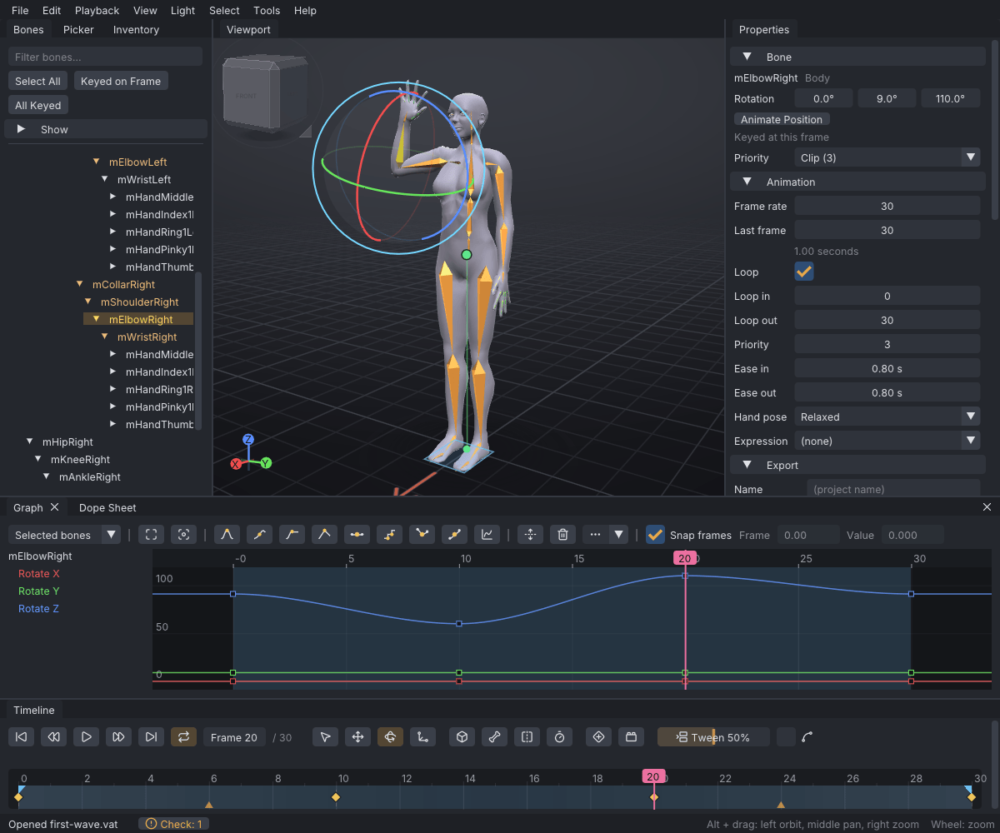

# VATs

Viewport Avatar Toolset is an open-source editor for Second Life avatar animations. You pose the Bento
skeleton on a timeline, preview the motion on the Linden avatar or a mesh body, and export a `.anim`
or `.bvh` file that Second Life accepts. VATs is free software under the GNU Lesser General Public
License 2.1.

> Related articles: [[Installation]], [[First steps]], [[Interface]]

*The app with the [[First steps]] example open: a one-second wave, keyed on four frames.*

## App and viewer

VATs comes in two forms that share the same core code and the same project files:

| | App | Viewer |
|---|---|---|
| Name | Viewport Avatar Toolset | VATs Editor |
| Runs | on its own, on Linux and Windows | inside an SL viewer, from the **Avatar** menu |
| Avatar | the Linden avatar or a mesh body from your library | your own avatar, as you wear it, playing the clip live |
| Output | `.vat` projects, `.anim` and `.bvh` files; upload with any viewer | the same files; **File → Upload Animation...** uploads directly |

Features are kept the same in both wherever the viewer allows it. Where a feature differs, its page
says so in a note. See [[VATs Editor (viewer)]] for what differs in the viewer.

## Getting started

- [[Installation]]: download, unpack and run; file associations.
- [[First steps]]: make, preview and export a first animation.
- [[Projects and files]]: `.vat` projects, autosave, recovery and the data folders.

## Interface

- [[Interface]]: the menus, panels, viewport and timeline.
- [[Control presets]]: Industry, Blender, QAvimator or Second Life controls.
- [[Preferences]]: every setting and where it is stored.

## Animating

- [[Posing]]: the tools, the gizmo and the body-part menus.
- [[Keys and timeline]]: setting, moving and deleting keys.
- [[Graph editor]]: curves, tangents and timing.
- [[IK]]: inverse kinematics on arms, legs and spine.
- [[Hold and bind]]: pinning a hand or foot to the world or to another bone.
- [[Hand poser]]: finger poses.
- [[Face animation]]: face sliders, blinks, eye darts and looking at things; expression packs for HUDs.
- [[Lip sync]]: jaw and lips from speech, from the audio or Rhubarb Lip Sync.
- [[Pose library]]: stored poses and clips in the Inventory.
- [[Community content]]: shared CC0 poses, clips and animations from a cloned folder.
- [[Mirror, flip and reverse]]: mirroring, flipping and playing backwards.
- [[Onion skin]]: ghosts of nearby frames.
- [[Loop tools]]: seamless loops and hip travel.
- [[Time editing]]: inserting, removing and stretching time.
- [[Audio track]]: timing to a sound or music file.

## Motion

- [[Motion capture]]: live capture from capture apps.
- [[Face tracking]]: driving the face bones.
- [[Dynamics]]: secondary motion on tails, hair and other chains.
- [[Idle layer]]: breathing and sway that loop cleanly.
- [[Overlap]]: follow-through down a keyed chain.
- [[Ragdoll]]: physics falls.
- [[Balance]]: the centre of mass, Auto-Balance and Jump Arc.

## Import and export

- [[BVH]]: importing and exporting BVH motion.
- [[Retargeting]]: bringing motion from other skeletons.
- [[Props]]: `.dae` and `.fbx` objects held or worn.
- [[Mesh bodies]]: previewing on a rigged mesh body.
- [[Couples and groups]]: animating two or more avatars together.

## Second Life

- [[Export to Second Life]]: settings, limits and upload.
- [[Preview as SL plays it]]: the exported file played back, and how far each bone moves from yours.
- [[Animation priority]]: which animation wins in-world.
- [[Priority planner]]: your clip against an AO, a dance or a pose, bone by bone.
- [[Animation check]]: problems that show only in-world, with fixes.

## Viewer

- [[VATs Editor (viewer)]]: VATs inside an SL viewer.

## Reference

- [[Keyboard shortcuts]]: every key, per preset.
- [[Command line]]: every start-up option.
- [[Skeleton]]: the Bento bones, attachment points and collision volumes.
- [[Anim format]]: the Second Life `.anim` file.
- [[Project file format]]: what a `.vat` file holds.
- [[Glossary]]: the terms this help uses.
- [[FAQ]]: short answers to common questions.

## Troubleshooting

- [[Troubleshooting]]: start-up errors, settings, logs and bug reports.

Category: Getting started
Order: 1
